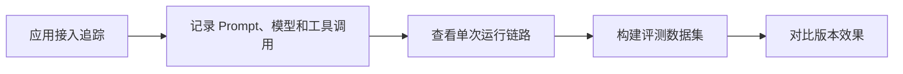

# LangSmith
LangSmith 是 LangChain 生态中的调试、追踪、评测和可观测性平台，用于分析 LLM 应用运行过程。

## 相关概念
- [[LangChain]]
- [[可观测性总览：日志、指标与链路追踪]]

## 使用流程

## 实践检查清单

- 是否记录输入、输出、模型参数、工具调用和耗时。
- 是否对敏感数据脱敏后再进入追踪平台。
- 是否建立固定评测集，用于提示词和模型版本回归。
- 是否按环境区分开发、测试和生产数据。
- 是否把失败样本沉淀为后续评估案例。

## 案例

RAG 问答上线前，可以把常见问题做成评测集，每次调整检索参数或 Prompt 后用 LangSmith 对比答案准确性、引用质量和响应成本。

## 使用边界

LangSmith 的价值在于把 LLM 应用从“凭感觉调 Prompt”转成“有样本、有追踪、有对比”的工程流程。单次 trace 能帮助定位问题，批量评测才能判断修改是否整体变好。两者要结合使用。

接入追踪平台前要先明确数据策略。生产输入可能包含用户隐私、内部文档和密钥片段，必须脱敏、分环境隔离，并限制谁能查看原始记录。

评测集应持续吸收线上失败样例。只有把真实失败变成回归用例，后续 Prompt、模型或检索参数调整才有可靠对照。

## 常见误区

- 只在出问题时临时打开追踪，缺少历史对比。
- 追踪记录包含用户隐私或内部密钥。
- 只看单次效果，不做批量评测和回归。

## 复盘问题

- 每次 Prompt 或模型调整是否有评测集对比。
- 线上失败样例是否进入下一轮回归数据。
