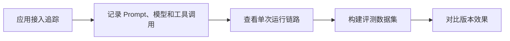

# LangSmith
LangSmith 是 LangChain 生态中的调试、追踪、评测和可观测性平台，用于分析 LLM 应用运行过程。

## 相关概念
- [[LangChain]]
- [[可观测性总览：日志、指标与链路追踪]]

## 使用流程

## 实践检查清单

- 是否记录输入、输出、模型参数、工具调用和耗时。
- 是否对敏感数据脱敏后再进入追踪平台。
- 是否建立固定评测集，用于提示词和模型版本回归。
- 是否按环境区分开发、测试和生产数据。
- 是否把失败样本沉淀为后续评估案例。

## 案例

RAG 问答上线前，可以把常见问题做成评测集，每次调整检索参数或 Prompt 后用 LangSmith 对比答案准确性、引用质量和响应成本。

## 常见误区

- 只在出问题时临时打开追踪，缺少历史对比。
- 追踪记录包含用户隐私或内部密钥。
- 只看单次效果，不做批量评测和回归。
