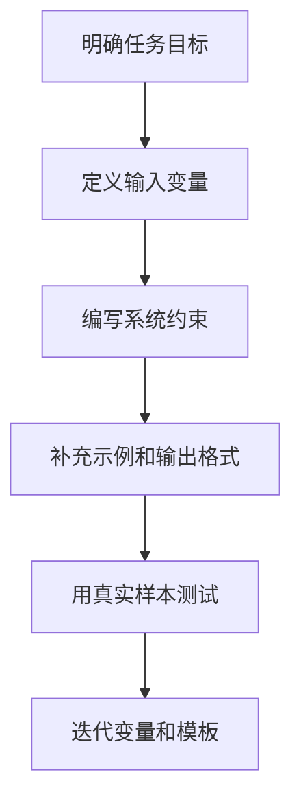

# PromptTemplate

提示词模板是 LangChain 中用于结构化 LLM 输入的工具，支持变量替换和复杂场景。

## 类型

### ChatPromptTemplate

用于对话场景：

```python
from langchain.prompts import ChatPromptTemplate

template = ChatPromptTemplate.from_messages([
    ("system", "你是{role}"),
    ("human", "{question}")
])

prompt = template.format_messages(
    role="专家",
    question="什么是AI？"
)
```

### FewShotPromptTemplate

用于少样本学习：

```python
from langchain.prompts import FewShotPromptTemplate

examples = [
    {"input": "开心", "output": "喜悦"},
    {"input": "悲伤", "output": "难过"}
]
```

## 最佳实践

- 使用清晰的变量命名
- 添加示例（Few-shot）提高效果
- 保持模板简洁，避免过长

## 相关概念

- [[LLM]] - 接收提示词的模型
- [[Chain]] - 组合模板和执行
- [提示词指南](https://python.langchain.com/docs/concepts/prompt_templates/)

## 设计流程



## 实践检查清单

- 变量名是否表达业务含义，例如 `user_question`、`context_docs`。
- 模板是否说明角色、任务、约束、输入和输出格式。
- 示例是否覆盖正常、边界和错误输入。
- 是否避免把用户输入直接拼接到高权限系统指令附近。
- 模板变更是否有样例回归，避免提示词改动破坏旧任务。

## 案例

客服摘要模板可以把变量拆成 `conversation_text`、`customer_profile` 和 `summary_schema`。这样模型既能看原始对话，又能按固定结构输出问题、诉求、处理结果和待跟进项。

## 常见误区

- 模板只有一句泛泛指令，缺少输出格式和判断标准。
- Few-shot 示例和真实输入分布不一致，模型学到错误模式。
- 模板过长且职责混杂，应拆成多个 Chain 或步骤。
