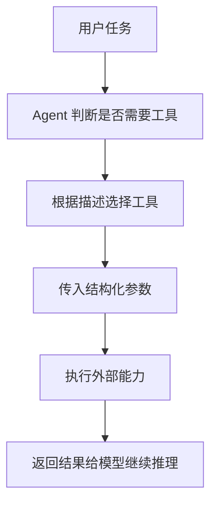

# Tool

工具是 Agent 可调用的外部功能，扩展了 LLM 的能力边界。

## 定义方式

### 使用装饰器（推荐）

```python
from langchain.tools import tool

@tool
def search_web(query: str) -> str:
    """搜索网页获取信息。"""
    # 实现搜索逻辑
    return f"搜索结果: {query}"
```

### 使用 Tool 类

```python
from langchain.tools import Tool

tool = Tool(
    name="calculator",
    func=lambda x: eval(x),
    description="执行数学计算"
)
```

## 常用工具类型

- **搜索** - Google Search, DuckDuckGo
- **计算** - Python REPL, 计算器
- **数据库** - SQL, NoSQL 查询
- **API** - REST, GraphQL 调用

## 关键要点

- 工具必须有清晰的 docstring（Agent 用它决定何时调用）
- 返回字符串格式
- 处理可能的错误

## 调用流程



## 实践检查清单

- 工具名称是否表达能力，而不是实现细节。
- docstring 是否写清适用场景、参数和返回值。
- 是否处理超时、权限、空结果和异常。
- 返回结果是否简洁，避免把无关数据塞回上下文。
- 高风险工具是否需要确认、审计或沙箱。

## 案例

数据库查询工具不应只叫 `query`，更适合命名为 `query_order_readonly`，并限制只读 SQL、最大行数和超时时间。这样 Agent 更容易正确选择工具，也能降低误操作风险。

## 相关概念

- [[Agent]] - 使用工具的实体
- [工具集成](https://python.langchain.com/docs/integrations/tools/)
