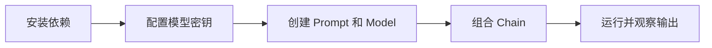

# LangChain 快速开始（知识库原始入口）

概要：LangChain 的安装、核心概念以及快速上手的最小可运行示例。

## 安装与环境
- Python 环境搭建
- pip 安装 LangChain

## 关键概念
- Agents、Chains、Memory、Retrieval、Prompts

## 快速示例
- Hello World 风格的最小示例

## 上手流程

## 实践检查清单

- 是否使用独立虚拟环境和锁定依赖版本。
- API Key 是否来自环境变量，不写入笔记或代码。
- 最小示例是否包含输入、模型调用和输出解析。
- 是否记录报错、延迟和成本。
- 跑通后是否连接到 Agents、Retrieval 或 Memory 专题。

## 案例

第一个 LangChain 示例可以只做“输入问题，模型返回回答”。确认链路稳定后，再加入 PromptTemplate 和 Output Parser，避免一开始就混入检索、工具和记忆。

## 常见误区

- 复制复杂示例，遇到错误无法判断是哪一层问题。
- 密钥写在代码或笔记里。
- 没固定依赖版本，教程代码和本地包版本不匹配。
