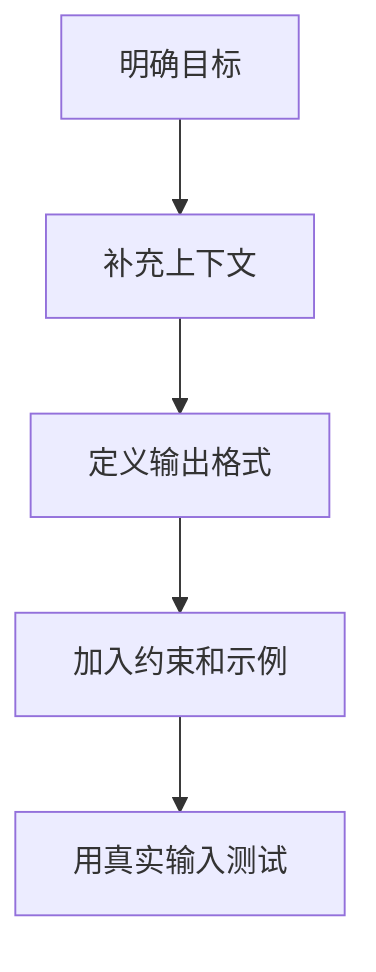

# Prompt 工程指南
Prompt 工程指南整理任务说明、上下文组织、约束表达、示例提供和输出验证的方法。

## Prompt 结构

- 角色和任务：明确模型要完成什么。
- 背景上下文：提供必要资料、限制和已有状态。
- 输出格式：规定结构、字段、语言和粒度。
- 约束条件：说明不能做什么、必须验证什么。
- 示例：给出正例或反例帮助对齐风格。

## 编写流程

## 实践检查清单

- 是否说明任务完成标准。
- 是否提供必要上下文，而不是让模型猜。
- 输出格式是否可解析或可审查。
- 是否要求引用、测试或其他验证证据。
- 是否用失败样例迭代 Prompt。

## 案例

让模型写技术方案时，应提供业务背景、目标、非目标、约束、现有系统和输出结构。只写“帮我设计一个系统”会让模型填补大量未知假设。

## 迭代方法

Prompt 不应一次写完就固定下来。更稳妥的做法是准备几组真实输入，观察模型在哪些地方误解任务、遗漏约束或输出不可用，再把这些失败点转化为更明确的上下文、格式要求和验收标准。高价值 Prompt 通常来自反复测试，而不是凭感觉堆长指令。

当任务复杂时，可以把 Prompt 拆成“理解任务、列出假设、执行、验证”几个阶段。这样输出更容易审查，也方便发现模型是在理解阶段出错，还是在执行阶段出错。

## 常见误区

- Prompt 很长但目标不清。
- 只写风格要求，不写验收标准。

## 相关概念
- [[Prompt Engineering]]
- [[Chain-of-Thought]]
