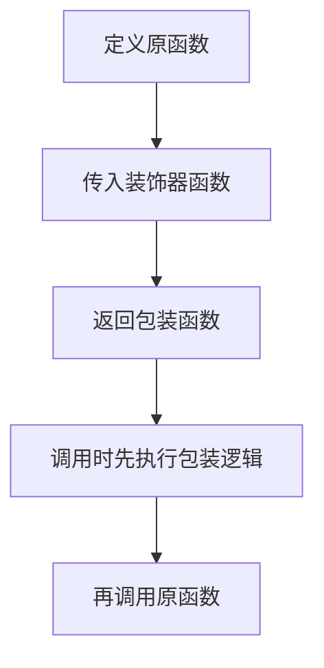

# Python装饰器详解
Python 装饰器是在不修改函数主体的情况下增强函数行为的语法机制，常用于日志、鉴权、缓存和中间件。

## 执行流程

## 常见用途

- 日志记录：记录调用参数和耗时。
- 权限校验：调用前检查身份或权限。
- 缓存：相同输入直接返回缓存结果。
- 重试：失败后按策略重新执行。
- 注册：把函数加入路由或任务表。

## 实践检查清单

- 是否用 `functools.wraps` 保留函数元信息。
- 装饰器是否支持参数。
- 是否正确处理返回值和异常。
- 多个装饰器叠加时顺序是否清楚。
- 是否避免把复杂业务逻辑藏进装饰器。

## 案例

Web 框架中的 `@route('/users')` 会把函数注册为接口处理器；缓存装饰器可以把昂贵计算结果按参数缓存起来，减少重复执行。

## 编写要点

装饰器本质是高阶函数：接收函数，返回新函数。最容易出错的地方是包装函数没有返回原函数结果，或者没有用 `functools.wraps` 保留函数名、文档和签名信息。对于带参数的装饰器，需要再多一层函数，用来先接收装饰器参数，再接收被装饰函数。

多个装饰器叠加时，执行顺序要特别留意。离函数最近的装饰器会先包装函数，调用时则从最外层包装开始执行。日志、鉴权、缓存、重试的顺序不同，可能产生完全不同的行为。

## 常见误区

- 忘记返回包装函数或原函数结果。
- 装饰器吞掉异常，导致问题难排查。

## 相关概念
- [[Python编程]]
- [[LangChain-Middleware]]
