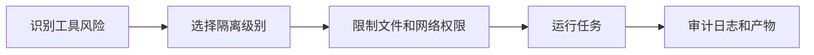

# Sandbox

**定义**: Sandbox（沙盒/沙箱）是一种安全机制，用于隔离程序的执行环境，限制其对系统资源的访问，防止恶意或错误的操作影响主机系统。

## 为什么需要 Sandbox

AI Agent 具有强大的执行能力，可以：
- 读写文件
- 执行系统命令
- 访问网络
- 调用外部 API

**风险**：如果 Agent 被误导、出现幻觉或遭遇提示注入攻击，可能造成：
- 数据丢失
- 隐私泄露
- 系统损坏
- 恶意软件执行

## Sandbox 的限制类型

### 1. 文件系统限制
| 模式 | 访问范围 |
|------|----------|
| **完全限制** | 不能访问任何文件 |
| **只读** | 只能读取指定目录 |
| **受限写入** | 只能写入特定目录（如 `~/.openclaw/workspace`） |
| **完全访问** | 无限制（危险） |

### 2. 网络限制
| 模式 | 能力 |
|------|------|
| **完全限制** | 不能发起网络请求 |
| **白名单** | 只能访问指定域名 |
| **完全访问** | 可以访问任何网络资源 |

### 3. 系统命令限制
| 模式 | 能力 |
|------|------|
| **完全限制** | 不能执行任何 shell 命令 |
| **受限** | 只能执行白名单内的命令 |
| **完全访问** | 可以执行任意命令（危险） |

### 4. 资源限制
- **CPU 限制**: 防止无限循环占用 CPU
- **内存限制**: 防止内存耗尽
- **时间限制**: 防止长时间运行的任务

## OpenClaw 的 Sandbox 模式

### 模式对比

| 模式 | 适用场景 | 安全性 |
|------|----------|--------|
| **Sandbox Mode** | 新手测试、不可信 Skills | ⭐⭐⭐⭐⭐ |
| **Standard Mode** | 日常使用、可信 Skills | ⭐⭐⭐⭐ |
| **Full Access Mode** | 高级用户、系统管理 | ⭐⭐ |

### Docker 沙盒配置

```bash
# 配置 Docker 沙盒
openclaw config set sandbox.mode "docker"
openclaw config set sandbox.docker.image "openclaw/sandbox:latest"

# 测试沙盒
openclaw sandbox test
```

Docker 沙盒提供最强的隔离：
- 独立的文件系统
- 独立的网络命名空间
- 资源限制（CPU、内存）
- 容器化隔离

### 安全配置检查清单

```bash
# 运行安全审计
openclaw security audit --deep

# 检查项目：
# [x] 沙盒模式已启用
# [x] 不必要的权限已禁用
# [x] API Key 使用环境变量存储
# [x] 敏感数据未硬编码
# [x] 网络访问受限制
```

## Sandbox 的最佳实践

### 1. 渐进式权限
```
新手 → 沙盒模式 → 标准模式 → 完全访问（仅限特定任务）
```

### 2. 专用设备
- 在专门的设备或虚拟机上运行 Agent
- 不要在主力工作机上运行 Full Access 模式

### 3. 定期审计
- 定期运行 `openclaw security audit`
- 检查已安装 Skills 的权限
- 移除不用的 Skills

### 4. 备份策略
- 定期备份 `~/.openclaw` 目录
- 使用 Git 版本控制配置
- 准备快速恢复方案

## Sandbox 的实现技术

| 技术 | 隔离级别 | 性能 | 复杂度 |
|------|----------|------|--------|
| **JavaScript VM** | 低 | 高 | 低 |
| **seccomp** | 中 | 高 | 中 |
| **Docker** | 高 | 中 | 中 |
| **虚拟机** | 最高 | 低 | 高 |
| **Wasm** | 中-高 | 高 | 中 |

## 相关概念

- [[AI Agent]] - Sandbox 保护 Agent 的执行环境
- [[Security]] - 安全实践和威胁模型
- [[Docker]] - 容器化隔离技术

---

*参考: [[OpenClaw]] 提供多层 Sandbox 保护*

## 实践流程



## 实践检查清单

- 是否按工具副作用区分只读、写文件、联网和执行命令权限。
- 是否为不可信输入、第三方 Skill 和自动化脚本启用更强隔离。
- 是否限制沙盒内可访问的目录、环境变量和密钥。
- 是否记录工具调用、文件变更和网络访问，便于复盘。
- 是否提供快速销毁和重建沙盒环境的方式。

## 案例

让 Agent 处理陌生仓库脚本时，可以先在 Docker 沙盒中运行测试，只挂载项目目录，不挂载 SSH Key 和云厂商凭证。确认脚本行为可信后，再考虑提升权限。

## 常见误区

- 把“模型不会故意作恶”当作安全边界。
- 沙盒里仍暴露真实 API Key，隔离效果大幅下降。
- Full Access 模式长期打开，所有任务共享高权限环境。
