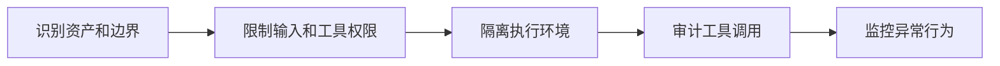

# Security
Security 在 AI 与软件系统中指身份、权限、隔离、输入验证、数据保护和供应链风险治理。

## 相关概念
- [[Sandbox]]
- [[API 安全基础]]

## 风险范围

- 输入风险：提示词注入、恶意文件、越权请求。
- 输出风险：泄露敏感信息、生成危险操作建议、错误引用。
- 工具风险：模型调用高权限工具、写入真实系统或执行命令。
- 数据风险：训练、检索和日志中混入隐私或商业机密。

## 防护流程

## 实践检查清单

- 模型可访问的数据是否按用户和租户隔离。
- 工具调用是否有最小权限、确认步骤和审计日志。
- 外部内容是否被当作不可信输入处理。
- 高风险输出是否需要规则校验或人工确认。
- 日志是否脱敏，避免把用户隐私写入调试记录。

## 治理边界

AI 安全要同时覆盖输入、上下文、工具和输出。提示词注入可能来自网页、文档、邮件或用户上传文件；检索系统可能召回用户无权访问的内容；工具调用可能把模型错误放大成真实写操作。只在系统提示词里写安全规则不够，必须配合权限、沙箱、审计和输出校验。

高风险场景应采用分级策略。只读查询可以自动执行，写操作需要确认，生产变更、支付、删除和权限修改应默认人工审批或进入隔离环境。

安全设计还要可观测。被拦截的输入、异常工具调用、越权检索和高风险输出都应留下审计记录，方便复盘和改进策略。

## 常见误区

- 认为提示词写“不要泄露”就足够安全。
- 检索系统没有权限过滤，模型引用了用户无权查看的文档。
- 工具执行没有沙箱，模型错误调用会影响真实环境。
