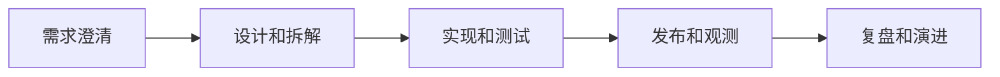

# SoftwareEngineering
SoftwareEngineering 指用工程化方法管理需求、代码、测试、部署、可观测性和长期维护。

## 相关概念
- [[后端开发]]
- [[前端开发]]
- [[AI工程实践]]

## 工程流程

## 实践检查清单

- 需求是否有明确目标、边界、验收标准和非目标。
- 设计是否覆盖数据、接口、错误、权限和可观测性。
- 测试是否覆盖关键路径、边界和回归风险。
- 发布是否有灰度、回滚和监控。
- 技术债是否被记录、排序并定期处理。

## 案例

AI 问答系统不仅要实现模型调用，还要设计知识库更新、权限过滤、答案引用、失败兜底、成本监控和评估集，否则很难稳定进入生产。

## 常见误区

- 把软件工程简化为写代码，忽略需求和运维闭环。
- 只追求新功能，不维护测试、文档和可观测性。
- AI 项目只看演示效果，不建立评估和回归机制。
