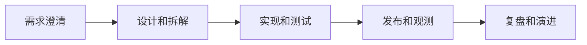

# SoftwareEngineering
SoftwareEngineering 指用工程化方法管理需求、代码、测试、部署、可观测性和长期维护。

## 相关概念
- [[后端开发]]
- [[前端开发]]
- [[AI工程实践]]

## 工程流程

## 实践检查清单

- 需求是否有明确目标、边界、验收标准和非目标。
- 设计是否覆盖数据、接口、错误、权限和可观测性。
- 测试是否覆盖关键路径、边界和回归风险。
- 发布是否有灰度、回滚和监控。
- 技术债是否被记录、排序并定期处理。

## 案例

AI 问答系统不仅要实现模型调用，还要设计知识库更新、权限过滤、答案引用、失败兜底、成本监控和评估集，否则很难稳定进入生产。

## 评价标准

软件工程质量不是代码量，而是系统面对变化和故障时的可维护性。一个工程化良好的系统应能回答：需求为什么这样做，接口如何演进，失败如何恢复，发布如何回滚，线上问题如何定位，新成员如何理解核心模块。

AI 时代的软件工程更强调验证闭环。模型能生成代码，但需求澄清、架构取舍、测试策略、权限边界和运行观测仍然需要工程方法约束。

团队复盘时可以把每次事故、返工和重复 Review 问题转化为工程规范、测试用例或自动化检查，减少同类问题再次发生。

## 常见误区

- 把软件工程简化为写代码，忽略需求和运维闭环。
- 只追求新功能，不维护测试、文档和可观测性。
- AI 项目只看演示效果，不建立评估和回归机制。

## 复盘问题

- 新功能是否有需求来源、验收标准、测试证据和上线观察。
- 代码是否能被后来者理解、修改、回滚和排查。
- 本次交付暴露的问题是否沉淀为测试、文档、脚本或规范。
