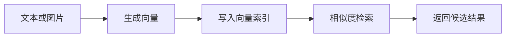

# Vector Database
Vector Database 是向量数据库的英文入口，用于连接语义检索、RAG 和嵌入表示相关笔记。

## 相关概念
- [[向量数据库]]
- [[Embedding]]

## 工作流程

## 实践检查清单

- 向量维度是否与 Embedding 模型匹配。
- metadata 是否包含来源、权限、版本和时间。
- 是否设计删除、更新和重建索引流程。
- 是否用真实查询评估召回率和延迟。
- 是否区分开发本地向量库和生产托管/集群方案。

## 案例

RAG 知识库把文档切分后写入向量数据库，用户提问时先检索相似片段，再把片段作为上下文交给模型生成答案。

## 常见误区

- 把向量数据库当关系数据库使用，忽略元数据和版本管理。
- 只看 top-k 结果数量，不评估召回质量。
- 文档更新后旧向量未删除，导致过期内容被引用。
