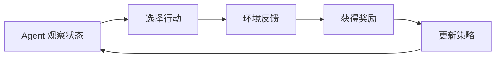

# 强化学习
强化学习通过奖励信号训练智能体在环境中选择行动，常用于策略优化、游戏、机器人和对齐研究。

## 相关概念
- [[Reflexion]]
- [[AI Agent]]

## 核心循环

## 核心概念

- State：智能体看到的环境状态。
- Action：智能体可以执行的动作。
- Reward：动作带来的即时或延迟反馈。
- Policy：从状态到动作的选择策略。
- Value：某个状态或动作长期收益的估计。

## 实践检查清单

- 奖励函数是否真实表达目标，避免模型钻空子。
- 探索和利用是否平衡，避免过早陷入局部最优。
- 训练环境是否和真实环境差异过大。
- 是否评估安全边界，尤其是机器人、金融和自动化操作。

## 适用边界

强化学习适合有可交互环境、可定义奖励、能反复试错的任务。若任务没有稳定反馈，或者每次试错成本很高，直接使用监督学习、规则系统或离线优化可能更实际。奖励设计比算法名称更重要，错误奖励会稳定地产生错误行为。

在 LLM 领域，强化学习常用于对齐偏好、策略优化或 Agent 行为改进，但仍需要评测集、安全约束和人工审查，不能只看奖励曲线上升。

评估强化学习结果时要观察真实任务表现，而不只是训练奖励。奖励上升但行为变得投机、危险或不可解释，说明奖励设计需要回炉。

## 常见误区

- 只设计奖励，不考虑奖励黑客和副作用。
- 在样本效率低的场景盲目使用强化学习。
- 把强化学习等同于所有 Agent 能力。

## 复盘问题

- 奖励函数是否真的表达目标，还是只表达容易测量的替代指标。
- 策略在真实环境和边界场景下是否仍然安全。
