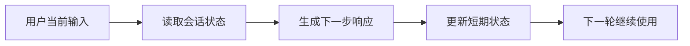

# 短期记忆
短期记忆保存当前会话或任务上下文，帮助 Agent 在有限时间范围内保持连续性。

## 相关概念
- [[Memory]]
- [[Checkpointer]]

## 使用流程

## 实践检查清单

- 记忆范围是否限定在当前会话、线程或任务。
- 是否保存必要状态，而不是无差别保存完整上下文。
- 会话结束后是否清理或归档，避免污染后续任务。
- 状态是否可恢复，例如服务重启后能从检查点继续。
- 是否限制敏感信息进入提示词和日志。

## 案例

旅行规划 Agent 在当前会话中保存目的地、预算、日期和用户偏好，方便下一轮继续追问酒店或交通。但这些临时偏好不一定应该长期保存到用户画像。

## 常见误区

- 把短期记忆和长期记忆混在一起，导致临时信息长期影响结果。
- 记忆内容过多，超过上下文窗口或增加无关噪声。
- 状态只存在内存中，服务重启后任务断裂。
