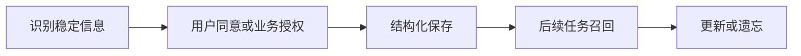

# 长期记忆
长期记忆保存跨会话、跨任务的稳定信息，常通过数据库、向量库或知识库实现。

## 相关概念
- [[Memory]]
- [[Store]]
- [[向量数据库]]

## 使用流程

## 实践检查清单

- 保存的信息是否稳定，例如偏好、画像、项目事实，而不是一次性上下文。
- 是否记录来源、时间和置信度，方便后续修正。
- 是否支持用户查看、修改和删除长期记忆。
- 是否按用户、租户和权限隔离。
- 是否有过期策略，避免旧事实长期污染答案。

## 案例

AI 助手可以长期记住用户偏好“周报使用要点式中文输出”。但“这次会议临时改到下午三点”更像任务状态，不应自动变成长期记忆。

## 常见误区

- 所有历史对话都进入长期记忆，导致召回噪声高。
- 没有遗忘机制，用户偏好变化后仍被旧信息影响。
- 长期记忆绕过权限控制，跨用户泄露信息。
