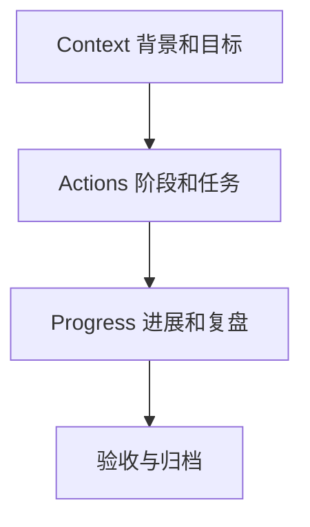

# 项目模板
项目模板用于统一项目目标、背景、行动计划、进展记录和验收标准。

## 适用场景

当一个事项需要多步推进、跨天执行、持续沉淀材料或需要验收标准时，就应该从普通任务升级为项目。项目模板的价值是把背景、目标、行动和进展放在同一处，避免信息散落在日记、聊天和临时文档中。

## C.A.P. 结构

## 示例字段

- 背景：为什么要做，关联哪些材料。
- 目标：完成后应该产生什么结果。
- 非目标：这次明确不做什么。
- 行动：阶段、下一步动作、依赖和风险。
- 进展：日期、变更、决策和阻塞。
- 验收：如何判断项目完成。

## 检查清单

- 是否写清项目属于哪个 Area。
- 是否有可判断的完成标准。
- 是否有下一步行动，而不只是方向。
- 是否链接相关笔记、资料和日记。
- 完成后是否能归档到系统目录。

## 使用案例

“完善知识库”适合用项目模板承载：Context 写明目标是补齐薄弱知识点，Actions 拆成扫描、补写、校验、复盘，Progress 记录每天新增或增强的笔记，验收标准可以是高引用薄弱节点明显下降、wikilink 无缺失、frontmatter 格式正常。

模板不是为了增加仪式感，而是为了让长期事项不会在执行过程中丢失上下文。

## 复盘提示

如果项目长期没有进展，优先检查模板中的 Actions 是否仍然只是愿望清单。好的项目笔记应该能让你下一次打开时立刻知道：当前状态是什么、下一步做什么、风险在哪里、完成后如何验收。

## 相关概念
- [[AI-Coding-50-工作法]]
- [[通用技能 MOC]]
