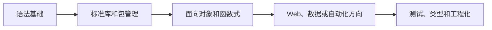

# Python编程
Python编程是 Python 语言基础、工程实践、Web 开发、数据分析和自动化脚本的知识领域入口。

## 相关概念
- [[MOC-Python编程]]
- [[Python装饰器详解]]

## 学习路径

## 实践检查清单

- 是否熟悉虚拟环境、依赖锁定和项目结构。
- 是否掌握文件、网络、日期、JSON、日志等常用标准库。
- 是否为核心函数补单元测试和类型标注。
- 脚本是否有参数、错误处理和日志，而不是只在本机可跑。
- Web 或数据项目是否有部署、监控和性能意识。

## 案例

把一次性 Excel 处理脚本沉淀成可复用工具时，应增加命令行参数、输入校验、异常提示和测试样例，而不是只保留 Notebook 中的临时代码。

## 工程化边界

Python 入门容易，长期维护不容易。脚本从个人使用走向团队复用时，要补项目结构、依赖锁定、配置管理、日志、异常处理和测试。数据处理脚本尤其要记录输入格式、输出位置、失败重试和样例数据，否则几周后很难判断结果是否可信。

学习路径也应根据目标选择侧重点。Web 开发要补框架、数据库和部署；数据分析要补 Pandas、可视化和统计；自动化要补文件、网络、CLI 和任务调度。

评估 Python 能力时，不只看能否写出脚本，还要看能否让别人稳定运行、定位错误并安全修改。这就是从个人脚本到工程代码的分界线。

## 常见误区

- 只学语法，不学习包管理、测试和工程结构。
- 把 Notebook 代码直接当生产脚本使用。
- 忽略类型和边界处理，脚本稍变复杂就难维护。
