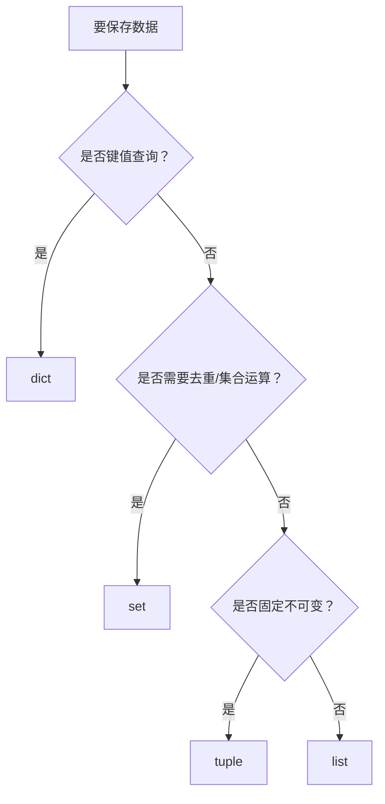

# Python 数据结构详解

> Python 中的五种核心数据结构: 列表、元组、字符串、集合、字典

---

## 数据结构对比速查表

| 特性 | 列表 (List) | 元组 (Tuple) | 字符串 (String) | 集合 (Set) | 字典 (Dict) |
|------|-------------|--------------|-----------------|------------|-------------|
| **符号** | `[]` | `()` | `''` 或 `""` | `{}` | `{key:value}` |
| **有序** | ✅ | ✅ | ✅ | ❌ | ❌ (Python 3.7+ 有序) |
| **可变** | ✅ | ❌ | ❌ | ✅ | ✅ |
| **重复** | ✅ | ✅ | ✅ | ❌ | 键不可重复 |
| **索引** | ✅ | ✅ | ✅ | ❌ | 按键索引 |
| **用途** | 通用序列 | 固定数据 | 文本处理 | 去重/数学运算 | 键值对存储 |

---

## List - 列表详解

### 什么是列表?

列表是 Python 中最常用的数据结构,用于存储有序的元素集合。

```python
# 创建列表
fruits = ['apple', 'banana', 'cherry']
numbers = [1, 2, 3, 4, 5]
mixed = [1, 'hello', 3.14, True]  # 可混合类型
empty = []                        # 空列表
```

### 列表的创建方式

```python
# 方式1: 字面量
items = [1, 2, 3]

# 方式2: list() 函数
items = list(range(1, 10))        # [1, 2, 3, 4, 5, 6, 7, 8, 9]
items = list('hello')             # ['h', 'e', 'l', 'l', 'o']

# 方式3: 列表生成式 (强烈推荐!)
items = [x for x in range(10)]                    # [0, 1, 2, ..., 9]
items = [x**2 for x in range(10)]                 # [0, 1, 4, 9, ..., 81]
items = [x for x in range(10) if x % 2 == 0]      # [0, 2, 4, 6, 8]

# 方式4: 重复创建
counters = [0] * 6                # [0, 0, 0, 0, 0, 0]
```

### 索引与切片

```python
items = ['a', 'b', 'c', 'd', 'e']

# 索引 (正向从0开始,反向从-1开始)
items[0]      # 'a'  (第一个)
items[-1]     # 'e'  (最后一个)
items[2]      # 'c'
items[-2]     # 'd'  (倒数第二个)

# 切片 [start:end:step]
items[1:3]    # ['b', 'c']      索引 1 到 2
items[:3]     # ['a', 'b', 'c'] 从头开始到索引 2
items[2:]     # ['c', 'd', 'e'] 从索引 2 到末尾
items[::2]    # ['a', 'c', 'e'] 每隔一个取一个
items[::-1]   # ['e', 'd', 'c', 'b', 'a'] 反转
```

### 列表常用方法

```python
items = [1, 2, 3]

# 添加元素
items.append(4)           # 末尾添加: [1, 2, 3, 4]
items.insert(0, 0)        # 指定位置插入: [0, 1, 2, 3, 4]
items.extend([5, 6])      # 扩展列表: [0, 1, 2, 3, 4, 5, 6]

# 删除元素
items.remove(3)           # 删除指定值 (第一个匹配项)
items.pop()               # 删除并返回最后一个元素
items.pop(0)              # 删除并返回指定索引的元素
del items[0]              # 删除指定索引
items.clear()             # 清空列表

# 查找元素
items.index(2)            # 返回元素索引 (找不到报错)
items.count(2)            # 统计出现次数
2 in items                # 判断是否包含 (True/False)

# 排序与反转
items.sort()              # 升序排序 (原地修改)
items.sort(reverse=True)  # 降序排序
items.reverse()           # 反转列表
sorted(items)             # 返回新列表,不修改原列表

# 其他
len(items)                # 列表长度
min(items)                # 最小值
max(items)                # 最大值
sum(items)                # 求和
```

### 列表运算

```python
list1 = [1, 2, 3]
list2 = [4, 5]

# 拼接
list1 + list2             # [1, 2, 3, 4, 5]

# 重复
list1 * 2                 # [1, 2, 3, 1, 2, 3]

# 比较
list1 == [1, 2, 3]        # True
list1 < [1, 2, 4]         # True (逐元素比较)
```

### 遍历列表

```python
items = ['a', 'b', 'c']

# 方式1: 直接遍历
for item in items:
    print(item)

# 方式2: 索引遍历
for i in range(len(items)):
    print(f'{i}: {items[i]}')

# 方式3: enumerate (推荐!)
for i, item in enumerate(items):
    print(f'{i}: {item}')

# 方式4: 同时遍历多个列表
names = ['Alice', 'Bob']
ages = [25, 30]
for name, age in zip(names, ages):
    print(f'{name}: {age}')
```

### 嵌套列表

```python
# 二维列表 (矩阵)
matrix = [
    [1, 2, 3],
    [4, 5, 6],
    [7, 8, 9]
]

# 访问元素
matrix[0]         # [1, 2, 3] (第一行)
matrix[0][1]      # 2 (第一行第二列)

# 生成二维列表
import random
scores = [[random.randint(60, 100) for _ in range(3)] for _ in range(5)]
# 5个学生,每人3门课的成绩
```

### 实战案例

```python
# 案例1: 双色球选号
import random

red_balls = list(range(1, 34))
selected = random.sample(red_balls, 6)  # 随机选6个
selected.sort()
blue_ball = random.randint(1, 16)

print('红球:', selected)
print('蓝球:', blue_ball)

# 案例2: 统计单词频率
text = "apple banana apple cherry banana apple"
words = text.split()
word_count = {}
for word in words:
    word_count[word] = word_count.get(word, 0) + 1
print(word_count)
```

---

## Tuple - 元组详解

### 什么是元组?

元组与列表类似,但是**不可变**的。一旦创建,不能修改。

```python
# 创建元组
t = (1, 2, 3)
t = 1, 2, 3           # 括号可省略
single = (1,)         # 单元素元组必须加逗号!
empty = ()            # 空元组
```

### 元组 vs 列表

```python
# 列表可变
list_items = [1, 2, 3]
list_items[0] = 10    # ✅ 可以

# 元组不可变
tuple_items = (1, 2, 3)
tuple_items[0] = 10   # ❌ TypeError!
```

**为什么需要元组?**
1. 保护数据不被修改
2. 可作为字典的键 (列表不行)
3. 创建速度更快
4. 适合多线程环境

### 元组操作

```python
t = (1, 2, 3, 4, 5)

# 索引和切片 (与列表相同)
t[0]          # 1
t[-1]         # 5
t[1:3]        # (2, 3)

# 不可变性
t[0] = 10     # ❌ 错误!

# 转换
list(t)       # 转列表
 tuple([1, 2, 3])  # 转元组
```

### 打包与解包

```python
# 打包
a = 1, 2, 3       # 自动打包成元组

# 解包
x, y, z = a       # x=1, y=2, z=3

# 扩展解包
first, *rest = [1, 2, 3, 4, 5]    # first=1, rest=[2, 3, 4, 5]
*begin, last = [1, 2, 3, 4, 5]    # begin=[1, 2, 3, 4], last=5
first, *middle, last = range(10)  # first=0, middle=[1..8], last=9

# 交换变量
a, b = b, a       # 不需要临时变量!
```

---

## String - 字符串详解

### 字符串基础

```python
# 创建字符串
s1 = 'hello'
s2 = "world"
s3 = '''多行
字符串'''
```

### 字符串常用方法

```python
s = "  Hello, World!  "

# 大小写转换
s.upper()             # "  HELLO, WORLD!  "
s.lower()             # "  hello, world!  "
s.title()             # "  Hello, World!  "
s.capitalize()        # "  hello, world!  "

# 查找与替换
s.find('World')       # 9 (索引)
s.find('Python')      # -1 (找不到)
s.replace('World', 'Python')   # "  Hello, Python!  "

# 去除空白
s.strip()             # "Hello, World!" (两边)
s.lstrip()            # "Hello, World!  " (左边)
s.rstrip()            # "  Hello, World!" (右边)

# 分割与连接
s.split(',')          # ['  Hello', ' World!  ']
'-'.join(['a', 'b'])  # 'a-b'

# 判断
s.startswith('Hello') # False (有空格)
s.endswith('!')       # True
s.isdigit()           # False
'123'.isdigit()       # True
```

### 字符串格式化

```python
name = "Alice"
age = 25

# 方式1: % 格式化
print("Name: %s, Age: %d" % (name, age))

# 方式2: format 方法
print("Name: {}, Age: {}".format(name, age))
print("Name: {0}, Age: {1}".format(name, age))

# 方式3: f-string (推荐! Python 3.6+)
print(f"Name: {name}, Age: {age}")
print(f"Name: {name.upper()}, Age: {age + 1}")
print(f"Pi: {3.14159:.2f}")       # Pi: 3.14
print(f"{age = }")                # age = 25 (调试友好)
```

### 字符串与列表互转

```python
# 字符串转列表
list('hello')         # ['h', 'e', 'l', 'l', 'o']
'apple,banana'.split(',')  # ['apple', 'banana']

# 列表转字符串
''.join(['h', 'e', 'l', 'l', 'o'])  # 'hello'
'-'.join(['a', 'b', 'c'])           # 'a-b-c'
```

---

## Set - 集合详解

### 什么是集合?

集合是**无序**、**不重复**的元素集合。

```python
# 创建集合
s = {1, 2, 3, 3, 2}   # {1, 2, 3} (自动去重)
s = set([1, 2, 2, 3]) # {1, 2, 3}
s = set()             # 空集合 (注意: {} 是字典!)
```

### 集合运算

```python
set1 = {1, 2, 3, 4}
set2 = {3, 4, 5, 6}

# 交集
set1 & set2           # {3, 4}
set1.intersection(set2)

# 并集
set1 | set2           # {1, 2, 3, 4, 5, 6}
set1.union(set2)

# 差集
set1 - set2           # {1, 2} (在1中但不在2中)
set1.difference(set2)

# 对称差 (异或)
set1 ^ set2           # {1, 2, 5, 6}
set1.symmetric_difference(set2)

# 子集/超集
set1 < set2           # False (真子集)
set1 <= set2          # False (子集)
set1.issubset(set2)
set2.issuperset(set1)
```

### 集合方法

```python
s = {1, 2, 3}

# 添加元素
s.add(4)              # {1, 2, 3, 4}

# 删除元素
s.remove(2)           # 删除2,不存在会报错
s.discard(5)          # 删除5,不存在不报错
s.pop()               # 随机删除并返回一个元素
s.clear()             # 清空

# 集合长度
len(s)
```

### 集合的应用场景

```python
# 去重
numbers = [1, 2, 2, 3, 3, 3, 4]
unique_numbers = list(set(numbers))   # [1, 2, 3, 4]

# 关系测试
python_students = {'Alice', 'Bob', 'Charlie'}
java_students = {'Bob', 'David', 'Eve'}

# 同时学 Python 和 Java 的
print(python_students & java_students)   # {'Bob'}

# 只学 Python 的
print(python_students - java_students)   # {'Alice', 'Charlie'}

# 所有学生
print(python_students | java_students)   # {'Alice', 'Bob', 'Charlie', 'David', 'Eve'}
```

---

## Dict - 字典详解

### 什么是字典?

字典是**键值对**的集合,通过键来快速查找值。

```python
# 创建字典
person = {
    'name': 'Alice',
    'age': 25,
    'city': 'Beijing'
}

# 空字典
empty = {}
empty = dict()
```

### 字典操作

```python
person = {'name': 'Alice', 'age': 25}

# 访问值
person['name']        # 'Alice'
person.get('name')    # 'Alice'
person.get('sex')     # None (键不存在)
person.get('sex', '未知')  # '未知' (提供默认值)

# 添加/修改
person['age'] = 26           # 修改
person['sex'] = 'Female'     # 添加

# 删除
person.pop('age')            # 删除并返回值
person.popitem()             # 删除并返回最后一项
del person['name']           # 删除
person.clear()               # 清空

# 遍历字典
for key in person:           # 遍历键
    print(key, person[key])

for key in person.keys():    # 遍历键
    print(key)

for value in person.values():  # 遍历值
    print(value)

for key, value in person.items():  # 遍历键值对 (推荐!)
    print(f'{key}: {value}')
```

### 字典的创建技巧

```python
# 方式1: 字面量
info = {'name': 'Alice', 'age': 25}

# 方式2: dict() 函数
info = dict(name='Alice', age=25)

# 方式3: zip() 函数
keys = ['name', 'age']
values = ['Alice', 25]
info = dict(zip(keys, values))

# 方式4: 字典生成式
squares = {x: x**2 for x in range(6)}
# {0: 0, 1: 1, 2: 4, 3: 9, 4: 16, 5: 25}

# 方式5: fromkeys() (设置默认值)
keys = ['a', 'b', 'c']
d = dict.fromkeys(keys, 0)   # {'a': 0, 'b': 0, 'c': 0}
```

### 字典的应用场景

```python
# 案例1: 统计词频
text = "apple banana apple cherry banana apple"
words = text.split()
word_count = {}
for word in words:
    word_count[word] = word_count.get(word, 0) + 1
print(word_count)   # {'apple': 3, 'banana': 2, 'cherry': 1}

# 案例2: 嵌套字典
students = {
    'Alice': {'age': 25, 'score': 90},
    'Bob': {'age': 23, 'score': 85}
}
print(students['Alice']['score'])   # 90

# 案例3: 字典列表
students = [
    {'name': 'Alice', 'age': 25},
    {'name': 'Bob', 'age': 23}
]
for student in students:
    print(f"{student['name']}: {student['age']}")
```

---

## 🎯 综合实战: 学生成绩管理系统

```python
"""
学生成绩管理系统
演示列表、字典的综合应用
"""

# 学生数据
students = [
    {'name': 'Alice', 'scores': [85, 90, 78]},
    {'name': 'Bob', 'scores': [92, 88, 95]},
    {'name': 'Charlie', 'scores': [78, 85, 80]}
]

# 1. 计算每个学生的平均分
for student in students:
    avg = sum(student['scores']) / len(student['scores'])
    student['average'] = round(avg, 2)

# 2. 找出最高分学生
best_student = max(students, key=lambda s: s['average'])
print(f"最高分学生: {best_student['name']}, 平均分: {best_student['average']}")

# 3. 按平均分排序
sorted_students = sorted(students, key=lambda s: s['average'], reverse=True)
print("\n成绩排名:")
for i, s in enumerate(sorted_students, 1):
    print(f"{i}. {s['name']}: {s['average']}")

# 4. 统计各科平均分
subjects_avg = []
for i in range(3):
    scores = [s['scores'][i] for s in students]
    subjects_avg.append(sum(scores) / len(scores))
print(f"\n各科平均分: {subjects_avg}")
```

---

## 📝 重点总结

### 选择合适的数据结构

| 需求 | 推荐数据结构 |
|------|-------------|
| 有序序列,需要频繁增删 | **列表** |
| 固定数据,不可变 | **元组** |
| 去重、集合运算 | **集合** |
| 键值对查找 | **字典** |
| 文本处理 | **字符串** |

### 性能对比

```python
# 成员测试: 集合 > 列表
# 集合是 O(1), 列表是 O(n)

# 查找: 字典 > 列表
# 字典按键查找是 O(1), 列表是 O(n)

# 适用场景:
# - 频繁查找: 用字典或集合
# - 有序遍历: 用列表
# - 数据保护: 用元组
```

---

**下一步**: [[01-基础-函数与模块|函数与模块]] → 学习如何组织和复用代码

## 数据结构选择流程



## 实践检查清单

- 是否能根据查找、顺序、去重、不可变需求选择结构。
- 是否理解 list、dict、set 常见操作的复杂度差异。
- 是否避免用列表做大量成员测试。
- 是否知道字典 key 必须可哈希。
- 是否能把嵌套数据结构拆成可读的业务模型。
