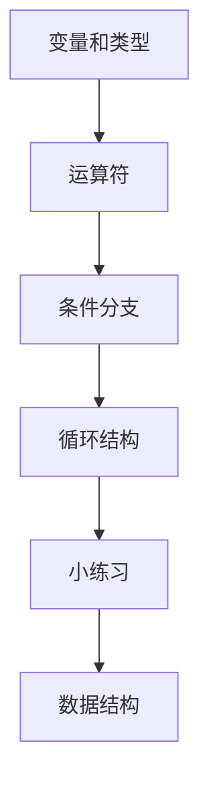

# Day 0 Python 基础入门

## Day 01: 初识 Python

### Python 简介

**Python** 是由荷兰人 Guido van Rossum 发明的一种编程语言,是目前世界上最受欢迎的编程语言之一。

**优点:**
- ✅ 简单优雅,容易上手
- ✅ 开发效率高,代码量少
- ✅ 强大的社区和生态圈
- ✅ 跨平台性强
- ✅ 胶水语言,可整合其他语言

**缺点:**
- ❌ 执行效率相对较低(解释型语言)

**应用领域:**
- 后端开发、数据分析、人工智能
- 自动化运维、自动化测试
- 网络爬虫、量化交易

### 环境搭建

#### Windows 安装
```bash
# 1. 官网下载 Python 安装包
# https://www.python.org/downloads/

# 2. 安装时勾选:
# ✓ Add python.exe to PATH
# ✓ Use admin privileges

# 3. 验证安装
python --version        # Python 3.x.x
pip --version          # pip x.x.x
```

#### macOS 安装
```bash
# macOS 通常预装了 Python 2.7
# 建议安装 Python 3
python3 --version      # Python 3.x.x
pip3 --version        # pip x.x.x
```

---

## Day 02: 第一个 Python 程序

### 编写代码的工具

1. **交互式环境**: `python` 或 `ipython`
2. **文本编辑器**: VS Code (推荐)
3. **IDE**: PyCharm (功能强大)

### Hello World

```python
print('hello, world')
print("你好,世界!")
```

### 注释

```python
# 单行注释

"""
多行注释
文档字符串
"""

'''
也可以用单引号
'''
```

**运行程序:**
```bash
python hello.py
```

---

## Day 03: 变量和数据类型

### 什么是变量?

**变量是数据的载体**,是内存中用来保存数据的空间。

```python
# 变量赋值
name = "Alice"
age = 25
height = 1.75
is_student = True
```

### Python 基本数据类型

| 类型 | 名称 | 示例 | 说明 |
|------|------|------|------|
| `int` | 整型 | `100`, `-50`, `0b1010` | 任意大小整数 |
| `float` | 浮点型 | `3.14`, `1.5e2` | 小数/科学计数法 |
| `str` | 字符串 | `"hello"`, `'world'` | 文本数据 |
| `bool` | 布尔型 | `True`, `False` | 真/假 |

### 进制表示

```python
print(0b100)    # 二进制 -> 4
print(0o100)    # 八进制 -> 64
print(100)      # 十进制 -> 100
print(0x100)    # 十六进制 -> 256
```

### 变量命名规则

**必须遵守:**
1. 由字母、数字、下划线组成
2. 数字不能开头
3. 区分大小写
4. 不能使用关键字

**推荐规范:**
- 使用小写字母+下划线: `user_name`, `total_count`
- 见名知意

```python
# ✅ 好的命名
user_name = "张三"
student_count = 50
max_score = 100

# ❌ 不好的命名
x = "张三"          # 不明确
UserName = "张三"   # 驼峰命名(类名才用)
2name = "张三"      # 语法错误!
```

### 类型检查与转换

```python
# 检查类型
a = 100
print(type(a))      # <class 'int'>

# 类型转换
int("123")          # 123
float("3.14")       # 3.14
str(100)            # "100"
bool(1)             # True
bool("")            # False
```

**常用转换函数:**
- `int()` - 转整数
- `float()` - 转浮点数
- `str()` - 转字符串
- `bool()` - 转布尔值
- `chr()` - ASCII 码转字符
- `ord()` - 字符转 ASCII 码

---

## Day 04: 运算符

### 算术运算符

```python
+   # 加法
-   # 减法
*   # 乘法
/   # 除法 (结果为浮点数)
//  # 整除
%   # 取余 (模运算)
**  # 幂运算
```

```python
print(10 + 3)       # 13
print(10 - 3)       # 7
print(10 * 3)       # 30
print(10 / 3)       # 3.333...
print(10 // 3)      # 3
print(10 % 3)       # 1
print(10 ** 3)      # 1000
```

### 比较运算符

```python
==   # 等于
!=   # 不等于
>    # 大于
<    # 小于
>=   # 大于等于
<=   # 小于等于
```

**特殊用法 - 连续比较:**
```python
# Python 支持数学式连续比较
age = 25
if 18 <= age <= 35:     # ✅ Python 特色
    print("青年")

# 其他语言需要这样写
if age >= 18 and age <= 35:  # ❌ 繁琐
    print("青年")
```

### 逻辑运算符

```python
and   # 与 (两边都为真才真)
or    # 或 (有一个为真就真)
not   # 非 (取反)
```

```python
age = 25
score = 85

if age >= 18 and score >= 60:
    print("及格")

if age < 18 or age > 60:
    print("享受优惠")

is_member = False
if not is_member:
    print("请先注册")
```

### 赋值运算符

```python
=     # 赋值
+=    # 加后赋值
-=    # 减后赋值
*=    # 乘后赋值
/=    # 除后赋值
//=   # 整除后赋值
%=    # 取余后赋值
**=   # 幂后赋值
```

```python
a = 10
a += 5      # a = a + 5 -> 15
a *= 2      # a = a * 2 -> 30
```

**海象运算符 (Python 3.8+):**
```python
# 赋值并返回值
print((a := 10))    # 10
print(a)            # 10
```

### 运算符优先级

从高到低:
1. `()` - 括号
2. `**` - 幂运算
3. `*`, `/`, `//`, `%` - 乘除
4. `+`, `-` - 加减
5. 比较运算符
6. `not` - 逻辑非
7. `and` - 逻辑与
8. `or` - 逻辑或

---

## Day 05: 分支结构

### if-else 基础

```python
# 单分支
if 条件:
    语句

# 双分支
if 条件:
    语句1
else:
    语句2

# 多分支
if 条件1:
    语句1
elif 条件2:
    语句2
elif 条件3:
    语句3
else:
    语句4
```

### 经典示例: BMI 计算器

```python
height = float(input('身高(cm):'))
weight = float(input('体重(kg):'))
bmi = weight / (height / 100) ** 2

if bmi < 18.5:
    print('体重过轻')
elif bmi < 24:
    print('身材正常')
elif bmi < 27:
    print('体重过重')
else:
    print('肥胖')
```

### match-case (Python 3.10+)

```python
# 适用于多值匹配
status_code = int(input('状态码:'))

match status_code:
    case 200:
        print('OK')
    case 404:
        print('Not Found')
    case 500:
        print('Server Error')
    case _:           # 默认情况
        print('Unknown')

# 合并模式
match status_code:
    case 200 | 201:   # 200 或 201
        print('Success')
    case 401 | 403 | 404:
        print('Client Error')
```

### 嵌套分支

**推荐: 扁平化代码**
```python
# ✅ 推荐: 扁平化
if x > 1:
    y = 3 * x - 5
elif x >= -1:
    y = x + 2
else:
    y = 5 * x + 3
```

**不推荐: 过多嵌套**
```python
# ❌ 避免: 嵌套过多
if x > 1:
    y = 3 * x - 5
else:
    if x >= -1:
        y = x + 2
    else:
        y = 5 * x + 3
```

---

## Day 06: 循环结构

### for 循环

**适用于: 已知循环次数**

```python
# range() 函数
range(5)        # 0, 1, 2, 3, 4
range(1, 5)     # 1, 2, 3, 4
range(1, 10, 2) # 1, 3, 5, 7, 9 (步长为2)

# 基本用法
for i in range(5):
    print(i)

# 遍历列表
fruits = ['apple', 'banana', 'cherry']
for fruit in fruits:
    print(fruit)
```

### while 循环

**适用于: 未知循环次数**

```python
# 基本用法
count = 0
while count < 5:
    print(count)
    count += 1

# 死循环 + break
while True:
    user_input = input("输入 'q' 退出:")
    if user_input == 'q':
        break
```

### 循环控制

```python
break       # 终止循环
continue    # 跳过当前迭代,进入下一轮
```

```python
# break 示例
for i in range(10):
    if i == 5:
        break       # 立即退出循环
    print(i)        # 输出: 0, 1, 2, 3, 4

# continue 示例
for i in range(10):
    if i % 2 == 0:
        continue    # 跳过偶数
    print(i)        # 输出: 1, 3, 5, 7, 9
```

### 嵌套循环

```python
# 九九乘法表
for i in range(1, 10):
    for j in range(1, i + 1):
        print(f'{i}×{j}={i*j}', end='\t')
    print()  # 换行
```

### for vs while 选择

| 场景 | 推荐 | 示例 |
|------|------|------|
| 已知次数 | for | 遍历列表、固定次数 |
| 未知次数 | while | 等待用户输入、条件满足 |

---

## Day 07: 实战练习

### 练习 1: 判断素数

```python
def is_prime(num):
    """判断是否为素数"""
    if num < 2:
        return False
    for i in range(2, int(num ** 0.5) + 1):
        if num % i == 0:
            return False
    return True

# 测试
print(is_prime(17))     # True
print(is_prime(18))     # False
```

### 练习 2: 斐波那契数列

```python
# 前 20 个数
a, b = 0, 1
for _ in range(20):
    a, b = b, a + b
    print(a, end=' ')
# 输出: 1 1 2 3 5 8 13 21 34 55 ...
```

### 练习 3: 水仙花数

```python
# 100-999 的水仙花数
# 153 = 1³ + 5³ + 3³
for num in range(100, 1000):
    low = num % 10
    mid = num // 10 % 10
    high = num // 100
    if num == low ** 3 + mid ** 3 + high ** 3:
        print(num)
# 输出: 153 370 371 407
```

### 练习 4: 猜数字游戏

```python
import random

answer = random.randint(1, 100)
counter = 0

while True:
    counter += 1
    num = int(input('猜一个数字 (1-100):'))
    
    if num < answer:
        print('太小了!')
    elif num > answer:
        print('太大了!')
    else:
        print(f'恭喜你猜对了! 用了 {counter} 次')
        break
```

---

## 🎯 本章重点回顾

### 必须掌握的概念

1. ✅ 变量定义和命名规范
2. ✅ 五种基本数据类型及其转换
3. ✅ 各种运算符的使用
4. ✅ if-elif-else 分支结构
5. ✅ for 和 while 循环
6. ✅ break 和 continue

### 常见错误

```python
# ❌ 错误 1: 混淆 = 和 ==
if x = 5:      # SyntaxError
    pass

if x == 5:     # ✅ 正确
    pass

# ❌ 错误 2: 缩进不一致
if True:
    print(1)
     print(2)   # IndentationError

# ❌ 错误 3: 死循环
while True:
    print(1)    # 忘记 break!
```

---

## 学习流程图



## 实践检查清单

- 是否能解释变量、类型转换和常见运算符。
- 是否能独立写出 `if/elif/else` 分支。
- 是否能用 `for` 和 `while` 分别解决循环问题。
- 是否能识别死循环、缩进错误和赋值/比较混淆。
- 是否完成至少 3 个小练习，并能说明解题思路。

## 最小项目建议

学完本章后，可以做一个命令行猜数字、BMI 计算器或简单记账脚本。项目不需要复杂，重点是把输入、类型转换、分支和循环串起来。

**下一步**: [[01-基础-数据结构详解|数据结构详解]] → 学习 Python 最常用数据结构
