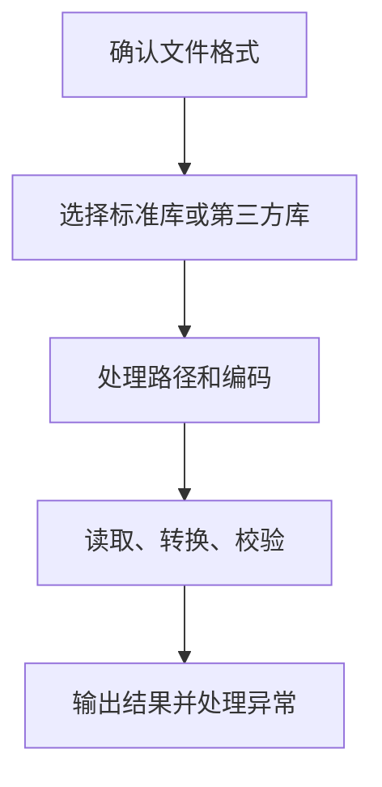

# Python文件操作与常用库 (Day 21-30)

> 掌握Python文件读写、数据处理和办公自动化技能

---

## 学习路线图

```
Day 21-22: 文件操作基础
├── 文本文件读写
├── 二进制文件操作
├── 异常处理机制
└── JSON序列化

Day 23-27: 办公文档处理
├── CSV文件读写
├── Excel文件操作
├── Word文档生成
├── PDF文件处理
└── 图像处理基础

Day 28-30: 实用工具
├── 图像处理进阶
├── 邮件发送
└── 正则表达式
```

---

## Day 21: 文件读写和异常处理

### 文件操作基础

#### 打开文件

```python
# 基本语法
file = open('filename.txt', mode='r', encoding='utf-8')
# 操作文件...
file.close()

# 推荐: 使用 with 语句 (自动关闭)
with open('filename.txt', 'r', encoding='utf-8') as file:
    content = file.read()
```

#### 文件打开模式

| 模式 | 含义 | 说明 |
|------|------|------|
| `'r'` | 读取 | 默认模式，文件必须存在 |
| `'w'` | 写入 | 会截断已有内容 |
| `'x'` | 独占写入 | 文件存在会报错 |
| `'a'` | 追加 | 在文件末尾添加 |
| `'b'` | 二进制 | 用于图片、视频等 |
| `'t'` | 文本 | 默认模式 |
| `'+'` | 读写 | 可读可写 |

#### 读取文件

```python
# 读取整个文件
with open('data.txt', 'r', encoding='utf-8') as f:
    content = f.read()

# 逐行读取
with open('data.txt', 'r', encoding='utf-8') as f:
    for line in f:
        print(line.strip())

# 读取到列表
with open('data.txt', 'r', encoding='utf-8') as f:
    lines = f.readlines()

# 读取指定字节
with open('data.txt', 'r', encoding='utf-8') as f:
    chunk = f.read(1024)  # 读取1024个字符
```

#### 写入文件

```python
# 写入文本
with open('output.txt', 'w', encoding='utf-8') as f:
    f.write('Hello, World!\n')
    f.write('第二行内容\n')

# 写入多行
lines = ['第一行\n', '第二行\n', '第三行\n']
with open('output.txt', 'w', encoding='utf-8') as f:
    f.writelines(lines)

# 追加模式
with open('log.txt', 'a', encoding='utf-8') as f:
    f.write('新日志条目\n')
```

### 异常处理

#### 基本语法

```python
try:
    # 可能出错的代码
    file = open('不存在的文件.txt', 'r')
    content = file.read()
except FileNotFoundError:
    # 文件不存在
    print('文件不存在!')
except PermissionError:
    # 权限不足
    print('没有权限读取文件!')
except Exception as e:
    # 其他异常
    print(f'发生错误: {e}')
else:
    # 没有异常时执行
    print('读取成功!')
finally:
    # 无论是否异常都执行
    if 'file' in locals() and file:
        file.close()
        print('文件已关闭')
```

#### 常见异常类型

```
BaseException
├── SystemExit              # 系统退出
├── KeyboardInterrupt       # Ctrl+C
├── Exception
│   ├── ArithmeticError     # 算术错误
│   ├── LookupError         # 索引/键错误
│   │   ├── IndexError      # 列表索引越界
│   │   └── KeyError        # 字典键不存在
│   ├── TypeError           # 类型错误
│   ├── ValueError          # 值错误
│   ├── FileNotFoundError   # 文件不存在
│   └── PermissionError     # 权限错误
```

#### 自定义异常

```python
class ValidationError(Exception):
    """数据验证错误"""
    pass

class AgeError(ValidationError):
    """年龄错误"""
    def __init__(self, age, message="年龄必须在0-150之间"):
        self.age = age
        self.message = message
        super().__init__(self.message)

# 使用
def set_age(age):
    if not 0 <= age <= 150:
        raise AgeError(age)
    return age

try:
    set_age(200)
except AgeError as e:
    print(f"错误: {e.message}, 输入值: {e.age}")
```

---

## Day 22: 对象的序列化和反序列化

### JSON处理

```python
import json

# Python对象转JSON字符串
data = {
    'name': 'Alice',
    'age': 25,
    'is_student': False,
    'courses': ['Python', 'JavaScript']
}

json_str = json.dumps(data, ensure_ascii=False, indent=2)
print(json_str)

# JSON字符串转Python对象
obj = json.loads(json_str)
print(obj['name'])

# 写入JSON文件
with open('data.json', 'w', encoding='utf-8') as f:
    json.dump(data, f, ensure_ascii=False, indent=2)

# 从JSON文件读取
with open('data.json', 'r', encoding='utf-8') as f:
    data = json.load(f)
```

### pickle序列化

```python
import pickle

# Python对象转二进制
data = {'name': 'Alice', 'age': 25}
binary = pickle.dumps(data)

# 二进制转Python对象
obj = pickle.loads(binary)

# 写入文件
with open('data.pkl', 'wb') as f:
    pickle.dump(data, f)

# 从文件读取
with open('data.pkl', 'rb') as f:
    data = pickle.load(f)
```

**JSON vs Pickle:**

| 特性 | JSON | Pickle |
|------|------|--------|
| 格式 | 文本 | 二进制 |
| 可读性 | ✅ 人类可读 | ❌ 不可读 |
| 跨语言 | ✅ 支持 | ❌ Python专属 |
| 安全性 | ✅ 安全 | ❌ 可能执行恶意代码 |
| 支持类型 | 基本类型 | 几乎所有Python对象 |

---

## Day 23-25: CSV和Excel处理

### CSV文件操作

```python
import csv

# 写入CSV
with open('data.csv', 'w', newline='', encoding='utf-8') as f:
    writer = csv.writer(f)
    # 写入表头
    writer.writerow(['姓名', '年龄', '成绩'])
    # 写入数据
    writer.writerow(['Alice', 25, 85])
    writer.writerow(['Bob', 23, 90])

# 读取CSV
with open('data.csv', 'r', encoding='utf-8') as f:
    reader = csv.reader(f)
    for row in reader:
        print(row)

# 使用DictReader
with open('data.csv', 'r', encoding='utf-8') as f:
    reader = csv.DictReader(f)
    for row in reader:
        print(f"{row['姓名']}: {row['成绩']}")
```

### Excel处理 (openpyxl)

```python
from openpyxl import Workbook, load_workbook
from openpyxl.styles import Font, PatternFill, Alignment

# 创建工作簿
wb = Workbook()
ws = wb.active
ws.title = "学生成绩"

# 写入数据
ws['A1'] = '姓名'
ws['B1'] = '成绩'
ws.append(['Alice', 85])
ws.append(['Bob', 90])

# 设置样式
ws['A1'].font = Font(bold=True, color='FFFFFF')
ws['A1'].fill = PatternFill(start_color='366092', end_color='366092', fill_type='solid')
ws['A1'].alignment = Alignment(horizontal='center')

# 设置列宽
ws.column_dimensions['A'].width = 15
ws.column_dimensions['B'].width = 10

# 保存
wb.save('成绩表.xlsx')

# 读取Excel
wb = load_workbook('成绩表.xlsx')
ws = wb.active
for row in ws.iter_rows(min_row=2, values_only=True):
    print(f"姓名: {row[0]}, 成绩: {row[1]}")
```

---

## Day 26-27: Word和PDF处理

### Word文档 (python-docx)

```python
from docx import Document
from docx.shared import Pt, RGBColor, Inches
from docx.enum.text import WD_ALIGN_PARAGRAPH

# 创建文档
doc = Document()

# 添加标题
title = doc.add_heading('Python学习报告', 0)
title.alignment = WD_ALIGN_PARAGRAPH.CENTER

# 添加段落
p = doc.add_paragraph('这是正文内容，')
p.add_run('加粗文字').bold = True
p.add_run('和斜体文字').italic = True

# 添加列表
doc.add_paragraph('第一点', style='List Bullet')
doc.add_paragraph('第二点', style='List Bullet')

# 添加表格
table = doc.add_table(rows=3, cols=2)
table.style = 'Light Grid Accent 1'
table.rows[0].cells[0].text = '姓名'
table.rows[0].cells[1].text = '成绩'
table.rows[1].cells[0].text = 'Alice'
table.rows[1].cells[1].text = '85'

# 添加图片
# doc.add_picture('image.png', width=Inches(5))

# 保存
doc.save('报告.docx')
```

### PDF处理 (PyPDF2)

```python
from PyPDF2 import PdfReader, PdfWriter

# 读取PDF
reader = PdfReader('input.pdf')
print(f"总页数: {len(reader.pages)}")

# 提取文本
page = reader.pages[0]
text = page.extract_text()

# 合并PDF
writer = PdfWriter()
for page in reader.pages:
    writer.add_page(page)

# 添加密码保护
writer.encrypt('password')

# 保存
with open('output.pdf', 'wb') as f:
    writer.write(f)

# 旋转页面
writer = PdfWriter()
page = reader.pages[0]
page.rotate(90)
writer.add_page(page)
```

---

## Day 28: 图像处理 (Pillow)

### 基础操作

```python
from PIL import Image, ImageFilter, ImageDraw, ImageFont

# 打开图片
img = Image.open('photo.jpg')

# 查看信息
print(img.size)     # (宽, 高)
print(img.mode)     # RGB, RGBA, L等

# 基本操作
img_resized = img.resize((800, 600))
img_cropped = img.crop((100, 100, 400, 400))  # (左, 上, 右, 下)
img_rotated = img.rotate(45)
img_flipped = img.transpose(Image.FLIP_LEFT_RIGHT)

# 滤镜
img_blurred = img.filter(ImageFilter.BLUR)
img_sharpened = img.filter(ImageFilter.SHARPEN)
img_contour = img.filter(ImageFilter.CONTOUR)

# 调整亮度/对比度
from PIL import ImageEnhance
enhancer = ImageEnhance.Brightness(img)
img_bright = enhancer.enhance(1.5)  # 1.0=原图, <1变暗, >1变亮

# 转换模式
img_gray = img.convert('L')  # 转灰度

# 保存
img.save('output.png', 'PNG')
img.save('output.jpg', 'JPEG', quality=95)
```

### 绘图和文字

```python
from PIL import Image, ImageDraw, ImageFont

# 创建画布
img = Image.new('RGB', (800, 600), color='white')
draw = ImageDraw.Draw(img)

# 画形状
draw.rectangle([100, 100, 300, 200], outline='red', width=3)
draw.ellipse([400, 100, 600, 300], fill='blue')
draw.line([(0, 0), (800, 600)], fill='green', width=5)

# 添加文字
try:
    font = ImageFont.truetype('arial.ttf', 40)
except:
    font = ImageFont.load_default()

draw.text((100, 400), 'Hello, Pillow!', fill='black', font=font)

img.save('drawing.png')
```

---

## Day 29: 发送邮件

### SMTP邮件发送

```python
import smtplib
from email.mime.text import MIMEText
from email.mime.multipart import MIMEMultipart
from email.mime.base import MIMEBase
from email import encoders

def send_email(subject, body, to_email, attachment=None):
    # 邮件配置
    smtp_server = 'smtp.gmail.com'
    smtp_port = 587
    from_email = 'your_email@gmail.com'
    password = 'your_password'
    
    # 创建邮件
    msg = MIMEMultipart()
    msg['From'] = from_email
    msg['To'] = to_email
    msg['Subject'] = subject
    
    # 添加正文
    msg.attach(MIMEText(body, 'plain', 'utf-8'))
    
    # 添加附件
    if attachment:
        with open(attachment, 'rb') as f:
            part = MIMEBase('application', 'octet-stream')
            part.set_payload(f.read())
            encoders.encode_base64(part)
            part.add_header(
                'Content-Disposition',
                f'attachment; filename= {attachment}'
            )
            msg.attach(part)
    
    # 发送
    with smtplib.SMTP(smtp_server, smtp_port) as server:
        server.starttls()
        server.login(from_email, password)
        server.send_message(msg)

# 使用
send_email(
    subject='测试邮件',
    body='这是一封测试邮件',
    to_email='recipient@example.com'
)
```

---

## Day 30: 正则表达式

### 基础语法

```python
import re

# 常用模式
pattern_email = r'\b[A-Za-z0-9._%+-]+@[A-Za-z0-9.-]+\.[A-Z|a-z]{2,}\b'
pattern_phone = r'1[3-9]\d{9}'
pattern_url = r'https?://(?:[-\w.]|(?:%[\da-fA-F]{2}))+'

# re模块函数

# 1. match - 从开头匹配
result = re.match(r'\d+', '123abc')
if result:
    print(result.group())  # 123

# 2. search - 搜索第一个匹配
result = re.search(r'\d+', 'abc123def456')
print(result.group())  # 123

# 3. findall - 查找所有匹配
results = re.findall(r'\d+', 'abc123def456')
print(results)  # ['123', '456']

# 4. finditer - 返回迭代器
for match in re.finditer(r'\d+', 'abc123def456'):
    print(match.group())

# 5. sub - 替换
new_text = re.sub(r'\d+', '#', 'abc123def456')
print(new_text)  # abc#def#

# 6. split - 分割
parts = re.split(r'[,;]+', 'a,b;;c;d')
print(parts)  # ['a', 'b', 'c', 'd']
```

### 正则表达式速查表

| 符号 | 含义 | 示例 |
|------|------|------|
| `.` | 任意字符 | `a.c`匹配abc, a1c |
| `\d` | 数字 | `\d{3}`匹配3位数字 |
| `\w` | 单词字符 | `\w+`匹配单词 |
| `\s` | 空白字符 | `\s+`匹配空格 |
| `^` | 开始 | `^Hello`匹配行首Hello |
| `$` | 结束 | `world$`匹配行尾world |
| `*` | 0次或多次 | `a*`匹配``, a, aa |
| `+` | 1次或多次 | `a+`匹配a, aa |
| `?` | 0次或1次 | `a?`匹配``, a |
| `{n}` | n次 | `a{3}`匹配aaa |
| `{n,m}` | n到m次 | `a{1,3}`匹配a, aa, aaa |
| `[]` | 字符集 | `[abc]`匹配a, b, 或c |
| `[^]` | 否定字符集 | `[^0-9]`匹配非数字 |
| `\|` | 或 | `cat\|dog`匹配cat或dog |
| `()` | 分组 | `(ab)+`匹配ab, abab |

### 实战示例

```python
import re

# 1. 验证邮箱
def is_valid_email(email):
    pattern = r'^[a-zA-Z0-9._%+-]+@[a-zA-Z0-9.-]+\.[a-zA-Z]{2,}$'
    return re.match(pattern, email) is not None

# 2. 提取电话号码
def extract_phone(text):
    pattern = r'1[3-9]\d{9}'
    return re.findall(pattern, text)

# 3. 提取HTML标签内容
def extract_html_content(html):
    pattern = r'<[^>]+>([^<]+)</[^>]+>'
    return re.findall(pattern, html)

# 4. 密码强度检查
def check_password_strength(password):
    """检查密码强度"""
    if len(password) < 8:
        return "密码长度至少8位"
    
    checks = [
        (r'[A-Z]', "大写字母"),
        (r'[a-z]', "小写字母"),
        (r'\d', "数字"),
        (r'[!@#$%^&*]', "特殊字符")
    ]
    
    missing = [name for pattern, name in checks if not re.search(pattern, password)]
    
    if missing:
        return f"缺少: {', '.join(missing)}"
    return "密码强度良好"

# 测试
print(check_password_strength("Hello1!"))  # 缺少: 大写字母
print(check_password_strength("HelloWorld1!"))  # 密码强度良好
```

---

## 🎯 实战项目

### 项目1: 批量文件重命名工具

```python
import os
import re

def batch_rename(directory, pattern, replacement):
    """批量重命名文件"""
    for filename in os.listdir(directory):
        new_name = re.sub(pattern, replacement, filename)
        if new_name != filename:
            old_path = os.path.join(directory, filename)
            new_path = os.path.join(directory, new_name)
            os.rename(old_path, new_path)
            print(f"{filename} -> {new_name}")

# 使用: 移除文件名中的数字
batch_rename('./photos', r'\d+', '')
```

### 项目2: 自动发送周报邮件

```python
import smtplib
from email.mime.text import MIMEText
from email.mime.multipart import MIMEMultipart
import datetime

def send_weekly_report():
    # 生成报告内容
    today = datetime.date.today()
    subject = f"周报 - {today}"
    
    body = f"""
    本周工作总结:
    1. 完成项目A的开发
    2. 修复了3个bug
    3. 编写了技术文档
    
    下周计划:
    1. 开始项目B的需求分析
    2. 优化现有代码
    
    附件为详细报告。
    """
    
    # 发送邮件
    send_email(subject, body, 'boss@company.com', 'report.docx')

# 可以配合定时任务每周五自动执行
```

### 项目3: 通讯录管理系统

```python
import json
import os

class ContactManager:
    def __init__(self, filename='contacts.json'):
        self.filename = filename
        self.contacts = self.load()
    
    def load(self):
        if os.path.exists(self.filename):
            with open(self.filename, 'r', encoding='utf-8') as f:
                return json.load(f)
        return {}
    
    def save(self):
        with open(self.filename, 'w', encoding='utf-8') as f:
            json.dump(self.contacts, f, ensure_ascii=False, indent=2)
    
    def add(self, name, phone, email=''):
        self.contacts[name] = {
            'phone': phone,
            'email': email
        }
        self.save()
        print(f"已添加: {name}")
    
    def delete(self, name):
        if name in self.contacts:
            del self.contacts[name]
            self.save()
            print(f"已删除: {name}")
        else:
            print(f"联系人不存在: {name}")
    
    def search(self, keyword):
        results = {k: v for k, v in self.contacts.items() if keyword.lower() in k.lower()}
        return results
    
    def list_all(self):
        for name, info in self.contacts.items():
            print(f"{name}: {info['phone']}, {info['email']}")

# 使用
manager = ContactManager()
manager.add('张三', '13800138000', 'zhangsan@example.com')
manager.add('李四', '13900139000')
manager.list_all()
```

---

## 📝 重点总结

### 文件操作最佳实践

```python
# ✅ 总是使用 with 语句
with open('file.txt', 'r', encoding='utf-8') as f:
    content = f.read()

# ✅ 处理异常
try:
    with open('file.txt', 'r') as f:
        content = f.read()
except FileNotFoundError:
    print("文件不存在")
except UnicodeDecodeError:
    print("编码错误，尝试其他编码")

# ✅ 使用绝对路径
import os
base_dir = os.path.dirname(os.path.abspath(__file__))
file_path = os.path.join(base_dir, 'data', 'file.txt')
```

### 常用库清单

| 功能 | 库名 | 安装 |
|------|------|------|
| CSV处理 | csv | 内置 |
| Excel处理 | openpyxl | `pip install openpyxl` |
| Word处理 | python-docx | `pip install python-docx` |
| PDF处理 | PyPDF2 | `pip install PyPDF2` |
| 图像处理 | Pillow | `pip install Pillow` |
| 邮件发送 | smtplib | 内置 |
| 正则表达式 | re | 内置 |
| JSON处理 | json | 内置 |

---

**下一步**: [[02-应用-进阶与Linux|进阶与Linux]] → 学习高级Python特性和Linux基础

## 使用流程



## 实践检查清单

- 是否明确文件编码、换行符和路径来源。
- 是否使用 `with` 管理文件句柄。
- 是否对文件不存在、权限不足、编码错误做异常处理。
- 是否区分一次性读取和流式处理大文件。
- 是否为 CSV、JSON、Excel、PDF 等格式选择合适库。
