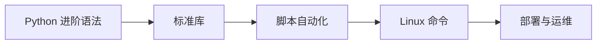

# Python进阶与Linux (Day 31-35)

> 深入理解Python高级特性，掌握Linux操作系统基础

---

## Day 31: Python语言进阶

### 生成式（推导式）

```python
# 列表生成式
squares = [x**2 for x in range(10)]
evens = [x for x in range(10) if x % 2 == 0]

# 字典生成式
prices = {'apple': 5.5, 'banana': 3.0, 'cherry': 8.0}
expensive = {k: v for k, v in prices.items() if v > 4}

# 集合生成式
unique_lengths = {len(x) for x in ['apple', 'banana', 'cherry']}

# 生成器表达式 (节省内存)
sum_of_squares = sum(x**2 for x in range(1000000))
```

### 迭代器与生成器

#### 迭代器 (Iterator)

```python
# 可迭代对象 vs 迭代器
from collections.abc import Iterable, Iterator

# 可迭代对象
my_list = [1, 2, 3]
print(isinstance(my_list, Iterable))  # True
print(isinstance(my_list, Iterator))  # False

# 创建迭代器
it = iter(my_list)
print(isinstance(it, Iterator))  # True

# 手动迭代
print(next(it))  # 1
print(next(it))  # 2

# 自定义迭代器
class CountDown:
    def __init__(self, start):
        self.start = start
    
    def __iter__(self):
        return self
    
    def __next__(self):
        if self.start <= 0:
            raise StopIteration
        self.start -= 1
        return self.start + 1

# 使用
counter = CountDown(5)
for num in counter:
    print(num)  # 5, 4, 3, 2, 1
```

#### 生成器 (Generator)

```python
# 函数生成器
def fibonacci(n):
    """斐波那契数列生成器"""
    a, b = 0, 1
    for _ in range(n):
        yield a
        a, b = b, a + b

# 使用
for num in fibonacci(10):
    print(num)

# 生成器表达式
gen = (x**2 for x in range(1000000))  # 不占用内存

# send() 方法
def accumulator():
    total = 0
    while True:
        value = yield total
        if value is None:
            break
        total += value

acc = accumulator()
next(acc)  # 初始化
print(acc.send(10))   # 10
print(acc.send(20))   # 30
```

### 高级模块

#### heapq - 堆队列

```python
import heapq

numbers = [34, 25, 12, 99, 87, 63, 58, 78, 88, 92]

# 最大/最小的N个元素
print(heapq.nlargest(3, numbers))   # [99, 92, 88]
print(heapq.nsmallest(3, numbers))  # [12, 25, 34]

# 复杂对象
stocks = [
    {'name': 'IBM', 'price': 91.1},
    {'name': 'AAPL', 'price': 543.22},
    {'name': 'FB', 'price': 21.09}
]
print(heapq.nlargest(2, stocks, key=lambda x: x['price']))
```

#### itertools - 迭代工具

```python
import itertools

# 无限迭代器
count = itertools.count(10, 2)  # 10, 12, 14, ...
cycle = itertools.cycle('ABC')  # A, B, C, A, B, C, ...
repeat = itertools.repeat(5, 3)  # 5, 5, 5

# 组合生成器
# 排列
print(list(itertools.permutations('ABC', 2)))
# [('A', 'B'), ('A', 'C'), ('B', 'A'), ('B', 'C'), ('C', 'A'), ('C', 'B')]

# 组合
print(list(itertools.combinations('ABC', 2)))
# [('A', 'B'), ('A', 'C'), ('B', 'C')]

# 笛卡尔积
print(list(itertools.product('AB', '12')))
# [('A', '1'), ('A', '2'), ('B', '1'), ('B', '2')]

# 分组
data = [('A', 1), ('A', 2), ('B', 3), ('B', 4)]
for key, group in itertools.groupby(data, key=lambda x: x[0]):
    print(key, list(group))
```

#### collections - 高级数据结构

```python
from collections import namedtuple, deque, Counter, defaultdict, OrderedDict

# namedtuple - 命名元组
Point = namedtuple('Point', ['x', 'y'])
p = Point(10, 20)
print(p.x, p.y)

# deque - 双端队列
d = deque([1, 2, 3])
d.appendleft(0)
d.append(4)
d.pop()
d.popleft()

# Counter - 计数器
words = ['apple', 'banana', 'apple', 'cherry', 'banana', 'apple']
counter = Counter(words)
print(counter.most_common(2))  # [('apple', 3), ('banana', 2)]

# defaultdict - 默认字典
dd = defaultdict(list)
dd['fruits'].append('apple')
dd['fruits'].append('banana')
print(dd['fruits'])  # ['apple', 'banana']
print(dd['vegetables'])  # [] (不会报错)

# OrderedDict - 有序字典 (Python 3.7+ dict本身就有序)
od = OrderedDict()
od['a'] = 1
od['b'] = 2
od['c'] = 3
```

### 闭包与装饰器进阶

```python
# 闭包
 def make_multiplier(n):
    def multiplier(x):
        return x * n
    return multiplier

double = make_multiplier(2)
triple = make_multiplier(3)
print(double(5))  # 10
print(triple(5))  # 15

# 带参数的装饰器
import functools
import time

def retry(max_attempts=3, delay=1):
    """重试装饰器"""
    def decorator(func):
        @functools.wraps(func)
        def wrapper(*args, **kwargs):
            attempts = 0
            while attempts < max_attempts:
                try:
                    return func(*args, **kwargs)
                except Exception as e:
                    attempts += 1
                    if attempts == max_attempts:
                        raise e
                    time.sleep(delay)
                    print(f"重试第{attempts}次...")
        return wrapper
    return decorator

@retry(max_attempts=3, delay=2)
def unstable_function():
    import random
    if random.random() < 0.7:
        raise Exception("随机错误")
    return "成功!"
```

### 上下文管理器

```python
# 自定义上下文管理器
class DatabaseConnection:
    def __init__(self, host, port):
        self.host = host
        self.port = port
        self.connection = None
    
    def __enter__(self):
        print(f"连接到数据库 {self.host}:{self.port}")
        self.connection = f"连接对象-{self.host}"
        return self.connection
    
    def __exit__(self, exc_type, exc_val, exc_tb):
        print("关闭数据库连接")
        if exc_type:
            print(f"发生异常: {exc_type}, {exc_val}")
        return False  # 不抑制异常

# 使用
with DatabaseConnection('localhost', 3306) as conn:
    print(f"执行操作: {conn}")

# 使用 contextlibrom contextlib import contextmanager

@contextmanager
def managed_resource():
    print("获取资源")
    resource = "资源"
    try:
        yield resource
    finally:
        print("释放资源")

with managed_resource() as res:
    print(f"使用{res}")
```

---

## Day 32-33: Web前端入门

### HTML基础

```html
<!DOCTYPE html>
<html lang="zh-CN">
<head>
    <meta charset="UTF-8">
    <meta name="viewport" content="width=device-width, initial-scale=1.0">
    <title>我的网页</title>
    <style>
        /* CSS样式 */
        body {
            font-family: Arial, sans-serif;
            margin: 0;
            padding: 20px;
        }
        .container {
            max-width: 800px;
            margin: 0 auto;
        }
        h1 {
            color: #333;
        }
        .btn {
            background: #007bff;
            color: white;
            padding: 10px 20px;
            border: none;
            border-radius: 4px;
            cursor: pointer;
        }
        .btn:hover {
            background: #0056b3;
        }
    </style>
</head>
<body>
    <div class="container">
        <h1>欢迎来到我的网站</h1>
        <p>这是一个段落。</p>
        <button class="btn" onclick="showMessage()">点击我</button>
    </div>
    
    <script>
        // JavaScript代码
        function showMessage() {
            alert('Hello, World!');
        }
    </script>
</body>
</html>
```

### CSS基础

```css
/* 选择器 */
/* 元素选择器 */
p {
    color: blue;
}

/* 类选择器 */
.highlight {
    background-color: yellow;
}

/* ID选择器 */
#header {
    font-size: 24px;
}

/* 后代选择器 */
.container p {
    margin: 10px 0;
}

/* 盒模型 */
.box {
    width: 300px;
    height: 200px;
    padding: 20px;      /* 内边距 */
    border: 1px solid #ccc;  /* 边框 */
    margin: 10px;       /* 外边距 */
    box-sizing: border-box;  /* 边框盒模型 */
}

/* Flex布局 */
.flex-container {
    display: flex;
    justify-content: center;  /* 水平居中 */
    align-items: center;      /* 垂直居中 */
    flex-wrap: wrap;          /* 换行 */
}

/* Grid布局 */
.grid-container {
    display: grid;
    grid-template-columns: repeat(3, 1fr);  /* 3列 */
    gap: 20px;
}
```

### JavaScript基础

```javascript
// 变量
let name = 'Alice';      // 可重新赋值
const PI = 3.14159;     // 常量
var old = '旧的声明方式'; // 避免使用

// 函数
function greet(name) {
    return `Hello, ${name}!`;
}

// 箭头函数
const square = x => x * x;
const add = (a, b) => a + b;

// 数组操作
const numbers = [1, 2, 3, 4, 5];
const doubled = numbers.map(x => x * 2);
const evens = numbers.filter(x => x % 2 === 0);
const sum = numbers.reduce((a, b) => a + b, 0);

// DOM操作
// 获取元素
document.getElementById('myId');
document.querySelector('.myClass');
document.querySelectorAll('div');

// 修改内容
element.textContent = '新文本';
element.innerHTML = '<strong>HTML内容</strong>';
element.style.color = 'red';

// 事件监听
document.getElementById('btn').addEventListener('click', function(event) {
    console.log('按钮被点击');
    event.preventDefault();  // 阻止默认行为
});

// Fetch API (AJAX)
fetch('https://api.example.com/data')
    .then(response => response.json())
    .then(data => console.log(data))
    .catch(error => console.error(error));

// async/await
async function getData() {
    try {
        const response = await fetch('https://api.example.com/data');
        const data = await response.json();
        return data;
    } catch (error) {
        console.error(error);
    }
}
```

---

## Day 34-35: Linux操作系统

### Linux基础命令

#### 文件和目录操作

```bash
# 查看当前目录
pwd

# 列出文件
ls                    # 简单列表
ls -l                 # 详细信息
ls -la                # 包含隐藏文件
ls -lh                # 人类可读大小

# 切换目录
cd /home/user         # 绝对路径
cd ~                  # 用户主目录
cd ..                 # 上级目录
cd -                  # 上次目录

# 创建目录
mkdir dirname
mkdir -p parent/child # 递归创建

# 创建文件
touch filename.txt

# 复制
cp source.txt dest.txt
cp -r source_dir/ dest_dir/  # 递归复制目录

# 移动/重命名
mv old.txt new.txt
mv file.txt /path/to/dest/

# 删除
rm file.txt
rm -r dirname/        # 递归删除目录
rm -rf dirname/       # 强制删除 (慎用!)

# 查看文件内容
cat file.txt          # 全部显示
head -n 20 file.txt   # 前20行
tail -n 20 file.txt   # 后20行
tail -f log.txt       # 实时跟踪
less file.txt         # 分页查看 (按q退出)
```

#### 文件权限

```bash
# 查看权限
ls -l file.txt
# -rw-r--r-- 1 user group 1234 Jan 1 12:00 file.txt
# [文件类型][所有者权限][组权限][其他用户权限]

# 修改权限
chmod 755 script.sh   # rwxr-xr-x
chmod u+x script.sh   # 给所有者添加执行权限
chmod g-w file.txt    # 给组移除写权限
chmod o=r file.txt    # 设置其他用户只读

# 修改所有者
chown user:group file.txt
chown -R user:group dirname/  # 递归修改

# 权限数字
# r=4, w=2, x=1
# 7=rwx, 6=rw-, 5=r-x, 4=r--, 0=---
```

#### 进程管理

```bash
# 查看进程
ps aux                # 所有进程
ps aux | grep python  # 筛选Python进程
top                   # 实时进程监控
htop                  # 更好的top (需安装)

# 杀死进程
kill PID              # 正常终止
kill -9 PID           # 强制终止
killall python        # 杀死所有Python进程

# 后台运行
python script.py &    # 后台运行
nohup python script.py &  # 脱离终端运行

# 查看端口
netstat -tlnp         # 查看监听端口
lsof -i :8080         # 查看占用8080端口的进程
```

#### 网络命令

```bash
# 测试连通性
ping google.com

# 查看网络配置
ifconfig              # 或 ip addr

# 查看路由
route -n              # 或 ip route

# 下载文件
wget https://example.com/file.zip
curl -O https://example.com/file.zip
curl -o custom_name.zip https://example.com/file.zip

# SSH远程登录
ssh user@hostname
ssh -p 2222 user@hostname  # 指定端口

# 传输文件
scp file.txt user@host:/path/
scp -r dirname/ user@host:/path/
```

#### 压缩解压

```bash
# tar.gz
tar -czvf archive.tar.gz dirname/   # 压缩
tar -xzvf archive.tar.gz            # 解压
tar -tzvf archive.tar.gz            # 查看内容

# zip
zip -r archive.zip dirname/         # 压缩
unzip archive.zip                   # 解压
unzip archive.zip -d /path/to/dest  # 解压到指定目录
```

#### 文本处理

```bash
# grep - 文本搜索
grep "pattern" file.txt
grep -i "pattern" file.txt          # 忽略大小写
grep -r "pattern" dirname/          # 递归搜索
grep -n "pattern" file.txt          # 显示行号
grep -v "pattern" file.txt          # 反向匹配

# sed - 流编辑器
sed 's/old/new/g' file.txt          # 替换文本
sed -i 's/old/new/g' file.txt       # 直接修改文件
sed '2d' file.txt                   # 删除第2行
sed -n '1,5p' file.txt              # 打印1-5行

# awk - 文本处理
awk '{print $1}' file.txt           # 打印第一列
awk -F',' '{print $2}' file.csv     # 指定分隔符
awk '{sum+=$1} END {print sum}' file.txt  # 求和

# 管道组合
cat file.txt | grep "error" | wc -l  # 统计错误行数
```

### Shell脚本编程

```bash
#!/bin/bash

# 变量
NAME="World"
NUMBER=42
ARRAY=("apple" "banana" "cherry")

# 使用变量
echo "Hello, $NAME!"
echo "Number: ${NUMBER}"

# 特殊变量
$0      # 脚本名
$1, $2  # 参数
$#      # 参数个数
$@      # 所有参数
$?      # 上一个命令的退出状态
$$      # 当前进程ID

# 条件判断
if [ "$NUMBER" -eq 42 ]; then
    echo "等于42"
elif [ "$NUMBER" -gt 42 ]; then
    echo "大于42"
else
    echo "小于42"
fi

# 字符串比较
if [ "$NAME" = "World" ]; then
    echo "匹配"
fi

# 文件判断
if [ -f "file.txt" ]; then
    echo "文件存在"
fi

if [ -d "dirname" ]; then
    echo "目录存在"
fi

# 循环
# for循环
for i in 1 2 3 4 5; do
    echo $i
done

for i in {1..5}; do
    echo $i
done

for file in *.txt; do
    echo $file
done

# while循环
counter=0
while [ $counter -lt 5 ]; do
    echo $counter
    ((counter++))
done

# 函数
greet() {
    local name=$1  # local声明局部变量
    echo "Hello, $name!"
}

greet "Alice"

# 命令替换
current_date=$(date +%Y-%m-%d)
echo "Today is $current_date"

# 算术运算
result=$((10 + 5))
echo $result

# 重定向
command > file.txt    # 标准输出重定向
command 2> error.log  # 标准错误重定向
command &> all.log    # 全部重定向
command >> file.txt   # 追加
command < input.txt   # 输入重定向

# 管道
command1 | command2   # 管道
```

### Python与Shell交互

```python
import subprocess
import os

# 执行简单命令
result = subprocess.run(['ls', '-la'], capture_output=True, text=True)
print(result.stdout)

# 执行Shell命令
result = subprocess.run('ls -la | grep python', shell=True, capture_output=True, text=True)

# 获取返回码
result = subprocess.run(['ls', 'nonexistent'])
print(result.returncode)  # 非0表示错误

# 使用os模块
current_dir = os.getcwd()
files = os.listdir('.')
os.mkdir('new_dir')
os.remove('file.txt')
os.path.exists('file.txt')
os.path.join('dir', 'file.txt')

# 环境变量
import os
path = os.environ.get('PATH')
os.environ['MY_VAR'] = 'value'
```

---

## 🎯 实战项目

### 项目1: 日志分析脚本

```python
#!/usr/bin/env python3
"""日志分析工具"""

import re
from collections import Counter

def analyze_log(log_file):
    """分析日志文件"""
    ip_pattern = r'\d{1,3}\.\d{1,3}\.\d{1,3}\.\d{1,3}'
    error_pattern = r'ERROR|WARN'
    
    ip_counter = Counter()
    error_count = 0
    total_requests = 0
    
    with open(log_file, 'r') as f:
        for line in f:
            total_requests += 1
            
            # 统计IP
            ip = re.search(ip_pattern, line)
            if ip:
                ip_counter[ip.group()] += 1
            
            # 统计错误
            if re.search(error_pattern, line):
                error_count += 1
    
    print(f"总请求数: {total_requests}")
    print(f"错误数: {error_count}")
    print(f"\nTop 10 IP:")
    for ip, count in ip_counter.most_common(10):
        print(f"  {ip}: {count}")

if __name__ == '__main__':
    import sys
    if len(sys.argv) > 1:
        analyze_log(sys.argv[1])
    else:
        print("Usage: python log_analyzer.py <logfile>")
```

### 项目2: 自动化部署脚本

```bash
#!/bin/bash

# 自动化部署脚本

PROJECT_DIR="/var/www/myapp"
BACKUP_DIR="/var/backups/myapp"
TIMESTAMP=$(date +%Y%m%d_%H%M%S)

echo "开始部署..."

# 备份
echo "创建备份..."
tar -czvf "$BACKUP_DIR/backup_$TIMESTAMP.tar.gz" -C "$PROJECT_DIR" .

# 拉取最新代码
echo "更新代码..."
cd "$PROJECT_DIR"
git pull origin main

# 安装依赖
echo "安装依赖..."
pip install -r requirements.txt

# 数据库迁移
echo "执行数据库迁移..."
python manage.py migrate

# 收集静态文件
echo "收集静态文件..."
python manage.py collectstatic --noinput

# 重启服务
echo "重启服务..."
sudo systemctl restart gunicorn
sudo systemctl restart nginx

echo "部署完成!"
```

---

## 📝 重点总结

### Python进阶要点

1. **生成式**: 简洁高效地创建数据结构
2. **生成器**: 节省内存的迭代方式
3. **装饰器**: 扩展函数功能而不修改源码
4. **上下文管理器**: 确保资源正确释放
5. **标准库**: heapq, itertools, collections

### Linux必备技能

1. **文件操作**: ls, cd, cp, mv, rm, touch
2. **权限管理**: chmod, chown
3. **进程管理**: ps, top, kill
4. **网络工具**: ping, curl, ssh, scp
5. **文本处理**: grep, sed, awk
6. **脚本编程**: bash脚本基础

---

**下一步**: [[02-应用-数据库与SQL|数据库与SQL]] → 学习MySQL数据库操作

## 进阶能力路径



## 实践检查清单

- 是否能解释生成器、装饰器和上下文管理器的适用场景。
- 是否能用 `collections`、`itertools`、`pathlib` 简化代码。
- 是否能写可重复执行的脚本，而不是一次性手工命令。
- 是否理解 Linux 权限、进程、日志和网络排查基础。
- 部署脚本是否包含错误处理、备份和回滚。

## 常见误区

- 把脚本写成只能在自己电脑运行的临时代码。
- 在部署脚本里忽略失败退出，导致半部署状态。
- 不记录日志，出问题后无法复盘。
