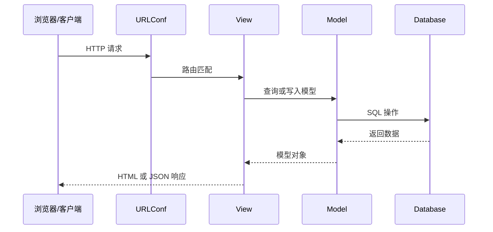

# Python Web开发 (Day 46-60)

> 掌握Django框架，开发完整的Web应用程序

---

## Django基础

### MVC vs MTV

```
传统MVC:
Model - 数据模型
View - 用户界面
Controller - 控制器

Django的MTV:
Model - 数据模型
Template - 模板 (界面)
View - 视图 (控制器)
```

### 快速开始

```bash
# 安装Django
pip install django

# 创建项目
django-admin startproject myproject
cd myproject

# 创建应用
python manage.py startapp myapp

# 运行开发服务器
python manage.py runserver

# 数据库迁移
python manage.py makemigrations
python manage.py migrate

# 创建超级用户
python manage.py createsuperuser
```

### 项目结构

```
myproject/
├── manage.py              # 命令行工具
├── myproject/             # 项目配置
│   ├── __init__.py
│   ├── settings.py        # 项目设置
│   ├── urls.py           # URL路由
│   ├── asgi.py           # ASGI配置
│   └── wsgi.py           # WSGI配置
└── myapp/                # 应用
    ├── __init__.py
    ├── admin.py          # 后台管理
    ├── apps.py           # 应用配置
    ├── models.py         # 数据模型
    ├── views.py          # 视图
    ├── urls.py           # 应用路由
    ├── forms.py          # 表单
    ├── tests.py          # 测试
    └── templates/        # HTML模板
```

---

## 模型 (Models)

### 定义模型

```python
from django.db import models
from django.contrib.auth.models import User

class Category(models.Model):
    name = models.CharField(max_length=100)
    slug = models.SlugField(unique=True)
    created_at = models.DateTimeField(auto_now_add=True)
    
    class Meta:
        verbose_name_plural = 'categories'
        ordering = ['name']
    
    def __str__(self):
        return self.name

class Article(models.Model):
    STATUS_CHOICES = [
        ('draft', '草稿'),
        ('published', '已发布'),
    ]
    
    title = models.CharField(max_length=200)
    slug = models.SlugField(unique=True)
    content = models.TextField()
    status = models.CharField(
        max_length=10,
        choices=STATUS_CHOICES,
        default='draft'
    )
    author = models.ForeignKey(
        User,
        on_delete=models.CASCADE,
        related_name='articles'
    )
    category = models.ForeignKey(
        Category,
        on_delete=models.SET_NULL,
        null=True,
        related_name='articles'
    )
    tags = models.ManyToManyField('Tag', blank=True)
    views = models.PositiveIntegerField(default=0)
    created_at = models.DateTimeField(auto_now_add=True)
    updated_at = models.DateTimeField(auto_now=True)
    
    class Meta:
        ordering = ['-created_at']
        indexes = [
            models.Index(fields=['-created_at']),
        ]
    
    def __str__(self):
        return self.title

class Tag(models.Model):
    name = models.CharField(max_length=50, unique=True)
    
    def __str__(self):
        return self.name
```

### 模型操作

```python
# 创建
article = Article(
    title='标题',
    content='内容',
    author=request.user
)
article.save()

# 或使用create
Article.objects.create(
    title='标题',
    content='内容',
    author=request.user
)

# 查询
Article.objects.all()                              # 所有
Article.objects.filter(status='published')         # 筛选
Article.objects.exclude(status='draft')            # 排除
Article.objects.get(id=1)                          # 单条 (不存在报错)
Article.objects.first()                            # 第一条
Article.objects.last()                             # 最后一条

# 复杂查询
from django.db.models import Q, Count, Avg

Article.objects.filter(
    Q(status='published') | Q(author=request.user)
)

Article.objects.filter(
    created_at__year=2024,
    views__gt=100
)

# 关联查询
Article.objects.select_related('author', 'category')  # 外键预加载
Article.objects.prefetch_related('tags')               # 多对多预加载

# 聚合
from django.db.models import Count, Avg, Max, Min
Article.objects.aggregate(
    total=Count('id'),
    avg_views=Avg('views')
)

# 排序
Article.objects.order_by('-created_at')  # 降序
Article.objects.order_by('?')             # 随机

# 分页
from django.core.paginator import Paginator

articles = Article.objects.all()
paginator = Paginator(articles, 10)  # 每页10条

page = paginator.get_page(page_number)
page.object_list      # 当前页数据
page.has_next()       # 是否有下一页
page.has_previous()   # 是否有上一页
```

---

## 视图 (Views)

### 函数视图

```python
from django.shortcuts import render, get_object_or_404, redirect
from django.http import JsonResponse, HttpResponse
from django.contrib.auth.decorators import login_required
from .models import Article
from .forms import ArticleForm

def article_list(request):
    """文章列表"""
    articles = Article.objects.filter(status='published')
    return render(request, 'myapp/article_list.html', {
        'articles': articles
    })

def article_detail(request, slug):
    """文章详情"""
    article = get_object_or_404(Article, slug=slug)
    article.views += 1
    article.save()
    return render(request, 'myapp/article_detail.html', {
        'article': article
    })

@login_required
def article_create(request):
    """创建文章"""
    if request.method == 'POST':
        form = ArticleForm(request.POST)
        if form.is_valid():
            article = form.save(commit=False)
            article.author = request.user
            article.save()
            return redirect('article_detail', slug=article.slug)
    else:
        form = ArticleForm()
    
    return render(request, 'myapp/article_form.html', {
        'form': form
    })

def article_api(request):
    """API接口"""
    articles = Article.objects.filter(status='published').values(
        'title', 'slug', 'created_at'
    )
    return JsonResponse(list(articles), safe=False)
```

### 类视图

```python
from django.views.generic import (
    ListView, DetailView, CreateView,
    UpdateView, DeleteView
)
from django.contrib.auth.mixins import LoginRequiredMixin
from django.urls import reverse_lazy

class ArticleListView(ListView):
    model = Article
    template_name = 'myapp/article_list.html'
    context_object_name = 'articles'
    paginate_by = 10
    
    def get_queryset(self):
        return Article.objects.filter(status='published')

class ArticleDetailView(DetailView):
    model = Article
    template_name = 'myapp/article_detail.html'
    slug_url_kwarg = 'slug'
    
    def get_object(self, queryset=None):
        obj = super().get_object(queryset)
        obj.views += 1
        obj.save()
        return obj

class ArticleCreateView(LoginRequiredMixin, CreateView):
    model = Article
    form_class = ArticleForm
    template_name = 'myapp/article_form.html'
    
    def form_valid(self, form):
        form.instance.author = self.request.user
        return super().form_valid(form)
    
    def get_success_url(self):
        return reverse('article_detail', kwargs={'slug': self.object.slug})

class ArticleUpdateView(LoginRequiredMixin, UpdateView):
    model = Article
    form_class = ArticleForm
    template_name = 'myapp/article_form.html'
    slug_url_kwarg = 'slug'
    
    def get_queryset(self):
        # 只能编辑自己的文章
        return Article.objects.filter(author=self.request.user)
```

---

## URL路由

```python
# myproject/urls.py
from django.contrib import admin
from django.urls import path, include
from django.conf import settings
from django.conf.urls.static import static

urlpatterns = [
    path('admin/', admin.site.urls),
    path('', include('myapp.urls')),
    path('api/', include('myapp.api_urls')),
]

if settings.DEBUG:
    urlpatterns += static(settings.MEDIA_URL, document_root=settings.MEDIA_ROOT)

# myapp/urls.py
from django.urls import path
from . import views

app_name = 'myapp'

urlpatterns = [
    path('', views.ArticleListView.as_view(), name='article_list'),
    path('article/<slug:slug>/', views.ArticleDetailView.as_view(), name='article_detail'),
    path('article/create/', views.ArticleCreateView.as_view(), name='article_create'),
    path('article/<slug:slug>/edit/', views.ArticleUpdateView.as_view(), name='article_update'),
    path('article/<slug:slug>/delete/', views.ArticleDeleteView.as_view(), name='article_delete'),
]
```

---

## 模板 (Templates)

### 基础语法

```html
<!-- templates/base.html -->
<!DOCTYPE html>
<html lang="zh-CN">
<head>
    <meta charset="UTF-8">
    <title>My Site</title>
    
    <link rel="stylesheet" href="">
    
</head>
<body>
    <nav>
        <a href="">首页</a>
        
            <span>欢迎，{{ user.username }}</span>
            <a href="">退出</a>
        
            <a href="">登录</a>
        
    </nav>
    
    <main>
        
            
                <div class="alert alert-{{ message.tags }}">
                    {{ message }}
                </div>
            
        
        
        
    </main>
    
    <script src=""></script>
    
</body>
</html>

<!-- templates/myapp/article_list.html -->


文章列表


<h1>文章列表</h1>


    <a href="" class="btn">写文章</a>


<div class="article-list">
    
        <article>
            <h2>
                <a href="">
                    {{ article.title }}
                </a>
            </h2>
            <p class="meta">
                作者：{{ article.author.username }} |
                时间：{{ article.created_at|date:"Y-m-d" }} |
                阅读：{{ article.views }}
            </p>
            <p>{{ article.content|truncatewords:30 }}</p>
        </article>
    
        <p>暂无文章</p>
    
</div>

<!-- 分页 -->

    <div class="pagination">
        
            <a href="?page={{ page_obj.previous_page_number }}">上一页</a>
        
        <span>第 {{ page_obj.number }} 页</span>
        
            <a href="?page={{ page_obj.next_page_number }}">下一页</a>
        
    </div>


```

### 模板标签和过滤器

```html
<!-- 变量 -->
{{ variable }}
{{ variable|default:"默认值" }}
{{ variable|length }}
{{ text|truncatewords:20 }}
{{ date|date:"Y-m-d H:i" }}
{{ html|safe }}  <!-- 小心XSS -->

<!-- 逻辑 -->

    <p>欢迎回来</p>

    <p>管理员</p>

    <p>请登录</p>



    {{ forloop.counter }}. {{ item }}

    <p>没有数据</p>


<!-- 注释 -->
{# 单行注释 #}

多行
注释

```

---

## Django REST Framework (DRF)

### 快速开始

```bash
pip install djangorestframework
```

```python
# settings.py
INSTALLED_APPS = [
    ...
    'rest_framework',
]

# serializers.py
from rest_framework import serializers
from .models import Article

class ArticleSerializer(serializers.ModelSerializer):
    author_name = serializers.CharField(source='author.username', read_only=True)
    
    class Meta:
        model = Article
        fields = ['id', 'title', 'slug', 'content', 'status', 
                  'author', 'author_name', 'created_at', 'updated_at']
        read_only_fields = ['slug', 'created_at', 'updated_at']

# views.py
from rest_framework import viewsets, permissions
from rest_framework.decorators import action
from rest_framework.response import Response
from .models import Article
from .serializers import ArticleSerializer

class ArticleViewSet(viewsets.ModelViewSet):
    queryset = Article.objects.all()
    serializer_class = ArticleSerializer
    permission_classes = [permissions.IsAuthenticatedOrReadOnly]
    lookup_field = 'slug'
    
    def get_queryset(self):
        queryset = Article.objects.all()
        status = self.request.query_params.get('status', None)
        if status:
            queryset = queryset.filter(status=status)
        return queryset
    
    def perform_create(self, serializer):
        serializer.save(author=self.request.user)
    
    @action(detail=True, methods=['post'])
    def publish(self, request, slug=None):
        article = self.get_object()
        article.status = 'published'
        article.save()
        return Response({'status': 'published'})

# urls.py
from rest_framework.routers import DefaultRouter
from . import api_views

router = DefaultRouter()
router.register(r'articles', api_views.ArticleViewSet)

urlpatterns = [
    path('', include(router.urls)),
]
```

---

## 🎯 实战项目

### 博客系统核心功能

```python
# models.py
from django.db import models
from django.contrib.auth.models import User

class Post(models.Model):
    title = models.CharField(max_length=200)
    content = models.TextField()
    author = models.ForeignKey(User, on_delete=models.CASCADE)
    published = models.DateTimeField(auto_now_add=True)
    updated = models.DateTimeField(auto_now=True)
    
    class Meta:
        ordering = ['-published']
    
    def __str__(self):
        return self.title

class Comment(models.Model):
    post = models.ForeignKey(Post, on_delete=models.CASCADE, related_name='comments')
    author = models.ForeignKey(User, on_delete=models.CASCADE)
    content = models.TextField()
    created = models.DateTimeField(auto_now_add=True)

# views.py - API
from rest_framework import generics, permissions
from .models import Post, Comment
from .serializers import PostSerializer, CommentSerializer

class PostListCreateView(generics.ListCreateAPIView):
    queryset = Post.objects.all()
    serializer_class = PostSerializer
    permission_classes = [permissions.IsAuthenticatedOrReadOnly]
    
    def perform_create(self, serializer):
        serializer.save(author=self.request.user)

class PostDetailView(generics.RetrieveUpdateDestroyAPIView):
    queryset = Post.objects.all()
    serializer_class = PostSerializer
    permission_classes = [permissions.IsAuthenticatedOrReadOnly]
    
    def get_object(self):
        obj = super().get_object()
        # 只有作者可以修改
        if self.request.method in ['PUT', 'PATCH', 'DELETE']:
            if obj.author != self.request.user:
                raise permissions.PermissionDenied("只有作者可以修改")
        return obj
```

---

## 📝 重点总结

### Django开发流程

1. **创建项目和应用**
2. **定义模型** → 迁移数据库
3. **创建序列化器** (API)
4. **编写视图**
5. **配置URL路由**
6. **创建模板**
7. **测试和部署**

### 性能优化

```python
# 1. 使用select_related和prefetch_related
Article.objects.select_related('author').prefetch_related('tags')

# 2. 使用values/values_list减少数据传输
Article.objects.values('title', 'slug')

# 3. 使用缓存
from django.core.cache import cache

data = cache.get('key')
if data is None:
    data = expensive_query()
    cache.set('key', data, 300)

# 4. 数据库索引
class Article(models.Model):
    class Meta:
        indexes = [
            models.Index(fields=['-created_at']),
        ]
```

---

## Django 请求流程图



## 实践检查清单

- Model 是否表达清楚领域对象和关系。
- View 是否只处理请求编排，复杂业务是否下沉到 Service。
- API 是否有序列化器、权限、分页和错误处理。
- 查询是否使用 `select_related`、`prefetch_related` 控制 N+1。
- 部署前是否配置环境变量、静态资源、数据库迁移和日志。

## 案例延伸

博客系统完成 CRUD 后，可以继续补登录、作者权限、评论审核、搜索、缓存和部署。这样能从“能跑 Demo”过渡到“接近真实项目”的完整闭环。

**下一步**: [[03-方向B-网络爬虫|网络爬虫]] → 学习数据采集技术
