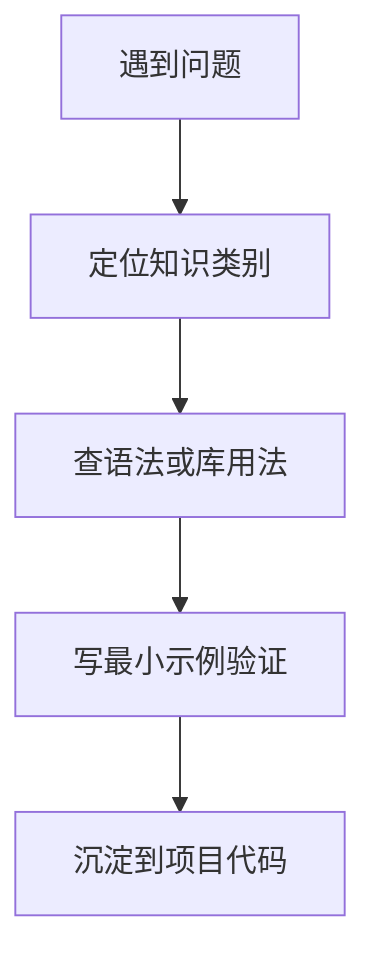

# Python-100-Days 核心知识点总结

> 从100天学习项目中提炼的核心知识点和技能树

---

## 🎯 核心技能树

```
Python开发技能树
│
├── 基础技能（必须掌握）
│   ├── 基础语法
│   ├── 数据结构
│   ├── 函数和模块
│   └── 面向对象
│
├── 应用技能（工作必备）
│   ├── 文件操作
│   ├── 办公自动化
│   ├── 数据库操作
│   └── Web开发
│
├── 进阶技能（提升竞争力）
│   ├── 网络爬虫
│   ├── 数据分析
│   ├── 机器学习
│   └── 工程化能力
│
└── 软技能（职业发展）
    ├── 团队协作
    ├── 项目管理
    └── 系统设计
```

---

## 📚 第一阶段核心：Python基础（Day01-20）

### 基础语法要点

#### 1. 变量与数据类型
```python
# 基本类型
int_val = 10          # 整数
float_val = 3.14      # 浮点数
str_val = "hello"     # 字符串
bool_val = True       # 布尔值
none_val = None       # 空值

# 类型转换
int("123")      # 123
str(123)        # "123"
float("3.14")   # 3.14
```

#### 2. 运算符优先级（重要）
```
1. 括号 ()
2. 幂运算 **
3. 正负号 +x, -x
4. 乘除 * / // %
5. 加减 + -
6. 比较 < <= > >= == !=
7. 逻辑 not
8. 逻辑 and
9. 逻辑 or
```

#### 3. 控制流技巧
```python
# 列表推导式（重要）
squares = [x**2 for x in range(10) if x % 2 == 0]

# 三元表达式
result = "偶数" if x % 2 == 0 else "奇数"

# enumerate遍历
for index, value in enumerate(['a', 'b', 'c']):
    print(index, value)

# zip并行遍历
for x, y in zip(list1, list2):
    print(x, y)
```

### 数据结构要点

#### 1. 列表操作（最常用）
```python
# 常用方法
lst.append(x)       # 添加元素
lst.insert(i, x)    # 插入元素
lst.remove(x)       # 删除元素
lst.pop([i])        # 删除并返回
lst.sort()          # 排序
lst.reverse()       # 反转

# 切片操作（核心）
lst[1:4]     # 索引1到3
lst[:3]      # 开头到2
lst[2:]      # 2到结尾
lst[::2]     # 每隔一个
lst[::-1]    # 反转
```

#### 2. 字典操作（最常用）
```python
# 常用方法
dict.get(key, default)  # 安全获取
dict.keys()             # 所有键
dict.values()           # 所有值
dict.items()            # 键值对

# 字典推导式
d = {k: v for k, v in zip(keys, values)}

# 合并字典（Python 3.9+）
dict1 | dict2
dict1 |= dict2
```

#### 3. 集合运算
```python
set1 | set2     # 并集
set1 & set2     # 交集
set1 - set2     # 差集
set1 ^ set2     # 对称差集
```

### 函数要点

#### 1. 参数类型（重点）
```python
def func(a, b=2, *args, c, d=4, **kwargs):
    """
    a: 位置参数
    b: 默认参数
    args: 可变位置参数（元组）
    c: 命名关键字参数
    d: 带默认值的命名关键字参数
    kwargs: 可变关键字参数（字典）
    """
    pass
```

#### 2. 装饰器（进阶）
```python
import functools

def my_decorator(func):
    @functools.wraps(func)
    def wrapper(*args, **kwargs):
        # 前置处理
        result = func(*args, **kwargs)
        # 后置处理
        return result
    return wrapper
```

#### 3. Lambda表达式
```python
# 简单函数
square = lambda x: x ** 2

# 与高阶函数结合
sorted(data, key=lambda x: x['age'])
list(filter(lambda x: x > 0, numbers))
```

### 面向对象要点

#### 1. 类的基本结构
```python
class Person:
    species = "人类"  # 类属性
    
    def __init__(self, name, age):
        self.name = name      # 实例属性
        self._age = age       # 受保护属性
        self.__id = "secret"  # 私有属性（名称修饰）
    
    def method(self):         # 实例方法
        pass
    
    @classmethod
    def class_method(cls):    # 类方法
        pass
    
    @staticmethod
    def static_method():      # 静态方法
        pass
    
    @property
    def age(self):            # 属性装饰器
        return self._age
    
    @age.setter
    def age(self, value):
        if value > 0:
            self._age = value
```

#### 2. 继承和多态
```python
class Student(Person):
    def __init__(self, name, age, student_id):
        super().__init__(name, age)  # 调用父类构造
        self.student_id = student_id
    
    def method(self):  # 方法重写
        super().method()  # 调用父类方法
        # 子类逻辑
```

#### 3. 魔术方法（重要）
```python
__init__      # 初始化
__str__       # str(obj)
__repr__      # repr(obj)
__eq__        # ==
__lt__        # <
__add__       # +
__getitem__   # obj[key]
__call__      # obj()
__len__       # len(obj)
```

---

## 📚 第二阶段核心：Python应用（Day21-35）

### 文件操作要点

```python
# 读写文件（必须掌握）
with open('file.txt', 'r', encoding='utf-8') as f:
    content = f.read()           # 读取全部
    lines = f.readlines()        # 读取为列表

with open('file.txt', 'w', encoding='utf-8') as f:
    f.write('content')

# 异常处理（必须掌握）
try:
    risky_operation()
except SpecificError as e:
    print(f"处理特定错误: {e}")
except Exception as e:
    print(f"处理其他错误: {e}")
else:
    print("无异常时执行")
finally:
    print("始终执行")
```

### 办公自动化要点

| 文件类型 | 常用库 | 核心操作 |
|---------|--------|---------|
| CSV | csv | reader/writer, DictReader/DictWriter |
| Excel | openpyxl | 读写单元格、样式、图表 |
| Word | python-docx | 段落、表格、图片 |
| PDF | PyPDF2/pdfplumber | 读取、合并、旋转、加密 |
| 图片 | Pillow | 打开、变换、滤镜、绘图 |
| 邮件 | smtplib/email | 发送文本/HTML/附件邮件 |

### 正则表达式要点

```python
import re

# 常用方法
re.match(pattern, string)    # 从头匹配
re.search(pattern, string)   # 搜索第一个
re.findall(pattern, string)  # 查找所有
re.sub(pattern, repl, string) # 替换
re.split(pattern, string)    # 分割

# 常用模式
\d      # 数字
\w      # 字母数字下划线
\s      # 空白字符
.       # 任意字符
*       # 0次或多次
+       # 1次或多次
?       # 0次或1次
{n,m}   # n到m次
^       # 开头
$       # 结尾
```

---

## 📚 第三阶段核心：数据库（Day36-45）

### SQL核心语句

```sql
-- DDL（数据定义）
CREATE TABLE users (
    id INT PRIMARY KEY AUTO_INCREMENT,
    name VARCHAR(50) NOT NULL,
    email VARCHAR(100) UNIQUE,
    created_at TIMESTAMP DEFAULT CURRENT_TIMESTAMP
);

-- DML（数据操作）
INSERT INTO users (name, email) VALUES ('张三', 'zhangsan@example.com');
UPDATE users SET name = '李四' WHERE id = 1;
DELETE FROM users WHERE id = 1;

-- DQL（数据查询）- 最重要
SELECT * FROM users WHERE age > 18 ORDER BY created_at DESC LIMIT 10;
SELECT department, COUNT(*) as count FROM employees GROUP BY department HAVING count > 5;

-- 表连接
SELECT u.name, o.order_no 
FROM users u 
INNER JOIN orders o ON u.id = o.user_id;
```

### Python操作MySQL

```python
import pymysql

# 建立连接
conn = pymysql.connect(
    host='localhost',
    user='root',
    password='password',
    database='test',
    charset='utf8mb4'
)

try:
    with conn.cursor() as cursor:
        # 执行SQL
        cursor.execute("SELECT * FROM users WHERE id = %s", (1,))
        result = cursor.fetchone()  # fetchall() fetchmany()
        
        # 插入数据
        cursor.execute("INSERT INTO users (name) VALUES (%s)", ("张三",))
        conn.commit()
except Exception as e:
    conn.rollback()
    print(f"Error: {e}")
finally:
    conn.close()
```

---

## 📚 第四阶段核心：Web开发（Day46-60）

### Django核心概念

```
MTV模式：
- Model: 数据模型（ORM）
- Template: 模板（HTML渲染）
- View: 视图（业务逻辑）
```

### Django常用操作

```python
# models.py - 定义模型
from django.db import models

class Article(models.Model):
    title = models.CharField(max_length=200)
    content = models.TextField()
    created_at = models.DateTimeField(auto_now_add=True)
    
    class Meta:
        db_table = 'articles'
        ordering = ['-created_at']

# views.py - 视图函数
from django.http import JsonResponse

def article_list(request):
    articles = Article.objects.all()[:10]
    data = [{'title': a.title, 'content': a.content} for a in articles]
    return JsonResponse({'data': data})

# urls.py - 路由配置
from django.urls import path
from . import views

urlpatterns = [
    path('articles/', views.article_list, name='article_list'),
]
```

### Django REST Framework要点

```python
# serializers.py
from rest_framework import serializers

class ArticleSerializer(serializers.ModelSerializer):
    class Meta:
        model = Article
        fields = '__all__'

# views.py - 使用ViewSet
from rest_framework import viewsets

class ArticleViewSet(viewsets.ModelViewSet):
    queryset = Article.objects.all()
    serializer_class = ArticleSerializer

# urls.py
from rest_framework.routers import DefaultRouter

router = DefaultRouter()
router.register(r'articles', ArticleViewSet)

urlpatterns = router.urls
```

---

## 📚 第五阶段核心：网络爬虫（Day61-65）

### 爬虫基础

```python
import requests
from bs4 import BeautifulSoup

# 基本请求
headers = {
    'User-Agent': 'Mozilla/5.0 (Windows NT 10.0; Win64; x64) AppleWebKit/537.36'
}
response = requests.get('https://example.com', headers=headers)
html = response.text

# 解析HTML
soup = BeautifulSoup(html, 'lxml')
titles = soup.select('h2.title')  # CSS选择器
links = soup.find_all('a', {'class': 'link'})
```

### 并发爬虫

```python
# 多线程
from concurrent.futures import ThreadPoolExecutor

def fetch(url):
    return requests.get(url).text

with ThreadPoolExecutor(max_workers=5) as executor:
    results = executor.map(fetch, urls)

# 异步爬虫
import aiohttp
import asyncio

async def fetch(session, url):
    async with session.get(url) as response:
        return await response.text()

async def main():
    async with aiohttp.ClientSession() as session:
        tasks = [fetch(session, url) for url in urls]
        results = await asyncio.gather(*tasks)

asyncio.run(main())
```

---

## 📚 第六阶段核心：数据分析（Day66-80）

### NumPy要点

```python
import numpy as np

# 创建数组
arr = np.array([1, 2, 3])
arr2d = np.array([[1, 2], [3, 4]])
zeros = np.zeros((3, 3))
ones = np.ones((2, 2))
random = np.random.randn(3, 3)

# 数组操作
arr.shape      # 形状
arr.dtype      # 数据类型
arr.reshape(2, 2)  # 重塑
arr.T          # 转置

# 索引和切片
arr[0]         # 第一个元素
arr[1:3]       # 切片
arr[arr > 0]   # 布尔索引

# 运算
arr + 1        # 广播
arr * 2
np.dot(arr1, arr2)  # 矩阵乘法
```

### Pandas要点

```python
import pandas as pd

# 创建DataFrame
df = pd.DataFrame({
    'name': ['张三', '李四', '王五'],
    'age': [25, 30, 35],
    'salary': [5000, 6000, 7000]
})

# 数据读写
df = pd.read_csv('data.csv')
df = pd.read_excel('data.xlsx')
df.to_csv('output.csv', index=False)

# 数据查看
df.head(10)      # 前10行
df.tail(5)       # 后5行
df.info()        # 信息
df.describe()    # 统计描述

# 数据选择
df['name']                    # 选择列
df[['name', 'age']]          # 选择多列
df.loc[0]                     # 按索引选择行
df.iloc[0:5]                  # 按位置选择
df[df['age'] > 25]           # 条件筛选

# 数据处理
df.dropna()                   # 删除缺失值
df.fillna(0)                  # 填充缺失值
df.drop_duplicates()          # 删除重复值
df.groupby('department').agg({'salary': 'mean'})  # 分组聚合
df.merge(df2, on='id')        # 合并
df.sort_values('age')         # 排序
```

---

## 📚 第七阶段核心：机器学习（Day81-90）

### 机器学习流程

```
1. 数据准备
   └── 数据收集、清洗、探索（EDA）

2. 特征工程
   └── 特征选择、特征变换、降维

3. 模型训练
   └── 选择算法、划分训练集测试集、训练模型

4. 模型评估
   └── 准确率、精确率、召回率、F1-score

5. 模型优化
   └── 交叉验证、超参数调优、正则化

6. 模型部署
   └── 保存模型、API服务化
```

### scikit-learn示例

```python
from sklearn.model_selection import train_test_split
from sklearn.preprocessing import StandardScaler
from sklearn.linear_model import LogisticRegression
from sklearn.metrics import accuracy_score

# 1. 数据准备
X_train, X_test, y_train, y_test = train_test_split(X, y, test_size=0.2)

# 2. 特征缩放
scaler = StandardScaler()
X_train_scaled = scaler.fit_transform(X_train)
X_test_scaled = scaler.transform(X_test)

# 3. 训练模型
model = LogisticRegression()
model.fit(X_train_scaled, y_train)

# 4. 预测和评估
predictions = model.predict(X_test_scaled)
accuracy = accuracy_score(y_test, predictions)
```

---

## 📚 第八阶段核心：工程化（Day91-100）

### 开发规范

```python
# 代码风格（PEP 8）
# 1. 缩进：4个空格
# 2. 行长度：79字符
# 3. 命名：
#    - 变量/函数：小写下划线（snake_case）
#    - 类名：驼峰命名（CamelCase）
#    - 常量：全大写下划线（UPPER_CASE）

# 文档字符串
def function(arg1, arg2):
    """
    函数简短描述。
    
    Args:
        arg1: 参数1说明
        arg2: 参数2说明
    
    Returns:
        返回值说明
    
    Raises:
        ValueError: 异常说明
    """
    pass
```

### Git常用命令

```bash
# 基础操作
git init
git clone <url>
git add .
git commit -m "message"
git push origin main
git pull origin main

# 分支操作
git branch              # 查看分支
git branch feature      # 创建分支
git checkout feature    # 切换分支
git checkout -b feature # 创建并切换
git merge feature       # 合并分支

# 高级操作
git stash               # 暂存修改
git reset --soft HEAD~1 # 撤销上次提交
git log --oneline       # 简洁日志
git diff                # 查看差异
```

### Docker基础

```dockerfile
# Dockerfile示例
FROM python:3.9-slim

WORKDIR /app

COPY requirements.txt .
RUN pip install -r requirements.txt

COPY . .

EXPOSE 8000

CMD ["python", "manage.py", "runserver", "0.0.0.0:8000"]
```

```bash
# Docker常用命令
docker build -t myapp .
docker run -d -p 8000:8000 myapp
docker ps
docker stop <container_id>
docker-compose up -d
```

---

## 🎯 学习路径建议

### 初学者路线（0基础）
```
第1-3周: Day01-20（基础语法 + 数据结构 + 函数 + OOP）
第4-5周: Day21-30（文件操作 + 办公自动化）
第6-8周: Day36-45（数据库 + SQL）
第9-12周: Day46-60（Django Web开发）
第13周+: 选择方向深入学习
```

### 转行者路线（有其他语言基础）
```
第1-2周: Day01-20（快速过一遍语法差异）
第3-4周: Day21-35（Python特有应用）
第5-8周: Day46-60（Django框架）
第9周+: 根据职业方向选择（爬虫/数据分析/机器学习）
```

### 进阶路线（Python开发者）
```
第1-2周: Day61-65（爬虫 + 并发编程）
第3-5周: Day66-80（数据分析三剑客）
第6-8周: Day81-90（机器学习入门）
第9-10周: Day91-100（工程化 + 架构设计）
```

---

## ⚠️ 常见陷阱和最佳实践

### 常见错误
```python
# 错误1：可变默认参数
def bad_func(items=[]):  # ❌ 不要这样做
    items.append(1)
    return items

def good_func(items=None):  # ✅ 正确做法
    if items is None:
        items = []
    items.append(1)
    return items

# 错误2：循环中修改列表
lst = [1, 2, 3, 4]
for i in lst:
    if i == 2:
        lst.remove(i)  # ❌ 危险操作

# 正确做法
lst = [x for x in lst if x != 2]  # ✅ 列表推导式

# 错误3：不关闭文件
f = open('file.txt')  # ❌
data = f.read()
f.close()

with open('file.txt') as f:  # ✅ 使用with
    data = f.read()
```

### 性能优化
```python
# 1. 使用生成器替代列表
# 差
sum([x**2 for x in range(1000000)])
# 好
sum(x**2 for x in range(1000000))

# 2. 使用局部变量
def fast():
    append = result.append
    for i in range(1000):
        append(i)

# 3. 使用合适的数据结构
from collections import defaultdict, Counter

# 4. 缓存结果
from functools import lru_cache

@lru_cache(maxsize=128)
def fib(n):
    if n < 2:
        return n
    return fib(n-1) + fib(n-2)
```

---

## 📖 推荐深入学习顺序

1. **必学基础**（优先级：⭐⭐⭐⭐⭐）
   - 基础语法、数据结构、函数、OOP
   - 文件操作、异常处理
   - 数据库和SQL

2. **职业方向**（优先级：⭐⭐⭐⭐）
   - Web开发：Django/Flask + RESTful
   - 数据分析：NumPy + Pandas + 可视化
   - 自动化：爬虫 + 办公自动化

3. **进阶提升**（优先级：⭐⭐⭐）
   - 并发编程（多线程/多进程/异步）
   - 机器学习基础
   - Docker和DevOps

## 使用流程



## 实践检查清单

- 速查前是否先明确输入、输出和边界条件。
- 是否用最小代码片段验证知识点，而不是直接复制到项目。
- 是否区分标准库、第三方库和项目自定义封装。
- 是否记录容易混淆的语法差异和异常信息。
- 是否把高频速查点整理回对应的原子笔记。

---

*基于Python-100-Days项目整理*
*建议配合原文档学习，此文档仅作为知识点速查*
