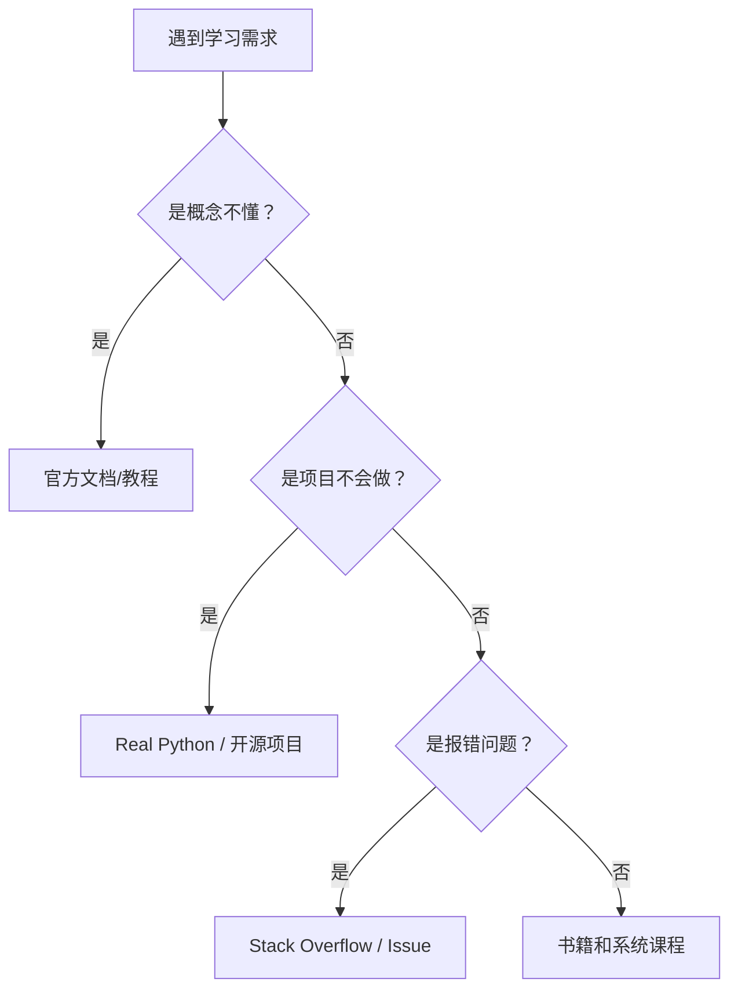

# Python 学习资源汇总

> 精选的Python学习资源、工具推荐和常用库清单

---

## 📚 学习网站

### 官方文档
- [Python官方文档](https://docs.python.org/zh-cn/3/) ⭐⭐⭐⭐⭐
  - 最权威的中文文档
  - 包含教程、库参考、语言参考

- [Python Cookbook](https://diveintopython3.problemsolving.io/) ⭐⭐⭐⭐
  - 深入Python 3
  - 实用编程技巧

### 在线教程
- [菜鸟教程](https://www.runoob.com/python3/python3-tutorial.html) ⭐⭐⭐
  - 适合零基础入门
  - 中文讲解，简单易懂

- [廖雪峰Python教程](https://www.liaoxuefeng.com/wiki/1016959663602400) ⭐⭐⭐⭐⭐
  - 系统化的中文教程
  - 从基础到实战

- [Real Python](https://realpython.com/) ⭐⭐⭐⭐⭐
  - 高质量英文教程
  - 涵盖各个进阶主题

- [Python-100-Days](https://github.com/jackfrued/Python-100-Days) ⭐⭐⭐⭐⭐
  - GitHub上超火的Python学习项目
  - 100天从入门到精通

---

## 🎬 视频课程

### 免费资源
- [小甲鱼Python教程](https://www.bilibili.com/video/BV1c4411e77t) (B站)
  - 零基础友好
  - 幽默风趣的讲解风格

- [Python核心技术与实战](https://time.geekbang.org/course/intro/100021601) (极客时间)
  - 景霄老师主讲
  - 系统全面

- [CS61A: Structure and Interpretation](https://cs61a.org/) (UC Berkeley)
  - 世界顶尖大学的计算机入门课
  - Python版本

### 付费课程（推荐）
- [Python进阶训练营](https://www.jiker.com/)
- [Python全栈开发](https://www.imooc.com/)

---

## 📖 推荐书籍

### 入门书籍
1. **《Python编程：从入门到实践》** ⭐⭐⭐⭐⭐
   - 作者：Eric Matthes
   - 适合零基础，项目实战多

2. **《笨办法学Python 3》** ⭐⭐⭐⭐
   - 作者：Zed Shaw
   - 通过练习学习，动手导向

3. **《Python基础教程》** ⭐⭐⭐⭐
   - 作者：Magnus Lie Hetland
   - 系统全面，适合入门

### 进阶书籍
1. **《流畅的Python》** ⭐⭐⭐⭐⭐
   - 作者：Luciano Ramalho
   - 深入理解Python特性

2. **《Python Cookbook》** ⭐⭐⭐⭐⭐
   - 作者：David Beazley
   - 实用编程技巧大全

3. **《Effective Python》** ⭐⭐⭐⭐
   - 作者：Brett Slatkin
   - 90个Python最佳实践

### 专业方向
- **Web开发**: 《Flask Web开发》、《Django企业开发实战》
- **数据分析**: 《Python数据分析》、《利用Python进行数据分析》
- **机器学习**: 《机器学习实战》、《Python机器学习基础教程》

---

## 🛠️ 开发工具

### 代码编辑器
- [VS Code](https://code.visualstudio.com/) ⭐⭐⭐⭐⭐
  - 免费、插件丰富
  - Python扩展：Python, Pylance

- [PyCharm](https://www.jetbrains.com/pycharm/) ⭐⭐⭐⭐⭐
  - 专业Python IDE
  - 有免费的Community版

- [Jupyter Notebook](https://jupyter.org/) ⭐⭐⭐⭐
  - 数据分析和可视化首选
  - 交互式编程

### 环境管理
- [Anaconda](https://www.anaconda.com/)
  - 数据科学首选
  - 预装大量科学计算库

- [pyenv](https://github.com/pyenv/pyenv)
  - Python版本管理
  - 轻松切换Python版本

- [pipenv](https://pipenv.pypa.io/)
  - 虚拟环境+依赖管理
  - Pipfile取代requirements.txt

- [Poetry](https://python-poetry.org/)
  - 现代化的包管理工具
  - 依赖解析更智能

---

## 📦 常用库清单

### 标准库（内置）
```python
import os           # 操作系统接口
import sys          # 系统相关
import json         # JSON处理
import re           # 正则表达式
import datetime     # 日期时间
import collections  # 高级数据结构
import itertools    # 迭代器工具
import functools    # 函数式编程工具
import math         # 数学函数
import random       # 随机数
import string       # 字符串工具
import hashlib      # 哈希算法
import argparse     # 命令行参数
import unittest     # 单元测试
import logging      # 日志记录
import threading    # 多线程
import multiprocessing  # 多进程
import socket       # 网络编程
import urllib       # URL处理
import http         # HTTP协议
import csv          # CSV文件
import sqlite3      # SQLite数据库
import html         # HTML处理
import email        # 邮件处理
import webbrowser   # 浏览器控制
import time         # 时间相关
import calendar     # 日历
```

### 第三方库

#### Web开发
| 库名 | 用途 | 学习难度 |
|------|------|----------|
| Django | 全功能Web框架 | ⭐⭐⭐ |
| Flask | 轻量级Web框架 | ⭐⭐ |
| FastAPI | 现代高性能Web框架 | ⭐⭐ |
| requests | HTTP请求 | ⭐ |
| beautifulsoup4 | HTML解析 | ⭐⭐ |
| selenium | 浏览器自动化 | ⭐⭐⭐ |

#### 数据分析
| 库名 | 用途 | 学习难度 |
|------|------|----------|
| pandas | 数据处理和分析 | ⭐⭐⭐ |
| numpy | 科学计算 | ⭐⭐⭐ |
| matplotlib | 数据可视化 | ⭐⭐ |
| seaborn | 统计数据可视化 | ⭐⭐ |
| plotly | 交互式可视化 | ⭐⭐ |
| scipy | 科学计算库 | ⭐⭐⭐ |

#### 机器学习
| 库名 | 用途 | 学习难度 |
|------|------|----------|
| scikit-learn | 机器学习基础 | ⭐⭐⭐ |
| tensorflow | 深度学习框架 | ⭐⭐⭐⭐ |
| pytorch | 深度学习框架 | ⭐⭐⭐⭐ |
| keras | 深度学习高级API | ⭐⭐⭐ |
| opencv-python | 计算机视觉 | ⭐⭐⭐ |

#### 办公自动化
| 库名 | 用途 | 学习难度 |
|------|------|----------|
| openpyxl | Excel操作 | ⭐⭐ |
| python-docx | Word文档 | ⭐⭐ |
| PyPDF2 | PDF处理 | ⭐⭐ |
| pillow | 图像处理 | ⭐⭐ |
| pyautogui | GUI自动化 | ⭐⭐ |

#### 数据库
| 库名 | 用途 | 学习难度 |
|------|------|----------|
| SQLAlchemy | ORM框架 | ⭐⭐⭐ |
| pymongo | MongoDB驱动 | ⭐⭐ |
| redis | Redis客户端 | ⭐⭐ |
| psycopg2 | PostgreSQL驱动 | ⭐⭐ |

#### 其他实用库
| 库名 | 用途 | 学习难度 |
|------|------|----------|
| python-dotenv | 环境变量管理 | ⭐ |
| tqdm | 进度条 | ⭐ |
| colorama | 彩色终端输出 | ⭐ |
| click | 命令行工具 | ⭐⭐ |
| schedule | 定时任务 | ⭐ |
| faker | 生成假数据 | ⭐ |
| arrow | 更好的日期时间 | ⭐⭐ |

---

## 🌐 推荐GitHub仓库

### 学习项目
- [Python-100-Days](https://github.com/jackfrued/Python-100-Days) - 100天学Python
- [awesome-python](https://github.com/vinta/awesome-python) - Python资源大全
- [intermediatePython](https://github.com/yasoob/intermediatePython) - Python进阶技巧
- [PythonDataScienceHandbook](https://github.com/jakevdp/PythonDataScienceHandbook) - 数据科学手册

### 实战项目
- [system-design-primer](https://github.com/donnemartin/system-design-primer) - 系统设计入门
- [public-apis](https://github.com/public-apis/public-apis) - 免费API列表
- [scrapy](https://github.com/scrapy/scrapy) - 强大的爬虫框架

---

## 📝 代码练习平台

### 在线编程
- [LeetCode](https://leetcode.cn/) ⭐⭐⭐⭐⭐
  - 算法题练习
  - 有中文站

- [HackerRank](https://www.hackerrank.com/) ⭐⭐⭐⭐
  - 分主题的编程挑战
  - Python专项练习

- [Codewars](https://www.codewars.com/) ⭐⭐⭐⭐
  - 游戏化编程挑战
  - 从简单到困难

- [Exercism](https://exercism.org/) ⭐⭐⭐⭐
  - 免费、开源
  - 有导师评审

### 项目练习
- [Project Euler](https://projecteuler.net/) - 数学和编程题
- [CheckiO](https://checkio.org/) - 游戏化学习Python
- [Python Challenge](http://www.pythonchallenge.com/) - Python解谜游戏

---

## 💡 学习建议

### 学习路径
```
第1-2周: 基础语法 → 菜鸟教程/廖雪峰
第3-4周: 数据结构 → Python Cookbook
第5-6周: 文件操作+OOP → 实战小项目
第7-8周: 标准库 → 官方文档
第9-10周: 第三方库 → pandas/requests
第11-12周: Web框架 → Flask/Django
第13周+: 项目实战 → 完整项目开发
```

### 学习Tips
1. **多敲代码**: 看10遍不如敲1遍
2. **善用搜索**: 遇到问题先Google
3. **读源码**: 学习优秀项目的代码
4. **做笔记**: 建立自己的知识体系
5. **教别人**: 能讲清楚才是真懂

### 避免的坑
- ❌ 只看视频不动手
- ❌ 追求速成，跳过基础
- ❌ 收藏从未停止，学习从未开始
- ❌ 闭门造车，不查文档
- ❌ 忽视英文文档的重要性

---

## 📮 社区和交流

### 中文社区
- [V2EX Python节点](https://www.v2ex.com/go/python)
- [知乎 Python话题](https://www.zhihu.com/topic/19552817)
- [掘金 Python专栏](https://juejin.cn/tag/Python)

### 英文社区
- [Reddit r/Python](https://www.reddit.com/r/Python/)
- [Stack Overflow](https://stackoverflow.com/questions/tagged/python)
- [Python.org Community](https://www.python.org/community/)

### Telegram/Discord
- Python中文社区
- Real Python Discord

---

## 🔍 常用搜索关键词

查找资源时可以使用这些关键词：
- `Python best practices`
- `Python design patterns`
- `Python clean code`
- `Python performance tips`
- `Python project structure`

---

## 资源选择流程



## 使用检查清单

- 是否先明确问题，再找资源。
- 是否优先看官方文档和高质量教程。
- 是否记录资源适合解决什么问题。
- 是否把学到的内容沉淀成自己的笔记或项目。
- 是否定期清理过期链接和低质量收藏。

## 常见误区

- 收藏大量资源却不实践。
- 资源之间重复度高，反而增加选择成本。
- 只看中文二手资料，忽略官方文档和源码。

*持续更新中... 发现好资源欢迎补充*
