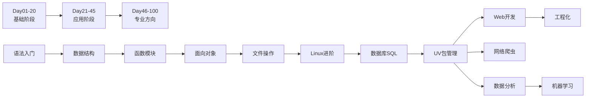

# 🐍 Python 编程 - 完整目录

> **Python 编程学习知识库的总目录**
> 
> 基于《Python-100天从新手到大师》整理，涵盖从入门到精通的完整学习路径

---

## 📁 目录结构

```
40_知识库/Python编程/
│
├── 📍 00-导航与规划/              # 入门导航和学习规划
│   ├── 00-导航-Python编程导航.md      # 主入口导航
│   ├── 00-MOC-知识地图.md              # 知识地图和进度追踪
│   └── 00-学习计划-100天路线.md         # 100天详细学习计划
│
├── 📚 01-基础阶段/               # Day01-20：语言基础
│   ├── 01-基础-语法入门.md            # Day01-07：基础语法
│   ├── 01-基础-核心语法汇总.md         # 核心语法速查
│   ├── 01-基础-数据结构详解.md         # Day08-13：列表、字典等
│   ├── 01-基础-函数与模块.md          # Day14-17：函数与装饰器
│   └── 01-基础-面向对象编程.md         # Day18-20：OOP
│
├── 🔧 02-应用阶段/               # Day21-45：实际应用
│   ├── 02-应用-文件操作与常用库.md      # Day21-30：文件IO、办公自动化
│   ├── 02-应用-进阶与Linux.md         # Day31-35：进阶特性、Linux
│   ├── 02-应用-数据库与SQL.md         # Day36-45：MySQL、SQL
│   └── 02-应用-Python-UV包管理工具.md   # UV现代包管理工具
│
├── 🚀 03-专业方向/               # Day46-100：职业发展
│   ├── 03-方向A-Web开发-Django全栈.md  # Day46-60：Django Web开发
│   ├── 03-方向A-工程化实践.md          # Day91-100：Docker、部署
│   ├── 03-方向B-网络爬虫.md           # Day61-65：爬虫、并发
│   ├── 03-方向C-数据分析.md           # Day66-80：NumPy、pandas
│   └── 03-方向C-机器学习.md           # Day81-90：sklearn、算法
│
└── 📖 04-速查与资源/              # 参考资料和速查
    ├── 04-速查-核心知识点.md           # 核心知识速查手册
    ├── 04-速查-进阶知识.md             # 高级特性速查
    ├── 04-速查-项目实践.md             # 实战项目清单
    └── 04-速查-资源汇总.md             # 学习资源大全
```

---

## 🎯 快速导航

### 🔰 零基础入门路线

如果你是 Python 初学者，请按以下顺序学习：

1. **[[00-导航-Python编程导航|📍 Python编程导航]]** - 了解整体学习路径
2. **[[00-MOC-知识地图|🗺️ 知识地图]]** - 可视化知识结构
3. **[[00-学习计划-100天路线|📅 100天学习计划]]** - 查看详细的学习计划
4. **[[01-基础-语法入门|📘 语法入门]]** - 从 Day 1 开始系统学习
5. **[[01-基础-数据结构详解|📊 数据结构]]** - 掌握核心数据结构
6. **[[01-基础-函数与模块|⚙️ 函数与模块]]** - 学习函数和模块化编程
7. **[[01-基础-面向对象编程|🏗️ 面向对象编程]]** - 理解 OOP 思想

### 🚀 有基础进阶路线

如果你已有编程基础，可直接选择感兴趣的方向：

| 方向 | 学习内容 | 建议路径 |
|:----:|:---------|:---------|
| **Web 开发** | Django + RESTful API | [[02-应用-数据库与SQL|数据库与SQL]] → [[03-方向A-Web开发-Django全栈|Django全栈]] → [[03-方向A-工程化实践|工程化实践]] |
| **数据分析** | NumPy + Pandas + 可视化 | [[03-方向C-数据分析|数据分析]] |
| **机器学习** | Scikit-learn + 算法 | [[03-方向C-数据分析|数据分析]] → [[03-方向C-机器学习|机器学习]] |
| **网络爬虫** | 爬虫技术 + 并发编程 | [[03-方向B-网络爬虫|网络爬虫]] |

### ⚡ 速查参考

- **[[01-基础-核心语法汇总|📋 核心语法速查]]** - 快速回顾核心概念
- **[[04-速查-核心知识点|🎯 核心知识点]]** - 核心概念与代码示例
- **[[04-速查-进阶知识|🚀 进阶知识]]** - 高级特性速查
- **[[04-速查-项目实践|💡 项目实践]]** - 寻找练手项目
- **[[04-速查-资源汇总|📚 资源汇总]]** - 推荐书籍、工具、库

---

## 📊 100天学习路线图



---

## 📚 文件详细说明

### 导航与规划类 (00-)

| 文件名 | 说明 | 适用人群 |
|:-------|:-----|:---------|
| [[00-导航-Python编程导航]] | 主入口导航，包含完整学习路径图 | 所有人 |
| [[00-MOC-知识地图]] | 知识地图，包含进度追踪和学习建议 | 所有人 |
| [[00-学习计划-100天路线]] | 100天详细学习计划，每日任务清单 | 初学者 |

### 基础阶段 (01-)

| 文件名 | 内容 | 对应天数 |
|:-------|:-----|:--------:|
| [[01-基础-语法入门]] | 变量、数据类型、运算符、控制流 | Day01-07 |
| [[01-基础-核心语法汇总]] | 核心语法速查手册 | 全阶段 |
| [[01-基础-数据结构详解]] | 列表、元组、字符串、集合、字典 | Day08-13 |
| [[01-基础-函数与模块]] | 函数定义、参数、装饰器、模块管理 | Day14-17 |
| [[01-基础-面向对象编程]] | 类、对象、继承、多态、魔术方法 | Day18-20 |

### 应用阶段 (02-)

| 文件名 | 内容 | 对应天数 |
|:-------|:-----|:--------:|
| [[02-应用-文件操作与常用库]] | 文件IO、CSV/Excel/Word/PDF、邮件 | Day21-30 |
| [[02-应用-进阶与Linux]] | 迭代器、生成器、并发、Linux基础 | Day31-35 |
| [[02-应用-数据库与SQL]] | MySQL、SQL语句、Python操作数据库 | Day36-45 |
| [[02-应用-Python-UV包管理工具]] | UV工具：虚拟环境、依赖管理、项目工作流 | 工具类 |

### 专业方向 (03-)

| 文件名 | 内容 | 对应天数 |
|:-------|:-----|:--------:|
| [[03-方向A-Web开发-Django全栈|Web开发-Django全栈]] | Django框架、ORM、RESTful API | Day46-60 |
| [[03-方向A-工程化实践|工程化实践]] | Docker、CI/CD、性能优化、部署 | Day91-100 |
| [[03-方向B-网络爬虫|网络爬虫]] | 爬虫基础、Scrapy、反爬、并发 | Day61-65 |
| [[03-方向C-数据分析|数据分析]] | NumPy、pandas、Matplotlib、数据清洗 | Day66-80 |
| [[03-方向C-机器学习|机器学习]] | Scikit-learn、算法、模型评估 | Day81-90 |

### 速查与资源 (04-)

| 文件名 | 用途 |
|:-------|:-----|
| [[04-速查-核心知识点|核心知识点]] | 核心概念、代码示例、最佳实践 |
| [[04-速查-进阶知识|进阶知识]] | 高级特性、Pythonic技巧、性能优化 |
| [[04-速查-项目实践|项目实践]] | 初级/中级/高级项目清单和实战指导 |
| [[04-速查-资源汇总|资源汇总]] | 推荐书籍、在线教程、开发工具、第三方库 |

---

## 🎓 学习建议

### 每日学习安排（建议 2 小时）

| 时间段 | 内容 | 时长 |
|:-------|:-----|:----:|
| 理论学习 | 阅读教程、看视频 | 30分钟 |
| 动手实践 | 敲代码、做练习 | 60分钟 |
| 总结复盘 | 写笔记、整理问题 | 30分钟 |

### 里程碑检查

- [ ] **基础完成** - 能独立写 100 行程序
- [ ] **进阶完成** - 理解装饰器和生成器
- [ ] **第一个项目** - 完成待办事项应用
- [ ] **Web 项目** - 完成博客系统
- [ ] **开源贡献** - 提交第一个 PR

---

## 🔗 关联知识库

- [[后端开发 MOC]] - Python 后端开发路线
- [[通用技能 MOC]] - 编程通用能力
- [[AI相关/MOC-RAG]] - AI 与 Python 应用

---

## 📖 外部资源

- [Python 官方文档](https://docs.python.org/zh-cn/3/)
- [Django 文档](https://docs.djangoproject.com/)
- [Pandas 文档](https://pandas.pydata.org/)
- [Scikit-learn 文档](https://scikit-learn.org/)
- [UV 官方文档](https://docs.astral.sh/uv/)

---

*最后更新: 2025-02-11*  
*基于《Python-100天从新手到大师》整理*