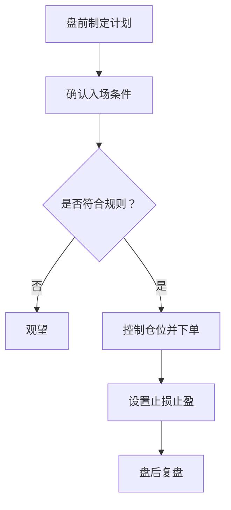

# ETF-T0-交易指南
ETF-T0-交易指南记录 ETF 日内交易的入场条件、仓位控制、止损止盈和复盘方法。

## 交易流程

## 检查清单

- 是否有明确的入场触发条件。
- 仓位是否符合单笔风险上限。
- 是否提前设置止损和止盈。
- 是否避免因情绪追涨杀跌。
- 是否记录交易理由、执行偏差和结果。

## 案例

若 ETF 回踩支撑位且成交量配合，可以按计划小仓位试单；若跌破止损位，应按规则退出，而不是临时改成“长期持有”来逃避亏损。

## 常见误区

- 把 T0 当作必须每天交易。
- 亏损后加仓摊平，但没有新的入场理由。
- 只看分时波动，不看日线结构和市场环境。
- 不复盘执行偏差，重复犯同类错误。

## 复盘提示

ETF-T0 复盘至少记录入场理由、买入点、卖出点、仓位、止损执行和情绪状态。不要只看当天是否赚钱，更要看是否遵守计划；长期收益来自可重复执行的规则，而不是单次运气。

## 风险边界

T0 只能优化持仓成本和日内波动利用，不能解决方向判断错误。若大级别趋势已经破坏，频繁 T0 可能只是增加交易成本和心理负担。

## 执行标准

一次 T0 交易至少要满足三个条件：有明确触发信号，有可接受止损位置，有计划内仓位。缺少任一条件时，观望本身就是交易纪律的一部分。

盘后复盘时也要记录是否按标准执行，而不只记录盈亏。

## 相关概念
- [[ETF-T0-交易检查清单]]
- [[条件单使用技巧]]
- [[交易心理建设]]
