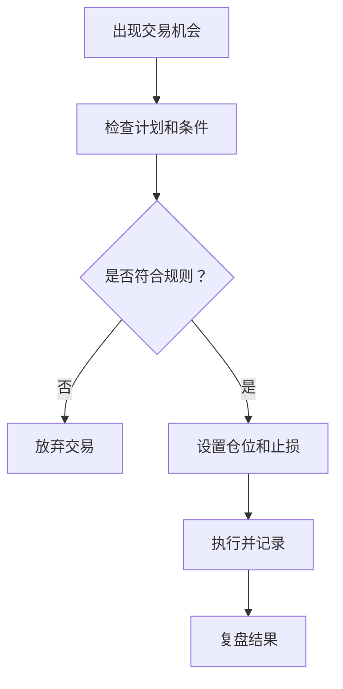

# 交易心理建设
交易心理建设关注纪律、耐心、止损执行、仓位克制和复盘，避免情绪驱动交易。

## 核心原则

- 先定义交易计划，再决定是否入场。
- 单次亏损不能影响下一次判断。
- 仓位大小要和风险承受能力匹配。
- 错过机会不等于必须追高。
- 复盘时区分市场噪音和执行错误。

## 决策流程

## 检查清单

- 是否提前写好入场、止损和退出条件。
- 是否因为亏损、盈利或错过机会而冲动下单。
- 单笔风险是否在可承受范围内。
- 是否记录交易理由和执行偏差。
- 是否定期复盘同类错误。

## 案例

如果 ETF 到达计划买入区间，但市场情绪剧烈波动，应先检查仓位、止损和交易理由是否仍成立。若只是害怕错过而追入，就偏离了交易计划。

## 常见误区

- 把一次盈利归因于能力，把一次亏损归因于市场。
- 亏损后急于翻本，扩大仓位和交易频率。
- 临盘修改止损，把短线交易变成长线被套。
- 只记录盈亏，不记录当时的交易理由和执行偏差。

## 复盘提示

交易心理复盘要分开看“计划质量”和“执行质量”。计划错了需要改规则，执行偏了需要改纪律；两者混在一起，就很难知道下一次到底应该改什么。

## 训练方法

可以用固定模板记录每次交易前后的心理状态：入场前是否急躁，持仓中是否恐惧，卖出后是否后悔。长期积累后，最容易破坏纪律的情绪触发点会更清楚。

## 相关概念
- [[ETF-波段交易检查清单]]
- [[条件单使用技巧]]
