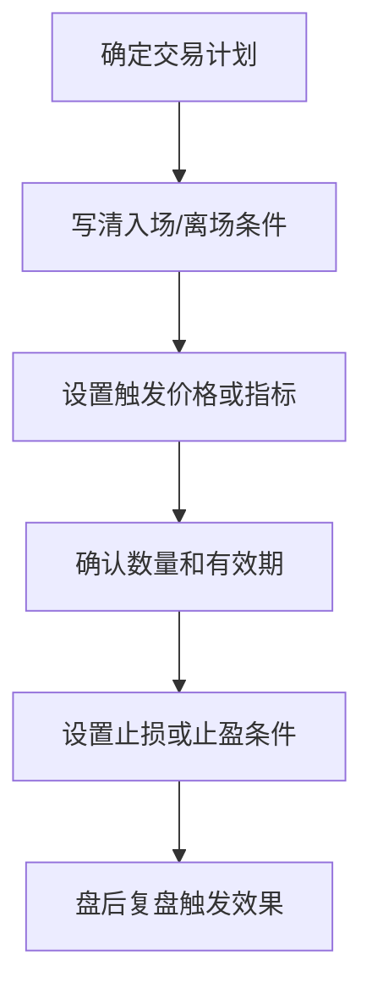

# 条件单使用技巧

## 定义

条件单使用技巧用于在价格、时间、涨跌幅或技术条件触发时自动执行交易计划，降低临场情绪干扰。它的核心价值是把“如果发生什么，就执行什么”提前写清楚，而不是盘中临时做决定。

## 要点
- 条件必须来自交易计划，而不是临时冲动。
- 设置前确认标的、方向、价格、数量和有效期。
- 条件单不能替代风险控制。
- 条件触发后仍可能因为流动性、价格跳变或委托规则导致成交价偏离预期。
- 重要条件单设置后要截图或记录，方便复盘。

## 使用流程

## 典型案例

### ETF 日内止盈

计划：某 ETF 跌到支撑位附近分批买入，反弹到预设收益后自动卖出。

- 买入条件：价格回落到计划支撑区间，且大盘没有明显破位。
- 卖出条件：持仓收益达到 0.6% 或价格触及上方压力位。
- 风控条件：跌破支撑位并持续 3 分钟，触发减仓或止损。

这个案例中，条件单不是为了“预测一定涨”，而是为了在计划成立时自动执行，避免涨了贪、跌了拖。

### 波段保护止损

计划：已有 ETF 波段仓位，防止突发行情跌破关键支撑。

- 条件：价格跌破支撑位 1%。
- 动作：卖出 30%-50% 仓位。
- 复盘：如果当天快速收回支撑位，记录是否属于假跌破，并调整下次触发条件。

## 设置检查清单

- 标的代码是否正确。
- 方向是买入还是卖出。
- 触发价、委托价、数量是否合理。
- 有效期是否覆盖计划周期。
- 是否与已有条件单冲突。
- 触发后是否还有仓位保护方案。

## 相关概念
- [[ETF-T0-交易指南]]
- [[支撑位判断方法]]
- [[交易心理建设]]
