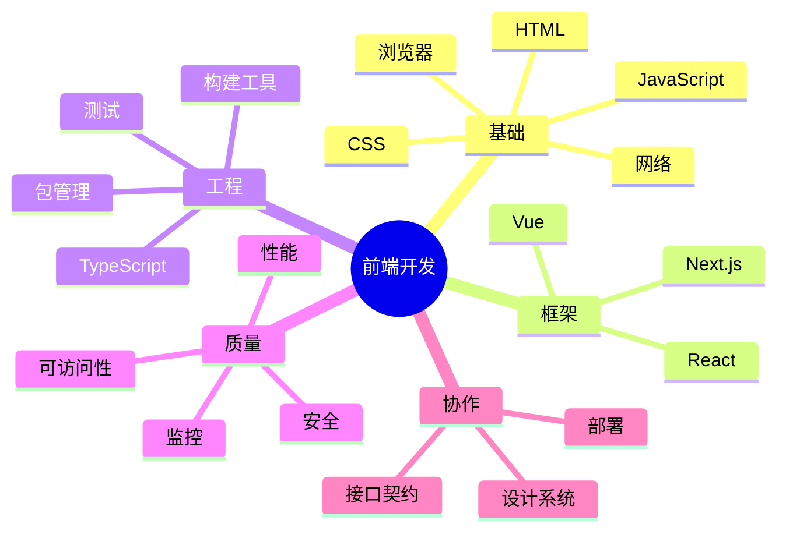

# 前端开发

## 定义

前端开发是围绕用户界面、浏览器运行环境、交互体验和客户端工程体系构建软件的领域。它连接产品体验、后端接口、设计系统、性能、安全和可访问性。

## 能力结构

## 学习路线

1. **打基础**：先掌握 HTML 语义、CSS 布局、JavaScript 运行机制、浏览器渲染和 HTTP。
2. **做项目**：用 React 或 Vue 完成一个包含路由、表单、请求、权限和状态管理的应用。
3. **补工程化**：引入 TypeScript、Vite/Webpack、测试、Lint、包管理和 CI。
4. **做质量治理**：补性能、安全、可访问性、错误上报和接口契约。
5. **形成架构意识**：理解组件边界、状态边界、设计系统和前后端职责划分。

## 典型案例

构建一个后台管理系统时，前端需要同时处理：

- 页面层：列表、详情、编辑、弹窗、表单校验。
- 数据层：用 [[TanStack-Query]] 管理服务器状态，用局部状态管理 UI 交互。
- 权限层：根据后端权限控制菜单和按钮展示，但最终授权由后端兜底。
- 质量层：核心流程写 [[前端测试体系总览]]，上线后监控 [[Web Vitals 与前端性能监控总览]]。
- 协作层：通过 [[前后端接口契约]] 和 [[OpenAPI 与类型生成]] 保持接口一致。

## 判断一个前端方案是否扎实

- 用户能否在慢网、弱设备和异常接口下完成任务。
- 组件是否职责清楚，状态是否有明确归属。
- 接口错误、空状态、加载状态、权限状态是否完整。
- 是否有关键路径测试和线上监控。
- 是否能被下一位开发者快速理解和修改。

## 知识地图

- [[前端开发 MOC]]
- [[React/README|React 知识地图]]
- [[vue/00-MOC/MOC-Vue|Vue 知识地图]]
- [[TypeScript 工程实践总览]]
- [[前后端接口契约]]
- [[前端测试体系总览]]

## 相关领域

- [[后端开发]]
- [[通用技能 MOC]]
