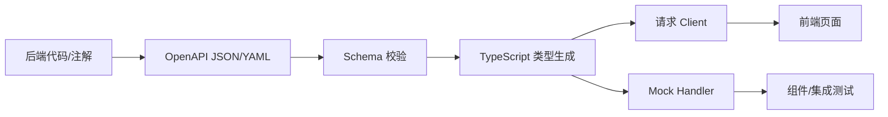

# OpenAPI 与类型生成

## 定义

OpenAPI 是描述 HTTP API 的结构化规范。类型生成是把 OpenAPI、GraphQL Schema 或其他契约转换成前端可直接使用的 TypeScript 类型、请求函数和 Mock 数据，从而减少手写接口类型与真实后端不一致的问题。

## 要点

- OpenAPI 适合 REST/HTTP API，能描述路径、方法、参数、请求体、响应体、安全方案和错误结构。
- 类型生成让接口响应、请求参数和枚举值进入编译期检查，减少运行期字段错误。
- 生成代码应被视为构建产物或受控源码，团队需要统一生成命令、输出目录和格式化策略。
- Schema 不能替代业务沟通；它只能表达结构，不能完整表达权限、幂等、并发和业务状态机。

## 工程实践

- 后端发布接口前先更新 OpenAPI 文档，并在 CI 中校验格式。
- 前端通过生成器产出 API Client、DTO 类型和 Mock Handler。
- 对关键接口补契约测试，确认服务端真实响应符合 Schema。
- 对破坏性变更使用 [[API 版本管理]] 或兼容字段过渡。

## 生成流程



生成链路的目标是让接口契约成为“单一事实来源”。当前端类型、请求函数、Mock 数据都来自同一份 Schema 时，字段改名、枚举变化和响应结构变化更容易在编译期或 CI 阶段暴露。

## 示例

一个订单详情接口至少需要描述：`GET /orders/{id}`、路径参数 `id`、成功响应 `OrderDetail`、未登录错误、无权限错误、订单不存在错误，以及字段如金额、状态、创建时间的精确类型。

```yaml
paths:
  /orders/{id}:
    get:
      parameters:
        - name: id
          in: path
          required: true
          schema:
            type: string
      responses:
        "200":
          description: 订单详情
          content:
            application/json:
              schema:
                $ref: "#/components/schemas/OrderDetail"
        "404":
          description: 订单不存在
components:
  schemas:
    OrderDetail:
      type: object
      required: [id, status, totalAmount]
      properties:
        id:
          type: string
        status:
          type: string
          enum: [CREATED, PAID, CANCELLED]
        totalAmount:
          type: number
```

生成 TypeScript 后，前端不需要手写 `OrderDetail` 类型，也不需要猜测 `status` 有哪些取值。

## 落地检查清单

- OpenAPI 文件是否纳入版本管理，并能在 CI 中校验。
- 生成命令是否固定，例如 `pnpm generate:api`，避免每个人生成结果不同。
- 输出目录是否清晰区分“生成代码”和“手写封装”。
- 生成 Client 是否统一处理认证、错误响应、超时和 Trace ID。
- Mock 是否来自同一份 Schema，服务端变更后测试能及时暴露差异。
- 破坏性变更是否配合 [[API 版本管理]] 和发布顺序。

## 常见误区

- 只生成类型，不生成请求函数，结果调用层仍然大量手写。
- 后端实现已经变了，但 OpenAPI 没更新，生成结果反而制造错误安全感。
- 生成代码被人工修改，下一次生成时改动丢失。
- Schema 只描述 200 响应，不描述错误结构、分页结构和认证方案。

## 相关概念

- [[前后端接口契约]]
- [[RESTful API 设计]]
- [[TypeScript 工程实践总览]]
- [[前端测试体系总览]]
- [[SpringBoot/26-SpringBoot-OpenAPI与客户端SDK]]
