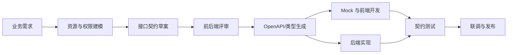

# 前后端接口契约

## 定义

前后端接口契约是前端、后端和测试共同认可的接口边界，描述请求方法、路径、参数、响应结构、错误码、认证方式和兼容性规则。它的目标不是只写一份文档，而是让交付物、类型、Mock、测试和发布流程围绕同一个事实来源协作。

## 要点

- 契约优先定义业务资源、输入输出、错误语义和权限边界，再决定具体实现。
- 接口字段需要明确必填、可空、默认值、枚举范围和时间格式，避免前端靠猜测处理异常数据。
- 错误响应应区分参数错误、认证失败、权限不足、资源不存在、限流和服务异常。
- 契约变更要遵守兼容性：新增字段通常安全，删除字段、改名、改类型和改变错误语义都需要版本策略。

## 典型流程

1. 后端用 [[RESTful API 设计]] 或 RPC 风格建模接口。
2. 双方把接口沉淀为 [[OpenAPI 与类型生成]] 或等价契约。
3. 前端根据契约生成类型、请求客户端和 Mock 数据。
4. CI 中加入契约检查，避免实现和文档漂移。



契约流程的重点是把接口从“联调时口头确认”前移到“开发前可验证”。前端可以基于 Mock 并行开发，后端可以基于同一份契约实现和测试。

## 契约示例

以订单详情接口为例，契约至少要说明：

```yaml
GET /api/orders/{orderId}
auth: Bearer token
path:
  orderId: string, required
response:
  id: string
  status: CREATED | PAID | CANCELLED | REFUNDED
  totalAmount: number
  currency: CNY
  paidAt: string | null
errors:
  401: 未登录或 Token 失效
  403: 无权访问该订单
  404: 订单不存在
```

这里最容易被忽略的是 `paidAt` 是否可空、金额单位是什么、订单状态枚举是否稳定，以及 403 和 404 如何区分。没有这些信息，前端只能靠猜测写分支。

## 变更规则

- **兼容变更**：新增可选字段、新增枚举但前端有默认兜底、新增非必填查询参数。
- **谨慎变更**：新增必填字段、改变排序默认值、改变错误码、改变分页语义。
- **破坏性变更**：删除字段、字段改名、字段类型变化、成功响应结构变化、权限边界变化。

破坏性变更应配合 [[API 版本管理]]、灰度发布和前后端发布顺序设计，不能只在群里通知。

## 常见缺口

- 只有接口文档，没有类型生成和契约测试。
- 只描述成功响应，不描述错误码和异常结构。
- 分页、排序、筛选、时间范围等通用参数没有统一规范。
- 发布时没有标注破坏性变更，导致前端灰度和后端发布互相阻塞。

## 检查清单

- 请求方法和路径是否表达资源语义，而不是把动作堆到路径里。
- 参数是否写清楚必填、可空、默认值、枚举、范围和格式。
- 响应是否区分空列表、空对象、无权限和资源不存在。
- 错误响应是否有稳定结构，便于前端统一拦截和展示。
- 认证方式、权限边界和数据脱敏规则是否写进契约。
- 契约是否能生成类型、Mock 或测试，避免文档和实现长期漂移。

## 相关概念

- [[OpenAPI 与类型生成]]
- [[RESTful API 设计]]
- [[API 版本管理]]
- [[认证授权总览：Session、JWT、OAuth2 与 OIDC]]
- [[BFF]]
