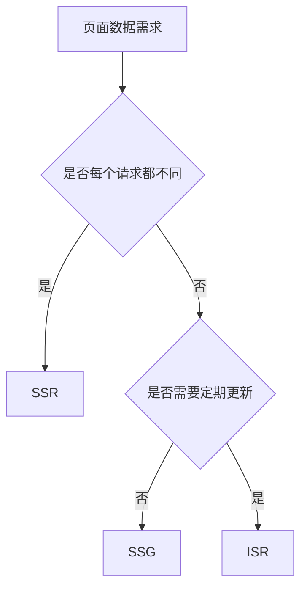

# Next.js SSR、SSG、ISR 对比

## 定义

SSR、SSG、ISR 是 Next.js 常见渲染策略，分别强调请求时渲染、构建时生成和按时间增量再生成。

## 对比

- SSR：每次请求生成页面，适合强动态内容。
- SSG：构建时生成静态页面，适合稳定内容。
- ISR：静态页面按策略重新生成，兼顾性能和新鲜度。

## 相关概念

- [[Next.js App Router 总览]]
- [[缓存系统总览]]
- [[Stale-While-Revalidate]]

## 选择流程

## 实践检查清单

- 页面是否依赖用户身份、Cookie 或实时库存。
- 数据新鲜度要求是秒级、分钟级还是发布级。
- 页面数量是否过多，构建时生成是否可接受。
- 缓存失效策略是否明确。
- 监控是否区分首屏性能、缓存命中和源站压力。

## 案例

营销落地页适合 SSG，商品详情页可用 ISR 定期更新，用户订单页必须按用户身份 SSR 或客户端请求。

## 常见误区

- 所有页面都 SSR，导致源站压力和延迟上升。
- SSG 页面引用强实时数据，用户看到过期内容。
- ISR 没有配置失效策略，内容更新不可预测。
