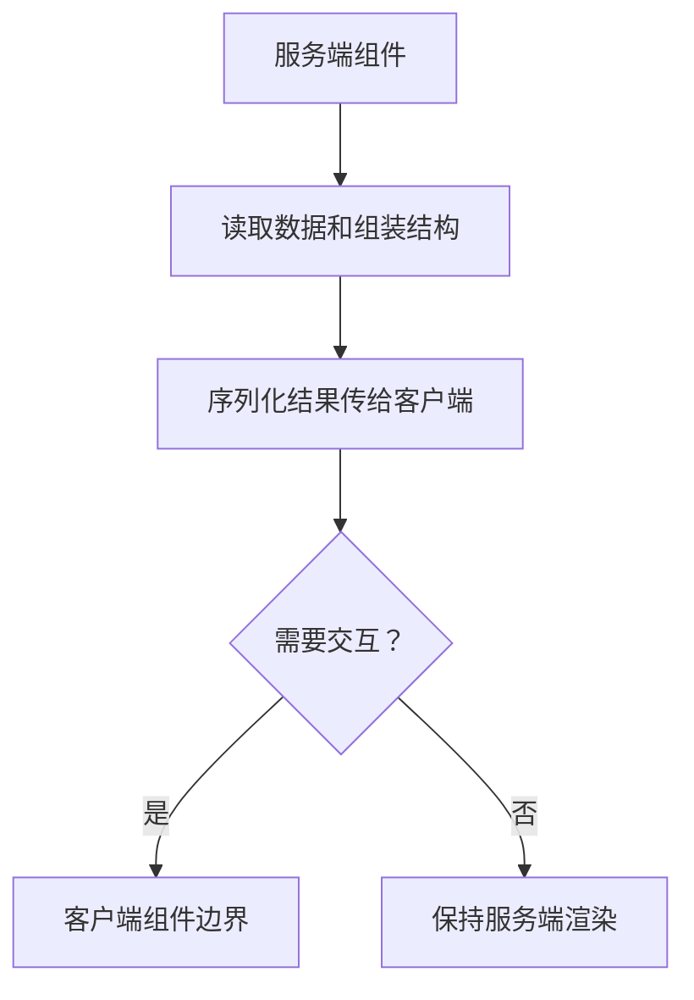

# Next.js 服务端组件 RSC

## 定义

React Server Components 允许组件在服务端执行并返回序列化结果，减少客户端 JavaScript 体积并更贴近数据源渲染页面。

## 要点

- 默认服务端组件不能使用浏览器 API 和客户端状态。
- 需要交互时使用 `"use client"` 标记客户端组件边界。
- 服务端组件适合读取数据和组装页面结构。

## 渲染边界

## 案例

商品详情页可以在服务端组件中读取商品、评价摘要和推荐数据，把加入购物车按钮拆成客户端组件。这样页面主体减少客户端 JS，而需要点击交互的区域仍保留状态和事件处理。

## 检查清单

- 是否把浏览器 API、事件处理和本地状态放到客户端组件。
- 服务端组件传给客户端组件的数据是否可序列化。
- 数据读取是否利用缓存、重新验证和权限上下文。
- 是否避免把大块页面无必要地标记为 `"use client"`。
- 是否理解 RSC 与传统 SSR Hydration 的差异。

## 常见误区

- 为了方便直接在页面顶层加 `"use client"`，导致 RSC 收益消失。
- 把不可序列化对象传给客户端组件。
- 在服务端组件里访问 `window`、localStorage 或浏览器事件。
- 没有区分数据缓存、路由缓存和浏览器缓存。

## 掘金文章补充

掘金《Next.js Caching》文章对 RSC 渲染链路的补充很有用：服务端会把服务器组件树渲染成 RSC Payload，再结合客户端组件 JavaScript 引用生成可用于首屏展示的 HTML。客户端随后用 RSC Payload 做协调更新，再 hydrate 客户端组件。

这解释了为什么 RSC 页面可以减少客户端 JS，但不是“没有客户端运行时”。客户端组件仍需要 JS hydrate；Router Cache 也会在客户端缓存按路由段拆分的 RSC Payload。设计组件边界时，应把读取数据和组装结构留在服务端，把事件、浏览器 API、本地状态和第三方交互组件放进较小的客户端边界。

来源：[【Next.js】Caching](https://juejin.cn/post/7474019962719780890)

## 相关概念

- [[Next.js App Router 总览]]
- [[SSR Hydration]]
- [[React 基础]]
