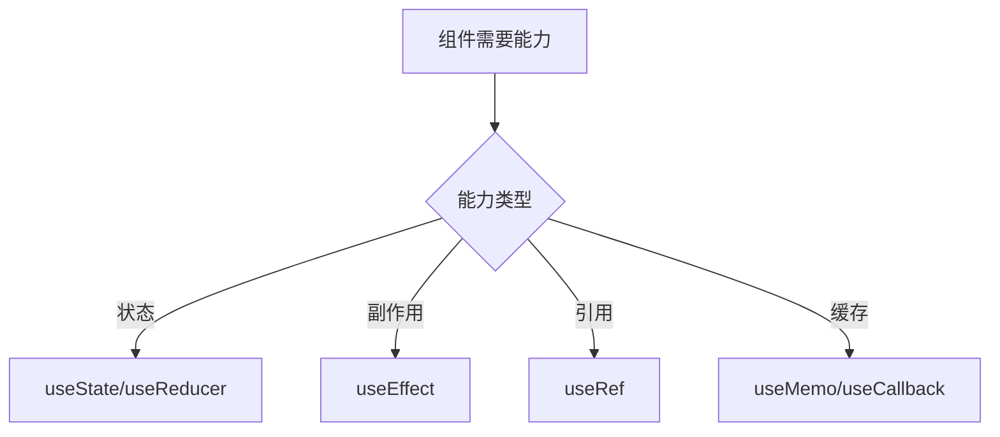

# Hooks

## 定义

Hooks 是 [[React Hooks]] 的简称，指 React 函数组件中用于接入状态、副作用、上下文、引用和缓存能力的一组 API。

## 相关概念

- [[React Hooks]]
- [[React 基础]]
- [[React-源码-Hooks]]

## 使用流程

## 实践检查清单

- Hook 是否只在组件顶层或自定义 Hook 顶层调用。
- 依赖数组是否完整，避免闭包过期。
- 副作用是否有清理逻辑，例如订阅、定时器和请求取消。
- 自定义 Hook 是否隐藏复用逻辑，而不是隐藏业务副作用。
- 缓存 Hook 是否有真实性能收益。

## 案例

窗口尺寸监听适合封装成 `useWindowSize`，内部用 `useEffect` 订阅 resize，并在清理函数中移除监听。组件只消费宽高结果，不关心订阅细节。

## 设计边界

Hooks 的价值是把状态逻辑和副作用逻辑组合到函数组件中，但它不会自动让逻辑清晰。自定义 Hook 应围绕一个可复用能力命名，例如 `useAuthUser`、`useDebouncedValue`、`useWindowSize`，而不是把一整段页面业务藏进去。

依赖数组是 Hooks 中最常见的风险点。缺依赖会产生闭包过期，多余依赖会造成重复执行。遇到复杂 effect 时，应先问这个副作用是否真的属于组件渲染生命周期，还是应该放到事件处理、状态管理或服务层。

## 常见误区

- 条件语句中调用 Hook，破坏调用顺序。
- 依赖数组为了消除警告随意留空。
- 为所有函数都加 `useCallback`，增加复杂度却没有收益。
