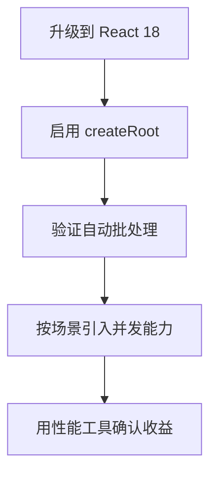

# React 18 新特性

## 🎯 学习目标
- 理解 React 18 的主要新特性
- 掌握并发渲染的概念
- 学会使用新 Hooks

## 📚 核心概念

### 概念1：新的 Root API
**定义**：React 18 引入了新的 root API，支持并发模式渲染。

**理解要点**：
- `ReactDOM.render` → `ReactDOM.createRoot`
- 支持新的并发渲染器 (concurrent renderer)
- 进入并发模式的前提是使用新的 Root API

**代码示例**：
```javascript
// React 17 - 旧 API
import ReactDOM from 'react-dom';
ReactDOM.render(<App />, document.getElementById('root'));

// React 18 - 新 API
import ReactDOM from 'react-dom/client';
const root = ReactDOM.createRoot(document.getElementById('root'));
root.render(<App />);

// SSR 升级
// React 17
ReactDOM.hydrate(<App />, document.getElementById('root'));

// React 18
ReactDOM.hydrateRoot(document.getElementById('root'), <App />);

// 卸载组件
// React 17
ReactDOM.unmountComponentAtNode(root);

// React 18
root.unmount();
```

**⚠️ 注意**：React 18 中使用旧的 render API 会显示警告，但仍然兼容。

---

### 概念2：并发渲染 (Concurrent Rendering)
**定义**：React 18 引入了并发渲染机制，允许 React 中断渲染工作以处理更高优先级的更新。

**理解要点**：
- 不是并行执行，而是可中断的渲染
- 允许 React 准备多个版本的 UI
- 用户交互可以优先于后台渲染

**代码示例**：
```javascript
// 使用 useTransition 标记非紧急更新
import { useTransition } from 'react';

function App() {
  const [isPending, startTransition] = useTransition();
  const [count, setCount] = useState(0);

  const handleClick = () => {
    startTransition(() => {
      setCount(c => c + 1);
    });
  };

  return (
    <div>
      {isPending && <Spinner />}
      <button onClick={handleClick}>{count}</button>
    </div>
  );
}
```

### 概念3：自动批处理 (Automatic Batching)
**定义**：React 18 将多个状态更新批量处理为一次渲染，开箱即用的性能改进。

**理解要点**：
- **React 17**：只在 React 事件处理函数中自动批处理
- **React 18**：在任何地方都自动批处理（setTimeout、Promise、原生事件）
- 批处理指数据层合并多次更新，视图层合并为一次渲染

**代码示例**：
```javascript
// React 17 之前 - 以下情况会触发 2 次渲染
setTimeout(() => {
  setCount1(c => c + 1);
  setCount2(c => c + 1);
}, 0);

// 原生事件监听 - 触发 2 次渲染
document.addEventListener('click', () => {
  setCount1(c => c + 1);
  setCount2(c => c + 1);
});

// React 18 - 以上情况都只会触发 1 次渲染（自动批处理）
```

**⚠️ 特殊情况**：
```javascript
// await 后的更新不会自动批处理
onClick={async () => {
  await setCount1(c => c + 1);  // 第一次渲染
  setCount2(c => c + 1);         // 第二次渲染
}}
```

---

### 概念4：flushSync - 退出批处理
**定义**：需要立即同步更新状态时，使用 flushSync 退出自动批处理。

**代码示例**：
```javascript
import { flushSync } from 'react-dom';

const handleClick = () => {
  // 强制同步更新
  flushSync(() => {
    setCount1(c => c + 1);
  });
  // 此时 DOM 已更新
  console.log(count1); // 最新值
  
  flushSync(() => {
    setCount2(c => c + 1);
  });
};
```

**注意**：flushSync 内部的多个 setState 仍然会被批处理。

### 概念5：Suspense 改进
**定义**：更好的 Suspense 支持，包括服务器端渲染和错误处理。

**理解要点**：
- 可以在组件树任意位置使用
- React 18 中 Suspense 不再需要 fallback 来捕获边界
- 没有 fallback 时，会渲染 null 而不是跳过边界

**代码示例**：
```javascript
import { Suspense } from 'react';

// React 17: 内部没有 fallback 的 Suspense 会被跳过
// React 18: 内部没有 fallback 的 Suspense 会作为边界，渲染 null
function App() {
  return (
    <Suspense fallback={<Loading />}>  // 外层边界
      <Suspense>                       // 内层边界 - React18 会使用这个边界
        <Page />
      </Suspense>
    </Suspense>
  );
}
```

---

## 🆕 新的 Hooks

### useId
**定义**：生成在客户端和服务端保持唯一性的 ID，解决 hydration 不匹配问题。

**使用场景**：
- 表单元素的 id 和 htmlFor 关联
- ARIA 属性中的 id 引用

**代码示例**：
```javascript
import { useId } from 'react';

function PasswordField() {
  const id = useId();
  
  return (
    <>
      <label htmlFor={id}>Password:</label>
      <input id={id} type="password" />
    </>
  );
}
```

**原理**：每个 id 代表组件在组件树中的层级结构。

---

### useSyncExternalStore
**定义**：让 React 组件在并发模式下安全地读取外部数据源。

**使用场景**：
- 第三方状态管理库（如 Redux）
- 浏览器 API（如 localStorage、matchMedia）
- 解决并发模式下的数据撕裂问题

**代码示例**：
```javascript
import { useSyncExternalStore } from 'react';

// 简单的 store 示例
function useOnlineStatus() {
  return useSyncExternalStore(
    // subscribe: 订阅外部数据源
    (callback) => {
      window.addEventListener('online', callback);
      window.addEventListener('offline', callback);
      return () => {
        window.removeEventListener('online', callback);
        window.removeEventListener('offline', callback);
      };
    },
    // getSnapshot: 获取当前值
    () => navigator.onLine,
    // getServerSnapshot: 服务端渲染时的初始值
    () => true
  );
}
```

**注意**：日常业务开发很少直接使用，主要是框架开发者使用。

---

### useInsertionEffect
**定义**：在 DOM 变更之后，layout effect 之前执行，用于插入样式。

**使用场景**：
- CSS-in-JS 库插入样式
- 需要在布局计算前插入样式的场景

**代码示例**：
```javascript
import { useInsertionEffect } from 'react';

function useCSS(rule) {
  useInsertionEffect(() => {
    if (!isInserted.has(rule)) {
      isInserted.add(rule);
      const style = document.createElement('style');
      style.textContent = rule;
      document.head.appendChild(style);
    }
  });
  return rule;
}
```

**执行顺序**：DOM 生成 → useInsertionEffect → useLayoutEffect → useEffect

**注意**：只能用于 CSS-in-JS 库，不要在常规组件中使用。

## 🔧 并发模式详解

### 架构演进
React 从同步不可中断更新演变为异步可中断更新：

**四种情况对比**：
| 版本 | 架构 | 并发更新 |
|------|------|---------|
| React 15 及之前 | Stack Reconciler (递归) | ❌ |
| React 16-17 默认 | Fiber Reconciler (遍历) | ❌ |
| React 18 默认 | Fiber Reconciler + 自动批处理 | ❌ (未使用并发特性时) |
| React 18 使用并发特性 | Fiber Reconciler | ✅ |

**重要理解**：
- `并发模式` 是 `并发更新` 的前提
- 使用 `startTransition` 或 `useDeferredValue` 才会真正开启并发更新
- 否则只是享受自动批处理等特性

---

### 时间切片 (Time Slicing)
**定义**：将长任务拆分到每一帧中执行，保持 UI 响应。

**对比示例**：
```javascript
// 普通渲染 - 阻塞 500ms
function App() {
  const [list, setList] = useState([]);
  useEffect(() => {
    setList(new Array(10000).fill(null)); // 一次性渲染 10000 个元素
  }, []);
  return list.map((_, i) => <div key={i}>{i}</div>);
}

// 使用 useTransition - 分片执行
function App() {
  const [list, setList] = useState([]);
  const [isPending, startTransition] = useTransition();
  
  useEffect(() => {
    startTransition(() => {
      setList(new Array(10000).fill(null)); // 分片渲染，不阻塞主线程
    });
  }, []);
  
  return (
    <>
      {isPending && <Spinner />}  // 显示加载状态
      {list.map((_, i) => <div key={i}>{i}</div>)}
    </>
  );
}
```

**效果**：
- 普通渲染：JS 执行 500ms，页面卡顿
- 并发渲染：每帧执行约 5ms，浏览器有时间进行样式布局和绘制

---

### 并发特性使用对比

#### startTransition
用于包装状态更新函数：
```javascript
const [isPending, startTransition] = useTransition();

// 标记为低优先级更新
startTransition(() => {
  setSearchQuery(input);  // 延迟执行，可被紧急更新中断
});

// isPending 指示 transition 是否在进行中
{isPending && <Spinner />}
```

#### useDeferredValue
用于包装状态值：
```javascript
const [searchQuery, setSearchQuery] = useState('');
// 创建一个延迟版本的值
const deferredQuery = useDeferredValue(searchQuery);

// searchQuery 立即更新（紧急）
// deferredQuery 延迟更新（非紧急）
<SearchResults query={deferredQuery} />
```

**区别**：
- `startTransition`：包装更新方法
- `useDeferredValue`：包装状态值

---

### 实际应用场景：搜索 + 大数据列表
**场景描述**：输入框实时搜索，同时渲染包含 10000 条数据的列表。

**问题分析**：
- **紧急任务**：输入框内容更新（用户需要立即看到输入反馈）
- **非紧急任务**：列表过滤和渲染（可以延迟处理）

**代码示例**：
```javascript
import { useState, useTransition, memo } from 'react';

// 模拟大数据
const mockData = new Array(10000).fill(null);

// 列表组件 - 使用 memo 优化
const List = memo(({ query }) => {
  console.log('List 渲染');
  const filteredData = mockData.filter((_, i) => 
    i.toString().includes(query)
  );
  
  return (
    <div style={{ height: '400px', overflow: 'auto' }}>
      {filteredData.map((_, i) => (
        <div key={i} style={{ padding: '4px', borderBottom: '1px solid #eee' }}>
          Item {i}
        </div>
      ))}
    </div>
  );
});

function App() {
  const [inputValue, setInputValue] = useState('');
  const [searchQuery, setSearchQuery] = useState('');
  const [isPending, startTransition] = useTransition();

  const handleChange = (e) => {
    const value = e.target.value;
    
    // 紧急更新：立即更新输入框
    setInputValue(value);
    
    // 非紧急更新：延迟更新列表
    startTransition(() => {
      setSearchQuery(value);
    });
  };

  return (
    <div>
      <div style={{ marginBottom: '10px' }}>
        <input 
          value={inputValue}
          onChange={handleChange}
          placeholder="搜索..."
          style={{ padding: '8px', width: '300px' }}
        />
        {isPending && (
          <span style={{ marginLeft: '10px', color: '#1890ff' }}>
            加载中...
          </span>
        )}
      </div>
      <List query={searchQuery} />
    </div>
  );
}
```

---

### 方案对比分析

#### 1. startTransition vs setTimeout
**为什么不用 setTimeout？**

```javascript
// ❌ 使用 setTimeout
const handleChange = (e) => {
  setInputValue(e.target.value);
  setTimeout(() => {
    setSearchQuery(e.target.value);  // 异步延迟执行
  }, 0);
};

// ✅ 使用 startTransition
const handleChange = (e) => {
  setInputValue(e.target.value);
  startTransition(() => {
    setSearchQuery(e.target.value);  // 同步执行，但标记为低优先级
  });
};
```

**对比分析**：

| 特性 | startTransition | setTimeout |
|------|----------------|------------|
| 执行时机 | 同步执行 | 异步延迟执行 |
| 阻塞页面 | 不会（可中断） | 会（超时后执行） |
| 用户体验 | 即时响应 | 有延迟感 |
| 优先级控制 | 支持 | 不支持 |

**结论**：
- `setTimeout` 虽然能让输入框不卡顿，但列表渲染仍会阻塞页面交互
- `startTransition` 在并发模式下可以中断渲染，不会阻塞页面

---

#### 2. startTransition vs 防抖/节流
**为什么不用防抖/节流？**

```javascript
import { debounce } from 'lodash';

// ❌ 使用防抖
const debouncedSetSearch = useMemo(
  () => debounce((value) => setSearchQuery(value), 1000),
  []
);

const handleChange = (e) => {
  setInputValue(e.target.value);
  debouncedSetSearch(e.target.value);  // 延迟 1000ms 执行
};

// ✅ 使用 startTransition
const handleChange = (e) => {
  setInputValue(e.target.value);
  startTransition(() => {
    setSearchQuery(e.target.value);  // 立即执行，但低优先级
  });
};
```

**对比分析**：

| 特性 | startTransition | 防抖/节流 |
|------|----------------|----------|
| 渲染次数 | 不减少 | 减少 |
| 延迟时间 | 自适应（根据设备性能） | 固定 |
| 用户体验 | 流畅 | 可能感到滞后 |
| 实现复杂度 | 简单 | 需要调参 |

**结论**：
- 防抖/节流通过减少渲染次数来提升性能，但固定延迟时间难以把握
- `startTransition` 让 React 自动决定何时渲染，用户体验更好

---

### 性能表现

#### 不同设备上的表现差异

**高性能设备**：
- 不使用 startTransition：可能感觉不出卡顿
- 使用 startTransition：两次更新延迟很小

**低性能设备**：
- 不使用 startTransition：输入卡顿明显，列表渲染阻塞页面
- 使用 startTransition：输入响应及时，列表逐步渲染

**核心优势**：`startTransition` 能根据设备性能自适应调整，无需开发者手动配置。

---

### Fiber 架构三层含义

1. **作为架构**：从 Stack Reconciler (递归) 升级为 Fiber Reconciler (遍历)
2. **作为静态数据结构**：每个 fiber 对应一个组件，保存组件类型和 DOM 节点信息（虚拟 DOM）
3. **作为动态工作单元**：保存节点更新状态和需要执行的副作用

---

## 🔬 并发特性原理解析

### startTransition 原理
**核心机制**：通过设置全局标记 `transition = 1`，将回调内的所有更新标记为过渡任务。

**简化源码**：
```javascript
function startTransition(scope) {
  const prevTransition = ReactCurrentBatchConfig.transition;
  // 开启 transition 标记
  ReactCurrentBatchConfig.transition = 1;
  try {
    // 执行更新 - 内部所有 setState 都会被标记为 transition
    scope();
  } finally {
    // 恢复之前的标记
    ReactCurrentBatchConfig.transition = prevTransition;
  }
}
```

**工作流程**：
1. 设置 `transition = 1`，开启过渡模式
2. 同步执行回调函数内的所有状态更新
3. React 检测到 transition 标记，将更新优先级降低
4. 恢复之前的 transition 状态

---

### useTransition 原理
**核心机制**：`useState` + `startTransition` 的组合

**简化源码**：
```javascript
function mountTransition() {
  // 使用 useState 管理 pending 状态
  const [isPending, setPending] = mountState(false);
  
  const start = (callback) => {
    // 开始 transition - 设置为 pending
    setPending(true);
    
    const prevTransition = ReactCurrentBatchConfig.transition;
    ReactCurrentBatchConfig.transition = 1;
    
    try {
      // 结束 pending 状态（作为 transition 任务）
      setPending(false);
      callback();
    } finally {
      ReactCurrentBatchConfig.transition = prevTransition;
    }
  };
  
  return [isPending, start];
}
```

**关键点**：
- `setPending(true)`：立即执行（高优先级）
- `setPending(false)`：在 transition 回调内执行（低优先级）
- 通过两次 `setPending` 调用，精确捕获过渡状态

**流程图**：
```
用户触发更新
    ↓
setPending(true) [高优先级] → isPending = true (显示 loading)
    ↓
执行 transition 标记
    ↓
setPending(false) + callback() [低优先级]
    ↓
Transition 完成 → isPending = false (隐藏 loading)
```

---

### useDeferredValue 原理
**核心机制**：`useState` + `useEffect` + `startTransition`

**简化源码**：
```javascript
function updateDeferredValue(value) {
  // 保存当前值
  const [prevValue, setValue] = updateState(value);
  
  // 在 useEffect 中异步更新
  updateEffect(() => {
    const prevTransition = ReactCurrentBatchConfig.transition;
    ReactCurrentBatchConfig.transition = 1;
    try {
      // 通过 transition 模式更新值
      setValue(value);
    } finally {
      ReactCurrentBatchConfig.transition = prevTransition;
    }
  }, [value]);
  
  // 返回延迟前的值
  return prevValue;
}
```

**执行顺序**：
1. State 更新（高优先级）：`value` 立即更新
2. Effect 执行（异步）：`setValue` 在 transition 模式下执行
3. 返回值滞后：`prevValue` 保持旧值直到 transition 完成

**与 useTransition 的区别**：
```javascript
// useTransition - 控制更新函数
startTransition(() => {
  setSearchQuery(value);  // 包装 setState
});

// useDeferredValue - 控制值本身
const deferredValue = useDeferredValue(value);  // 包装值
```

**执行时机对比**：
- `useTransition`：同步标记，立即生效
- `useDeferredValue`：`useEffect` 中异步执行，更加滞后

---

## 🛠 实践应用

### 使用场景
1. **大数据列表渲染** - 使用 useTransition 保持界面响应
2. **搜索过滤** - 使用 useDeferredValue 延迟更新搜索结果
3. **数据获取** - 使用 Suspense 处理加载状态

### 最佳实践
- ✅ **应该做的**：
  - 使用 useTransition 标记非紧急更新
  - 使用 useDeferredValue 延迟不重要的 UI 更新
  - 合理使用 Suspense 组织加载状态

- ❌ **避免的**：
  - 不要滥用并发特性
  - 不要在 useTransition 中执行同步的昂贵计算
  - 不要忽略 fallback UI 的设计

---

## ⚠️ 重要变更

### 1. 组件返回值放宽
- **React 17**：只能返回 `null`，返回 `undefined` 会报错
- **React 18**：可以返回 `null` 或 `undefined`
- **注意**：TypeScript 类型定义可能仍会警告，可以忽略

### 2. Strict Mode 双重渲染
- **React 17**：严格模式下组件渲染两次，但控制台日志只打印一次
- **React 18**：不再抑制第二次渲染的日志（如果有 React DevTools，会显示为灰色）

### 3. TypeScript 类型变化
**children 需要显式定义**：
```typescript
// React 17 - FC 默认包含 children
interface MyProps {
  title: string;
}
const Component: React.FC<MyProps> = ({ children }) => { ... }

// React 18 - 需要显式定义 children
interface MyProps {
  title: string;
  children?: React.ReactNode;
}
const Component: React.FC<MyProps> = ({ children }) => { ... }
```

### 4. render 回调函数移除
**React 17**：
```javascript
ReactDOM.render(<App />, root, () => {
  console.log('渲染完成');
});
```

**React 18**：
```javascript
// 使用 useEffect 替代
const AppWithCallback = () => {
  useEffect(() => {
    console.log('渲染完成');
  }, []);
  return <App />;
};
root.render(<AppWithCallback />);
```

### 5. 卸载组件时的警告移除
- **React 17**：组件卸载后更新状态会报 "Can't perform a React state update on an unmounted component"
- **React 18**：移除此警告，因为该警告在实际开发中经常误报（如异步请求完成前组件已卸载）

## 🔗 相关链接

### 官方文档
- [React 18 发布说明](https://react.dev/blog/2022/03/29/react-v18)
- [并发模式文档](https://react.dev/blog/2022/03/29/react-v18#what-is-concurrent-react)

### 推荐文章
- [React 18 完整指南](https://www.sitepoint.com/react-18-whats-new/)
- [React18 新特性解读 & 完整版升级指南 - 掘金](https://juejin.cn/post/7094037148088664078)
- [深入浅出用户体验大师—transition - 掘金](https://juejin.cn/post/7027995169211285512)
- [React 18 工作组讨论](https://github.com/reactwg/react-18/discussions)
- [New feature: startTransition](https://github.com/reactwg/react-18/discussions/41)
- [Real world example: adding startTransition](https://github.com/reactwg/react-18/discussions/65)

## 🧠 深入理解

### 常见问题
**Q1：并发渲染会影响现有代码吗？**
**A：** 不会，React 18 是向后兼容的。只有在使用新特性时才会启用并发模式。

**Q2：什么时候应该使用 useTransition？**
**A：** 当某个状态更新可以延迟，且不阻塞用户交互时使用，如搜索过滤、列表排序等。

**Q3：startTransition 和 useDeferredValue 该如何选择？**
**A：** 
- 如果能直接控制状态更新，使用 `startTransition`：
  ```javascript
  startTransition(() => setSearchQuery(value));
  ```
- 如果值来自 props 或无法控制更新逻辑，使用 `useDeferredValue`：
  ```javascript
  const deferredQuery = useDeferredValue(query);
  ```

**Q4：为什么 startTransition 比 setTimeout 更好？**
**A：** 
- `startTransition` 是同步执行的，只是标记为低优先级
- `setTimeout` 是异步延迟的，会有明显的延迟感
- `startTransition` 可以中断渲染，不会阻塞页面交互
- `startTimeout` 超时后仍会阻塞页面

**Q5：在低性能设备上效果更明显吗？**
**A：** 是的。在高性能设备上，使用与不使用可能感觉差异不大；但在低性能设备上，不使用会导致明显卡顿，使用后能保持界面响应。

### 易错点
- 误认为并发渲染是并行执行
- 在 useTransition 中执行同步阻塞操作
- 过度使用导致代码复杂度增加
- 在 startTransition 中使用 await（会破坏批处理）
- 在 startTransition 中混合紧急和非紧急更新
- 忘记处理 isPending 状态（用户不知道正在加载）
- 对不需要并发的简单场景滥用 useTransition

## 📝 个人笔记

### 关键收获
- React 18 的并发特性是可选的，不会破坏现有代码
- **核心升级**：同步不可中断 → 异步可中断（基于 Fiber 架构）
- useTransition 和 useDeferredValue 是实现并发特性的工具
- 自动批处理让性能优化开箱即用
- 三个新 Hook（useId/useSyncExternalStore/useInsertionEffect）各有特定使用场景
- Suspense 不再需要 fallback 边界，行为更可预测
- 时间切片（Time Slicing）是并发更新的具体实现手段

### 待深入研究
- [x] React 18 的 SSR 改进
- [x] useId Hook 的使用场景
- [x] useSyncExternalStore 的应用
- [x] useTransition 在复杂列表中的实战
- [x] startTransition vs setTimeout vs 防抖的对比
- [ ] Suspense 与数据获取库结合使用
- [ ] Server Components 与 React 18 的关系
- [ ] useDeferredValue 在图表渲染中的应用

### 相关笔记
- [[React Hooks]]
- [[React 性能优化]]
- [[React 项目实战]]

## 使用流程



## 实践检查清单

- 是否已经从旧 root API 迁移到 createRoot。
- 自动批处理是否影响了依赖同步更新的旧逻辑。
- useTransition 是否用于非紧急更新，而不是所有更新。
- Suspense、SSR 和数据获取库的边界是否清楚。
- 性能优化是否用 Profiler 或用户体验指标验证。

## 案例

搜索框联想列表可以把输入框更新视为紧急更新，把大列表过滤和渲染放进 transition。这样用户输入保持响应，列表结果可以稍后更新，但仍需要处理 `isPending`，让用户知道后台正在刷新。
