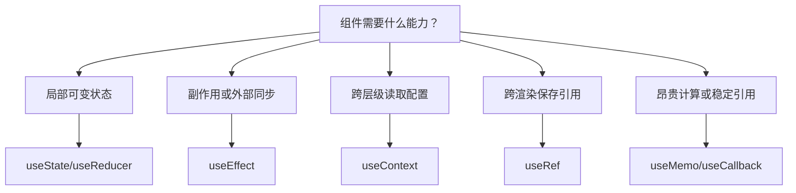

# React Hooks

## 定义

React Hooks 是让函数组件使用状态、副作用、上下文、引用和性能优化能力的一组 API。它把组件逻辑组织在函数调用中，替代了大量类组件生命周期写法。

## 常用 Hook

- `useState`：管理局部状态。
- `useEffect`：处理订阅、请求、定时器等副作用。
- `useMemo`：缓存计算结果。
- `useCallback`：缓存函数引用。
- `useRef`：保存跨渲染的可变引用或 DOM 引用。
- `useContext`：读取 Context 中的跨层级数据。

## 实践要点

- Hook 必须在组件或自定义 Hook 顶层调用，不能放在条件、循环或嵌套函数里。
- `useEffect` 不是数据流的默认答案，能在事件、派生计算或服务端完成的逻辑不要硬塞进去。
- 自定义 Hook 用来复用有状态逻辑，不是为了隐藏所有业务细节。

## 选择流程



Hook 的选择要从问题出发，而不是看到重复代码就抽 Hook。能用普通函数解决的纯计算，不需要变成自定义 Hook。

## 示例：自定义 Hook

```tsx
import { useEffect, useState } from "react";

export function useWindowWidth() {
  const [width, setWidth] = useState(() => window.innerWidth);

  useEffect(() => {
    const onResize = () => setWidth(window.innerWidth);
    window.addEventListener("resize", onResize);
    return () => window.removeEventListener("resize", onResize);
  }, []);

  return width;
}
```

这个 Hook 封装了订阅、清理和状态更新。调用组件只关心窗口宽度，不需要重复写事件监听逻辑。

## 常见误区

- 把事件处理逻辑放进 `useEffect`，导致依赖混乱和重复执行。
- 为了“优化”到处使用 `useMemo` 和 `useCallback`，反而增加理解成本。
- 自定义 Hook 名称不表达业务含义，只是把代码搬到另一个函数里。
- 忘记 Effect 清理函数，造成订阅、定时器或请求泄漏。
- 依赖数组漏项，让组件读到旧闭包里的状态。

## 检查清单

- Hook 是否只在组件或自定义 Hook 顶层调用。
- Effect 是否真的在同步外部系统，而不是做派生计算。
- 自定义 Hook 是否返回稳定、清晰的状态和操作。
- 是否把服务器状态交给 [[TanStack-Query]]，而不是手写请求 Effect。

## 相关概念

- [[React 基础]]
- [[React-源码-Hooks]]
- [[组件设计与状态边界]]
- [[React 性能优化]]
