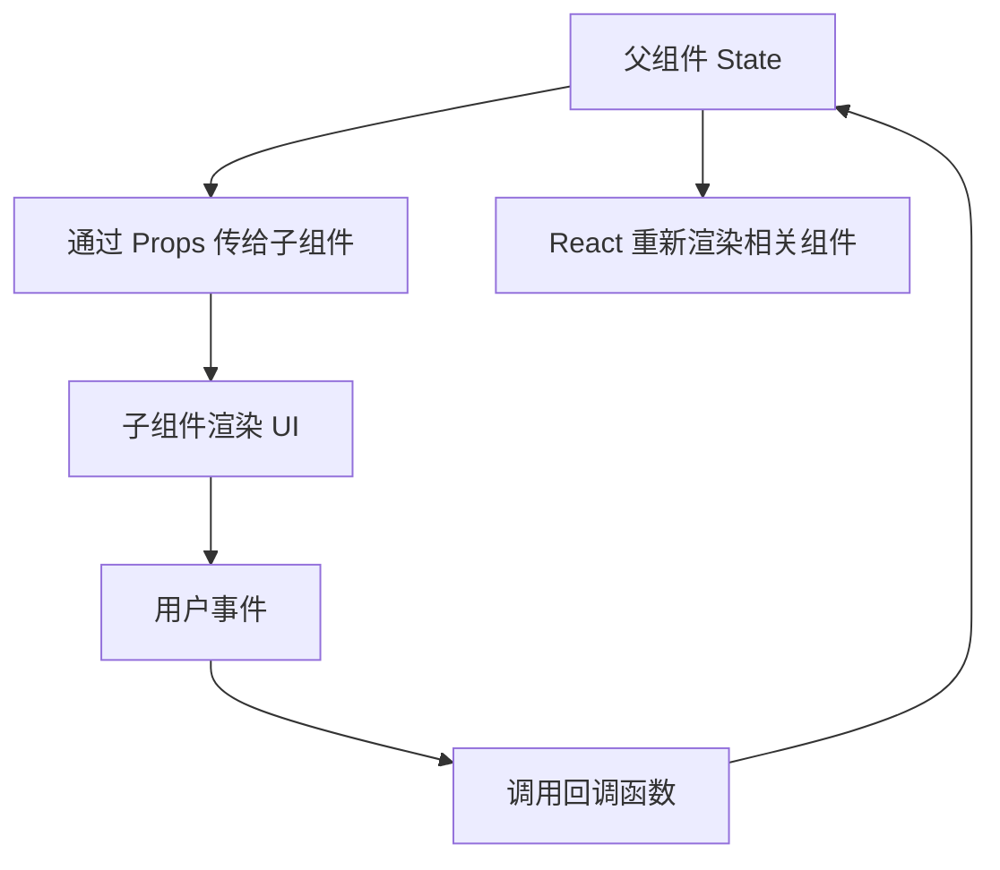

# React 基础

## 定义

React 是一个用于构建用户界面的 JavaScript 库，核心模型是用组件描述 UI，再由 React 根据状态变化更新视图。学习 React 基础要先理解组件、Props、State、事件、条件渲染、列表渲染和 Hook。

## 要点

- 组件是 UI 的基本单元，可以通过 Props 接收外部输入。
- State 表示组件内部会随交互变化的数据。
- JSX 是 JavaScript 的语法扩展，用声明式方式描述 UI 结构。
- React 通过渲染和协调机制把组件状态变化反映到 DOM。
- 副作用应放入合适的 Hook 或框架数据层，而不是写在渲染过程中。

## 组件数据流



React 的默认数据流是单向的：父组件把数据传给子组件，子组件通过事件回调把“发生了什么”告诉父组件。这样做能让状态来源清晰，也能减少多个组件同时修改同一份数据造成的不一致。

## 最小示例

```tsx
import { useState } from "react";

type CounterProps = {
  step?: number;
};

export function Counter({ step = 1 }: CounterProps) {
  const [count, setCount] = useState(0);

  return (
    <button onClick={() => setCount(count + step)}>
      点击 {count} 次
    </button>
  );
}
```

这个例子里：

- `Counter` 是组件。
- `step` 是 Props，由外部传入。
- `count` 是 State，由组件内部维护。
- `onClick` 是事件处理。
- `setCount` 触发状态更新，React 再根据新状态重新渲染按钮文本。

## 学习顺序

1. JSX、组件和 Props。
2. State、事件和条件渲染。
3. 列表渲染和 Key。
4. [[React Hooks]]。
5. [[组件设计与状态边界]]。

## 常见误区

- **在渲染过程中修改状态**：渲染应该保持纯粹，状态更新应来自事件、Effect 或外部数据层。
- **把 Props 复制到 State**：除非需要编辑草稿，否则直接使用 Props 更简单。
- **列表 Key 使用数组下标**：当列表会增删、排序时，下标 Key 容易导致组件状态错位。
- **把所有逻辑写进组件函数**：复杂计算、数据请求和业务规则应拆到 Hook、工具函数或页面数据层。
- **过早引入全局状态**：先用局部状态和组合模式，跨页面共享时再考虑 [[Zustand]] 或 [[Redux]]。

## 实践路径

- 写组件时先明确输入 Props、内部 State、输出事件。
- 表单、筛选器、弹窗等交互组件优先练习受控组件模式。
- 接口数据不要直接塞进局部 State，优先理解 [[TanStack-Query]] 等服务器状态工具。
- 性能优化先定位实际问题，再学习 memo、useMemo、useCallback 和 [[React 性能优化]]。

## 相关概念

- [[React Hooks]]
- [[React 18 新特性]]
- [[React 性能优化]]
- [[状态管理 MOC]]
