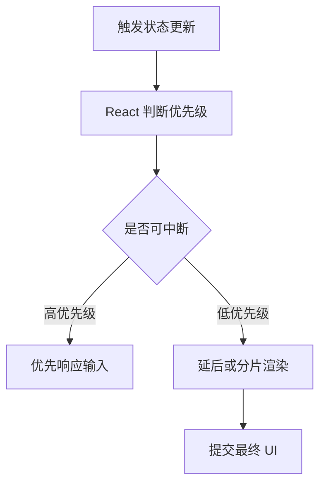

# React 并发特性

React 并发特性让渲染工作可以被中断、恢复和分优先级处理，从而改善复杂交互下的响应性。

## 相关概念

- [[React 18 新特性]]
- [[Suspense]]
- [[React 性能优化]]

## 工作流程

## 实践检查清单

- 是否用 `startTransition` 标记非紧急更新。
- Suspense 边界是否围绕有意义的加载区域。
- 重渲染问题是否先用 Profiler 定位。
- 是否避免把所有更新都当作 transition，导致反馈变慢。
- 是否理解并发渲染不等于多线程渲染。

## 案例

搜索框输入应保持高优先级响应，搜索结果列表刷新可以放进 transition。这样用户输入不会因为大列表渲染而卡顿。

## 常见误区

- 认为 React 并发特性会自动优化所有组件。
- fallback 设计粗糙，导致局部等待变成整页闪烁。
- 忽略状态边界，导致低优先级更新仍影响整棵树。
