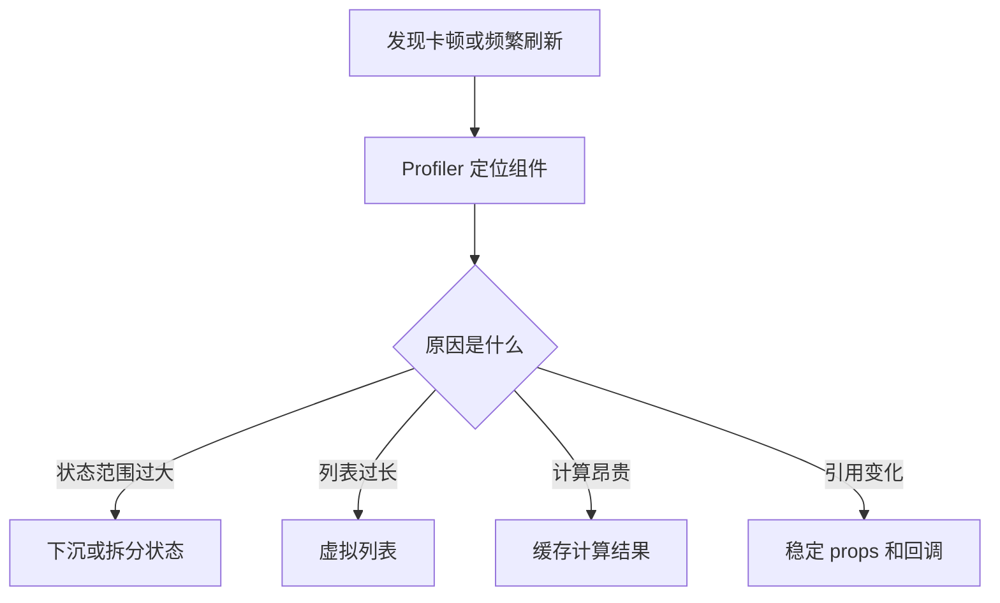

# React 渲染优化

React 渲染优化关注减少无效渲染、缩小状态影响范围、缓存昂贵计算和优化大列表。

## 相关概念

- [[React 性能优化实战]]
- [[记忆化]]
- [[虚拟列表]]
- [[组件设计与状态边界]]

## 判断路径

React 渲染优化应先定位瓶颈，再选择手段。不要一开始就大量使用 `memo`、`useMemo` 和 `useCallback`，否则可能让代码更难读，收益却很小。

## 实践检查清单

- 状态是否放在真正需要它的最近公共父级。
- 子组件是否因为对象、数组、函数引用变化而重复渲染。
- 大列表是否分页、懒加载或虚拟化。
- 昂贵计算是否能移到事件、服务端或缓存层。
- 优化前后是否用 Profiler 或性能指标验证。

## 案例

搜索页中筛选条件变化时，整页表格、统计卡片和侧边栏都刷新。优先把筛选状态拆到结果区域，统计卡片只订阅必要字段；如果表格行数很大，再引入虚拟列表。

## 常见误区

- 把渲染次数当作唯一指标，忽略单次渲染成本和用户感知。
- 为每个函数都加 `useCallback`，但没有稳定传给 memo 组件。
- 用深比较掩盖状态建模问题。
