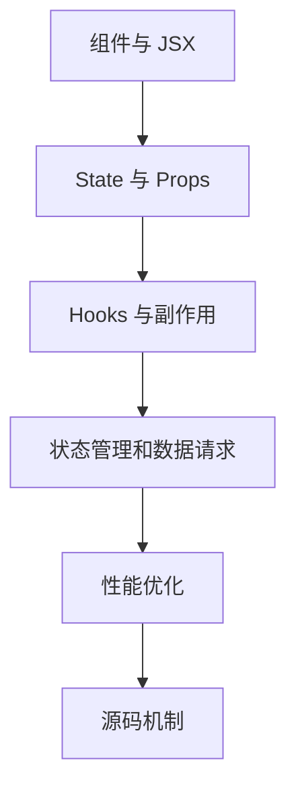

# React 学习笔记 MOC

React 是用 JavaScript 构建快速响应的大型 Web 应用程序的首选方式。本知识库包含 React 核心概念、性能优化和源码解析等内容。

## 核心特性

- **声明式**：React 使创建交互式 UI 变得轻而易举。为你应用的每一个状态设计简洁的视图
- **组件化**：创建拥有各自状态的组件，再由这些组件构成更加复杂的 UI

## 目录导航

### 01 - 核心概念
React 框架的核心概念和特性说明

- [[React 18 新特性]] - React 18 版本的新功能和并发特性
- [[React 性能优化]] - 性能优化技巧和最佳实践

### 02 - 源码解析
React 18.2.x 源码深度解读

- [[React-源码-核心]] - React 核心源码分析（JSX、Fiber、渲染流程）
- [[React-源码-Hooks]] - Hooks 源码解析（useState、useEffect 等）
- [[React-源码-Scheduler]] - Scheduler 调度器源码解读
- [[React-源码-Router]] - React Router 源码分析

### 03 - 资源
学习过程中使用的图片和参考资料

- [images/](./03-资源/images/) - 相关图片资源

## 学习路径

建议按照以下顺序学习：
1. **核心概念** → 了解 React 18 新特性和性能优化
2. **源码解析** → 深入理解 React 内部机制
   - 核心机制（JSX、Fiber、渲染流程）
   - Hooks 实现原理
   - Scheduler 调度器
   - Router 路由机制

## 工程场景

React 项目设计重点在组件边界、状态归属、副作用管理和渲染成本。小型组件可以用本地状态，大型业务应区分服务端状态、客户端 UI 状态和表单状态；当页面出现重复渲染、请求竞态或状态同步困难时，需要结合 [[React 性能优化]]、[[TanStack-Query]] 和状态管理方案一起分析。

## 检查清单

- 组件是否有清晰输入、输出和副作用边界。
- 状态是否放在最小必要共享层级。
- 是否避免在渲染阶段执行副作用。
- 列表、表单、路由和数据请求是否有稳定方案。
- 性能优化是否基于真实测量，而不是盲目使用 memo。

## 最近更新

- [[React 性能优化]] - 补充了并发模式相关内容
- [[React-源码-Scheduler]] - 完善了调度器流程说明

## 相关链接

- [React 官方文档](https://react.dev/)
- [React GitHub](https://github.com/facebook/react)
