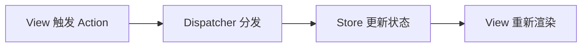

# Flux

Flux 是 Facebook 提出的前端单向数据流架构思想，强调 Action、Dispatcher、Store 和 View 之间的明确数据流。

## 相关概念

- [[Redux]]
- [[状态管理 MOC]]
- [[不可变性]]

## 数据流

## 实践检查清单

- Action 是否表达用户或系统事件，而不是直接描述 UI 修改细节。
- Store 是否集中管理共享状态，并保持可预测更新。
- 数据流是否单向，避免 View 直接修改 Store。
- 状态更新是否保持不可变，便于调试和回放。
- 是否确认项目复杂度真的需要 Flux 架构。

## 案例

待办应用中，用户点击“完成”产生 `todo_completed` Action，Dispatcher 把事件分发给 Store，Store 更新状态后通知 View 渲染完成状态。

## 使用边界

Flux 的价值在于让复杂状态变化可追踪。它适合多个视图共享状态、事件来源复杂、需要调试回放或统一约束更新路径的应用。若只是表单局部状态或单组件交互，直接使用 React 本地 state 更简单。

使用 Flux 思想时，应把 Action 当作业务事件，而不是 UI 操作细节。例如“订单已提交”比“设置 loading 为 false”更有业务语义。Store 负责状态更新，副作用应有清晰位置，避免数据流看似单向、实际到处隐藏调用。

## 常见误区

- 小型局部状态也引入全局 Flux，增加样板代码。
- Action 命名混乱，难以追踪业务事件。
- Store 中混入大量副作用，破坏可预测性。
