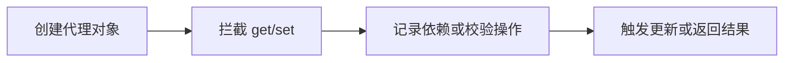

# Proxy

## 定义

Proxy 是 JavaScript 的元编程 API，可以拦截对象属性读取、写入、删除、函数调用等操作。

## 用途

- Vue 3 响应式系统。
- Valtio 等代理式状态管理。
- 参数校验、访问控制和调试。

## 相关概念

- [[Valtio]]
- [[响应式原理]]
- [[Prototype]]

## 工作流程

## 实践检查清单

- 是否明确代理对象和原始对象的边界。
- 是否避免在代理拦截器中做复杂副作用。
- 是否处理嵌套对象、数组和删除属性等场景。
- 调试时是否能识别真实数据和代理包装。
- 性能敏感路径是否评估代理开销。

## 案例

响应式状态库可以用 Proxy 拦截属性读取来收集依赖，拦截属性写入来通知订阅者更新。业务代码看似直接修改对象，底层会触发 UI 更新。

## 使用边界

Proxy 适合构建框架能力和状态管理底层，不一定适合普通业务逻辑。它会让属性访问带上隐式行为，代码读起来像普通对象，实际却可能触发依赖收集、校验、日志或通知。团队使用时需要明确代理对象的创建、传递和销毁规则。

调试代理对象时要注意原对象和代理对象不是同一个引用。若部分代码绕过代理直接修改原对象，响应式更新可能不会触发；若拦截器中做重逻辑，普通属性读取也会变慢。

框架底层可以使用 Proxy 隐藏复杂性，业务层则应避免过度魔法，保持状态变化路径可追踪。

## 常见误区

- 以为 Proxy 能拦截所有语言行为，忽略部分内部槽和不可代理对象。
- 代理对象和原对象混用，导致更新不触发。
- 在 get 拦截器中执行昂贵计算，拖慢普通属性读取。
