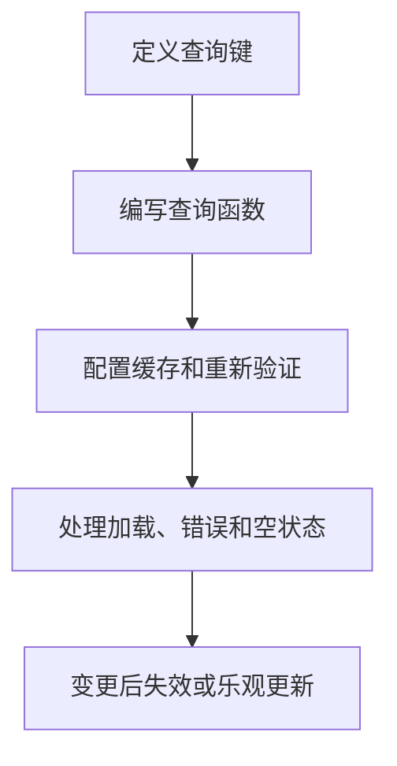

# React Query

## 定义

React Query 是 [[TanStack-Query]] 的早期名称和 React 生态常用称呼，用于管理服务器状态，包括请求、缓存、重新验证、分页、乐观更新和错误重试。

## 要点

- 适合 API 数据、加载状态、错误状态和缓存失效。
- 不应把服务器状态重复同步到 Redux 或 Zustand。
- 查询键决定缓存身份，失效策略决定数据刷新时机。

## 使用流程

## 案例

用户列表页可以用 `['users', filters]` 作为查询键，筛选条件变化时自动区分缓存。新增用户成功后，可以让用户列表查询失效并重新拉取，也可以先乐观更新 UI，再在失败时回滚。

## 检查清单

- 查询键是否完整表达参数。
- 是否区分服务器状态和本地 UI 状态。
- stale time、cache time 和重试策略是否符合业务。
- 变更后是否正确失效相关查询。
- 是否处理竞态、分页和错误展示。

## 常见误区

- 查询键缺少筛选条件，导致不同页面共用错误缓存。
- 把请求结果再复制到全局状态，制造双写和同步问题。
- 所有接口都用默认重试，导致失败请求放大后端压力。
- mutation 成功后忘记失效相关查询，页面显示旧数据。

复盘时优先检查查询键、缓存时长和失效范围，这三项通常决定页面数据是否可信，也决定用户看到的是新数据还是旧缓存。

## 掘金文章补充

掘金 TanStack Query 文章补充了一个实践判断：查询和变更应分工明确。`useQuery` 管读取、缓存和重新验证；`useMutation` 管新增、修改、删除等副作用。按钮禁用、提交中提示、成功后刷新、失败后提示都应围绕 mutation 状态设计，而不是在组件里散落多个 `useState`。

当接口参数较多时，Query Key 就是比 `useEffect deps` 更显式的请求身份。分页、筛选、关键字、用户 ID 都应该进入 Query Key，否则缓存会把不同查询结果混在一起。

来源：[为什么我推荐前端项目都应该使用 TanStack Query 管理接口请求](https://juejin.cn/post/7610979696307601417)

## 相关概念

- [[TanStack-Query]]
- [[SWR]]
- [[组件设计与状态边界]]
