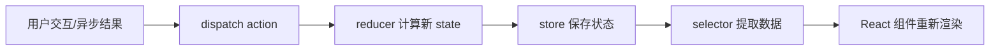

# Redux

## 定义

Redux 是一个用于 JavaScript 应用的可预测状态容器。它通过**单一数据源**（Single Source of Truth）、**状态只读**（State is Read-Only）和**使用纯函数执行修改**（Changes are made with Pure Functions）三大原则，让状态管理变得可预测且易于调试。

现代 Redux 开发推荐使用官方工具集 **Redux Toolkit (RTK)**，它简化了配置和样板代码。

## 核心概念

| 概念 | 说明 | 类比 |
|-----|------|-----|
| **Store** | 保存应用全局状态的容器 | 银行金库 |
| **Action** | 描述"发生了什么"的普通对象，必须包含 `type` 字段 | 存款单/取款单 |
| **Reducer** | 根据 Action 和旧 State 计算新 State 的**纯函数** | 银行柜员 |
| **Dispatch** | 发送 Action 到 Store 的唯一方法 | 提交单据的窗口 |
| **Selector** | 从 Store 中提取特定数据的函数 | 余额查询机 |

## 数据流



Redux 的价值在于让状态变化可追踪：任何变化都应该能回答“发生了什么 action”“旧状态是什么”“新状态是什么”。这适合复杂协作场景，但也意味着团队要接受更明确的结构约束。

## 现代 Redux (Redux Toolkit)

使用 `createSlice` 和 `configureStore` 是目前的标准写法。

### 1. 定义 Slice

```typescript
// features/counter/counterSlice.ts
import { createSlice, PayloadAction } from '@reduxjs/toolkit'

const counterSlice = createSlice({
  name: 'counter',
  initialState: { value: 0 },
  reducers: {
    increment: state => {
      // Redux Toolkit 允许我们在 reducers 中编写"可变"逻辑。
      // 它使用 Immer 库在内部将其转换为不可变更新。
      state.value += 1
    },
    decrement: state => {
      state.value -= 1
    },
    incrementByAmount: (state, action: PayloadAction<number>) => {
      state.value += action.payload
    }
  }
})

export const { increment, decrement, incrementByAmount } = counterSlice.actions
export default counterSlice.reducer
```

### 2. 配置 Store

```typescript
// app/store.ts
import { configureStore } from '@reduxjs/toolkit'
import counterReducer from '../features/counter/counterSlice'

export const store = configureStore({
  reducer: {
    counter: counterReducer,
  },
})

// 推断类型
export type RootState = ReturnType<typeof store.getState>
export type AppDispatch = typeof store.dispatch
```

### 3. 在 React 中使用

```tsx
import { useSelector, useDispatch } from 'react-redux'
import { increment, decrement } from './counterSlice'
import type { RootState } from '../../app/store'

export function Counter() {
  const count = useSelector((state: RootState) => state.counter.value)
  const dispatch = useDispatch()

  return (
    <div>
      <button onClick={() => dispatch(increment())}>+</button>
      <span>{count}</span>
      <button onClick={() => dispatch(decrement())}>-</button>
    </div>
  )
}
```

## 异步处理 (Redux Thunk)

Redux Toolkit 默认集成了 Redux Thunk。

```typescript
import { createAsyncThunk, createSlice } from '@reduxjs/toolkit'
import { fetchUser } from './userAPI'

// 创建异步 thunk
export const fetchUserById = createAsyncThunk(
  'users/fetchByIdStatus',
  async (userId: number, thunkAPI) => {
    const response = await fetchUser(userId)
    return response.data
  }
)

const usersSlice = createSlice({
  name: 'users',
  initialState: { entities: [], loading: 'idle' },
  reducers: {
    // 标准 reducer 逻辑...
  },
  extraReducers: (builder) => {
    // 处理异步 action 的生命周期
    builder.addCase(fetchUserById.fulfilled, (state, action) => {
      state.entities.push(action.payload)
    })
  },
})
```

## 与 Zustand 对比

| 特性 | Redux (RTK) | Zustand |
|-----|-------------|---------|
| **心智模型** | 单一不可变状态树，Flux 架构 | 极简 Hook Store，去中心化 |
| **样板代码** | 中等（RTK 大幅减少了旧版样板） | 极少 |
| **Provider** | 需要 `<Provider>` 包裹应用 | 不需要 |
| **异步处理** | 需中间件 (Thunk/Saga) | 原生支持 async/await |
| **调试工具** | Redux DevTools (极其强大，时间旅行) | 简单的 DevTools 中间件 |
| **适用场景** | 大型应用、复杂状态逻辑、需严格规范 | 中小型应用、快速原型、灵活简单 |

## 适用场景

✅ **选择 Redux 当：**
- 应用状态更新逻辑复杂，需要严格的可预测性。
- 多人协作的大型项目，需要统一的代码规范。
- 需要强大的调试功能（时间旅行、状态快照）。
- 状态需要频繁持久化或在服务端渲染（SSR）中复用。

❌ **选择 Zustand 当：**
- 项目规模较小，追求开发速度。
- 厌恶繁琐的配置和样板代码。
- 需要一个简单的全局状态，不想引入复杂的概念。

## 适合放进 Redux 的状态

- 跨多个页面共享、且更新规则复杂的客户端状态。
- 需要时间旅行调试、审计或回放的状态变化。
- 多个模块同时读写、需要统一约束的工作流状态。
- 权限、布局、草稿、复杂编辑器状态等非服务器缓存数据。

不适合放入 Redux 的状态：

- 从接口读取的列表、详情和分页缓存，优先交给 [[TanStack-Query]]。
- 只影响单个组件的输入框、展开收起和 hover 状态。
- 可以从 URL、Props 或现有状态推导出来的数据。

## 实践检查清单

- Slice 是否围绕业务领域或页面流程拆分，而不是按组件拆分。
- Reducer 是否保持纯函数，不直接发请求、不读时间、不访问浏览器 API。
- Selector 是否封装派生计算，避免组件到处理解 Store 结构。
- 异步逻辑是否有清晰的 pending、fulfilled、rejected 状态。
- 是否用 Redux Toolkit 和 Immer 降低不可变更新样板代码。

## 常见误区

- 把 Redux 当全局变量，任何组件想共享就往里塞。
- 在 Reducer 里执行副作用，破坏可预测性。
- Store 结构直接跟接口响应结构绑定，后端变更导致前端全局震荡。
- 用 Redux 管理服务器状态，却没有缓存失效、重试和重新验证策略。

## 相关概念

- [[中间件模式]] - Redux 强大的扩展机制
- [[不可变性]] - Redux 状态更新的基础原则
- [[Zustand]] - 更轻量级的替代方案
- [[Flux]] - Redux 遵循的架构思想

## 参考

- 主研究笔记：[[30_研究/SoftwareEngineering/Redux/Redux|Redux 完整指南]]
- 官方文档：https://redux-toolkit.js.org/
