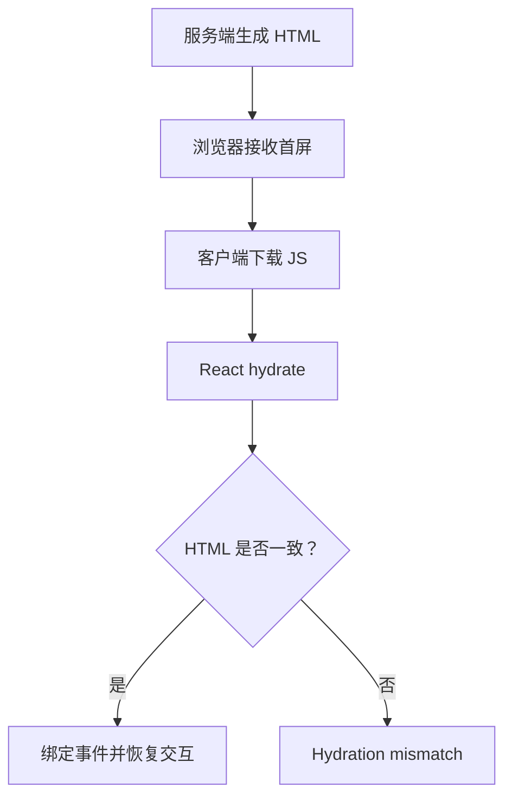

# SSR Hydration

## 定义

SSR Hydration 是客户端 React 接管服务端已经生成的 HTML，并绑定事件、恢复交互能力的过程。

## 要点

- 服务端和客户端首屏输出不一致会造成 hydration mismatch。
- 依赖浏览器 API 的逻辑需要放到客户端边界或 effect 中。
- 状态持久化和主题切换容易影响首屏一致性。

## Hydration 流程

## 实践检查清单

- 首屏渲染是否避免依赖 `window`、时间、随机数等不稳定值。
- 主题、语言、登录态等持久化状态是否有一致的初始化策略。
- 客户端专属逻辑是否放入 effect 或客户端组件。
- 是否关注控制台 hydration warning。
- 是否用真实 SSR 环境验证，而不是只看开发模式。

## 案例

深色模式如果服务端默认浅色、客户端读取 localStorage 后变成深色，就可能造成首屏不一致。可通过服务端读取 Cookie、内联初始主题脚本或延迟渲染解决。

## 排查提示

Hydration 问题通常先看首屏 HTML 是否稳定，再看客户端初始化状态是否和服务端一致。时间、随机数、浏览器存储、媒体查询和用户登录态都是高频不一致来源。

## 相关概念

- [[Next.js 服务端组件 RSC]]
- [[状态持久化]]
- [[React 基础]]
