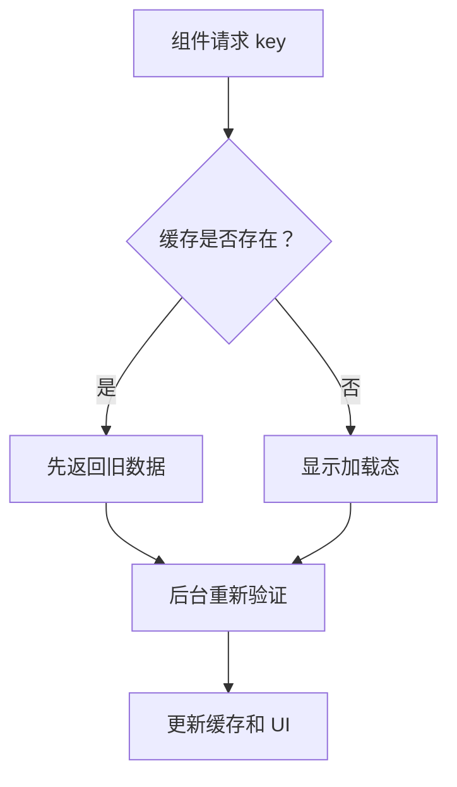

# SWR

## 定义

SWR 是一种 React 数据获取策略和同名库，名称来自 Stale-While-Revalidate。它先返回缓存中的旧数据，再在后台重新验证并更新数据。

## 要点

- 适合读取型接口和允许短暂陈旧的页面数据。
- 用 key 表示请求身份，用 fetcher 执行实际请求。
- 自动处理缓存、重新聚焦刷新、错误重试和加载状态。

## 数据流

## 实践检查清单

- key 是否完整表达请求参数。
- 页面是否允许短暂显示旧数据。
- 错误重试是否会放大后端压力。
- 焦点重新验证是否符合用户体验。
- 写操作后是否需要 mutate 更新缓存。

## 案例

用户资料页可以先展示缓存中的旧资料，再后台拉取最新数据。保存资料成功后调用 `mutate` 更新缓存，避免页面继续展示旧值。

## 常见误区

- key 设计不完整，导致不同参数共享缓存。
- 所有接口都启用自动重试，失败时放大请求量。
- 写操作后忘记 mutate，页面继续显示旧数据。
- 把不允许陈旧的数据也交给 SWR 缓存。

## 复盘提示

SWR 的关键是“允许短暂陈旧”。如果页面展示的是价格、库存、权限这类强时效数据，需要更谨慎地设置刷新、失效和后端校验策略。

## 工程边界

SWR 管服务器状态，不适合承载复杂客户端 UI 状态。筛选面板开关、弹窗状态和本地草稿应放在组件状态或客户端状态管理中。

## 相关概念

- [[Stale-While-Revalidate]]
- [[React Query]]
- [[TanStack-Query]]
