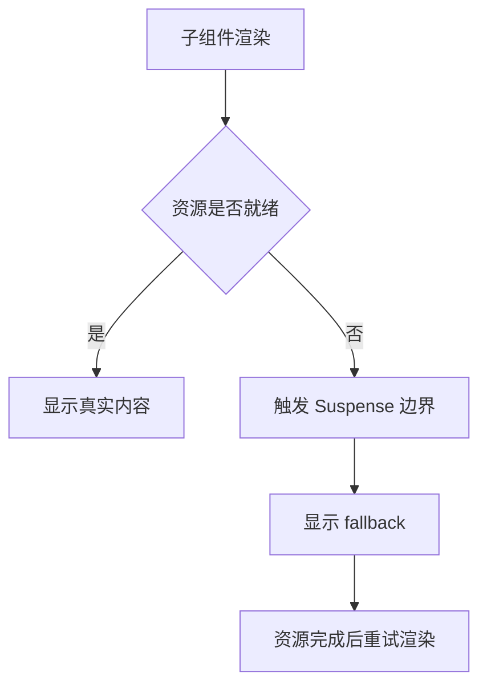

# Suspense

## 定义

Suspense 是 React 用于声明异步等待边界的机制，可以在子树数据或代码尚未准备好时展示 fallback。

## 要点

- 常与 lazy 代码分割、服务端组件和数据获取框架配合。
- fallback 应保持稳定，避免造成布局跳动。
- Suspense 边界是用户体验和加载策略的设计边界。

## 相关概念

- [[代码分割]]
- [[React Hooks]]
- [[Next.js 服务端组件 RSC]]

## 工作方式

Suspense 的核心不是“发请求”，而是让组件在尚未准备好时抛出等待信号，由最近的边界接住并显示 fallback。数据框架、代码分割和服务端组件会把这个机制封装成更容易使用的 API。

## 实践检查清单

- 边界是否围绕一个有意义的用户体验区域，而不是整页粗暴包裹。
- fallback 尺寸是否稳定，避免内容加载后产生布局跳动。
- 错误状态是否由 Error Boundary 处理，而不是只依赖 Suspense。
- 懒加载组件是否有预加载策略，避免用户点击后才开始下载关键资源。
- 在 Next.js 等框架中是否理解服务端和客户端 Suspense 的差异。

## 常见误区

- 认为 Suspense 本身会管理所有数据缓存和请求生命周期。
- fallback 做得太大，导致局部加载变成整页闪烁。
- 忽略错误边界，异步失败后用户只看到空白或崩溃页。
