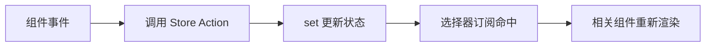

# Zustand

## 定义

Zustand（德语意为"状态"）是一个基于 Hooks 的小型、快速、可扩展的 React 状态管理库，采用极简 API 设计，无需 Provider 包裹即可使用。

## 核心特征

| 特征 | 说明 |
|-----|------|
| **轻量级** | 包体积极小 (~1KB gzipped) |
| **无样板代码** | 不需要 actions、reducers、action creators |
| **TypeScript 原生支持** | 无需额外类型定义 |
| **高性能** | 基于选择器的细粒度订阅 |
| **中间件生态** | devtools、persist、immer 等 |

## 核心 API

### create 函数

```typescript
const useStore = create<T>((set, get, api) => initialState)
```

- `set`：更新状态
- `get`：获取当前状态
- `api`：Store 实例

### 选择器模式

```typescript
const count = useStore((state) => state.count)
```

## 数据流



Zustand 没有 Redux 那样严格的 Action/Reducer 流程，优势是简单，风险是团队容易把业务逻辑随意塞进 Store。实践中应把 Store 视为“客户端状态容器”，而不是所有业务规则的集中地。

## 示例：筛选条件 Store

```typescript
import { create } from "zustand";

type FilterState = {
  keyword: string;
  status: "all" | "active" | "done";
  setKeyword: (keyword: string) => void;
  setStatus: (status: FilterState["status"]) => void;
};

export const useFilterStore = create<FilterState>((set) => ({
  keyword: "",
  status: "all",
  setKeyword: (keyword) => set({ keyword }),
  setStatus: (status) => set({ status }),
}));
```

这个 Store 只保存筛选 UI 状态。真正的列表数据应交给 [[TanStack-Query]]，通过 `keyword` 和 `status` 组成 Query Key 获取。

## 适用场景

- ✅ 中小型 React 应用
- ✅ 需要快速状态管理原型的场景
- ✅ 避免 Context API 性能陷阱
- ✅ 从 Redux 迁移的过渡方案
- ❌ 超大型应用（可考虑 Redux Toolkit）
- ❌ 需要严格数据流约束的团队

## 对比其他方案

| 特性 | Zustand | Redux | Context + useState | Recoil |
|-----|---------|-------|-------------------|--------|
| 学习成本 | 低 | 高 | 低 | 中 |
| 包体积 | 极小 | 大 | 内置 | 小 |
| 性能 | 好 | 好 | 一般 | 好 |
| DevTools | 有 | 强大 | 无 | 有 |
| 服务器状态 | 需配合 RQ | 需配合 RQ | 需配合 RQ | 需配合 RQ |

## 实践检查清单

- Store 是否只保存跨组件共享的客户端状态，避免保存接口缓存。
- 组件订阅是否使用选择器，避免整个 Store 更新导致大范围重渲染。
- Action 是否表达业务意图，而不是暴露一堆随意 set 字段的方法。
- 持久化状态是否有版本号和迁移策略。
- 大型团队是否约定 Store 拆分、命名、测试和 DevTools 使用方式。

## 常见误区

- 把服务端返回列表放进 Zustand，再手写加载、错误、刷新和失效逻辑。
- 一个全局 Store 承载所有页面状态，导致任何页面都能修改彼此状态。
- 选择器返回新对象但没有浅比较，导致组件频繁重渲染。
- 持久化敏感信息，例如 Token、权限明细或用户隐私数据。

## 相关概念

- [[选择器模式]] - 精确数据提取与性能优化
- [[中间件模式]] - 扩展 Store 功能
- [[状态持久化]] - 保存和恢复应用状态
- [[React Hooks]] - 状态管理基础
- [[Redux]] - 传统状态管理方案
- [[React Query]] - 服务器状态管理

## 参考

- 主研究笔记：[[30_研究/SoftwareEngineering/Zustand/Zustand|Zustand 完整指南]]
- 官方文档：https://docs.pmnd.rs/zustand
