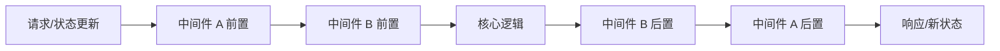

# 中间件模式 (Middleware Pattern)

## 定义

中间件是一种在操作执行前后插入额外逻辑的**装饰器模式**，允许在不修改核心代码的情况下扩展功能。

## 核心思想



## 在 Zustand 中的实现

中间件是高阶函数，接收 store creator 并返回增强的 store creator。

```typescript
const middleware = (config) => (set, get, api) => {
  // 增强 set/get/api
  const enhancedSet = (...args) => {
    console.log('状态更新前:', args)
    set(...args)
    console.log('状态更新后:', get())
  }
  
  return config(enhancedSet, get, api)
}

const useStore = create(middleware((set, get) => ({
  count: 0,
  increment: () => set((state) => ({ count: state.count + 1 })),
})))
```

## 常见中间件

| 中间件 | 用途 |
|-------|------|
| **devtools** | 集成 Redux DevTools |
| **persist** | 状态持久化到存储 |
| **immer** | 允许直接修改不可变状态 |
| **logger** | 记录所有状态变化 |
| **subscribeWithSelector** | 基于选择器的订阅 |

## 组合多个中间件

```typescript
const useStore = create(
  devtools(
    persist(
      immer((set) => ({ /* store */ })),
      { name: 'storage' }
    ),
    { name: 'Store' }
  )
)
```

**执行顺序：** 外层中间件先进入，内层先执行。

## 应用场景

- **日志记录**：追踪所有状态变化
- **权限控制**：拦截未授权操作
- **数据转换**：序列化/反序列化
- **缓存**：添加记忆化逻辑
- **副作用**：触发外部事件

## 案例

在 Zustand 中，`persist` 负责把部分状态写入 localStorage，`devtools` 负责把状态变化发送到调试工具，业务 Store 不需要知道这两个横切能力的细节。

```typescript
const useSettingsStore = create(
  devtools(
    persist(
      (set) => ({
        theme: "light",
        setTheme: (theme) => set({ theme }),
      }),
      { name: "settings" }
    )
  )
);
```

## 检查清单

- 中间件是否处理横切能力，而不是承载核心业务逻辑。
- 多个中间件组合顺序是否明确。
- 持久化中间件是否排除敏感字段。
- 日志中间件是否避免输出 Token、密码和隐私数据。
- 中间件引入的副作用是否可测试、可关闭、可观测。

## 相关概念

- [[Zustand]]
- [[选择器模式]]
- [[状态持久化]]
- [[装饰器模式]]
- [[函数式编程]]
