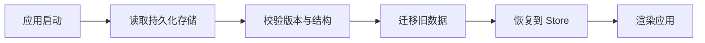

# 状态持久化 (State Persistence)

## 定义

状态持久化是指将应用状态**保存到非易失性存储**（如 localStorage、IndexedDB），在应用重新加载时恢复的技术。

## 为什么需要

- **用户体验**：刷新页面不丢失数据
- **离线支持**：在无网络时保持可用
- **跨会话**：用户偏好设置长期保存
- **性能优化**：减少不必要的 API 调用

## 存储选项对比

| 存储 | 容量 | 生命周期 | 适用场景 |
|-----|------|---------|---------|
| **localStorage** | ~5MB | 永久 | 用户偏好、主题设置 |
| **sessionStorage** | ~5MB | 标签页关闭 | 临时表单数据 |
| **IndexedDB** | 较大 | 永久 | 离线应用、大量数据 |
| **Cookie** | ~4KB | 可配置 | 身份验证令牌 |

## 恢复流程



持久化不仅是写入，还包括恢复、迁移、清理和安全边界。尤其在 SSR 或水合场景中，要避免服务端和客户端初始状态不一致。

## Zustand persist 中间件

```typescript
import { persist, createJSONStorage } from 'zustand/middleware'

const useStore = create(
  persist(
    (set) => ({
      theme: 'light',
      setTheme: (theme) => set({ theme }),
    }),
    {
      name: 'app-storage',
      storage: createJSONStorage(() => localStorage),
      partialize: (state) => ({ theme: state.theme }),
    }
  )
)
```

## 最佳实践

### 1. 选择性持久化

```typescript
// ✅ 只持久化必要数据
partialize: (state) => ({
  settings: state.settings,
  preferences: state.preferences,
})

// ❌ 不要持久化敏感数据
partialize: (state) => ({
  token: state.token,  // 安全风险
  user: state.user,    // 可能过期
})
```

### 2. 数据迁移

```typescript
{
  name: 'my-storage',
  version: 2,
  migrate: (persistedState, version) => {
    if (version === 1) {
      // 从 v1 迁移到 v2
      return {
        ...persistedState,
        newField: persistedState.oldField,
      }
    }
    return persistedState
  },
}
```

### 3. 处理 Hydration

```typescript
const useStore = create(persist(...))

function App() {
  const [hasHydrated, setHasHydrated] = useState(false)
  
  useEffect(() => {
    useStore.persist.onFinishHydration(() => {
      setHasHydrated(true)
    })
  }, [])
  
  if (!hasHydrated) return <Loading />
  return <MainApp />
}
```

## 注意事项

- **存储限制**：localStorage 有 5MB 限制
- **同步阻塞**：localStorage 读写是同步的，大数据量可能影响性能
- **序列化成本**：复杂对象序列化/反序列化有开销
- **隐私合规**：敏感数据不应持久化到客户端

## 案例

适合持久化：

- 主题、语言、表格列宽、侧边栏状态。
- 未提交的低敏感表单草稿。
- 离线应用的本地队列。

不适合持久化：

- Access Token、刷新 Token、密码。
- 权限结果和角色明细。
- 可以从接口重新获取且容易过期的服务器数据。

## 检查清单

- 是否只持久化必要字段，而不是整个 Store。
- 是否有版本号和迁移函数。
- 是否处理初次启动、迁移失败和存储损坏。
- 是否避免持久化敏感数据。
- 是否考虑 [[SSR Hydration]] 下的初始状态差异。

## 相关概念

- [[Zustand]]
- [[选择器模式]]
- [[中间件模式]]
- [[localStorage]]
- [[SSR Hydration]]
- [[离线优先]]
